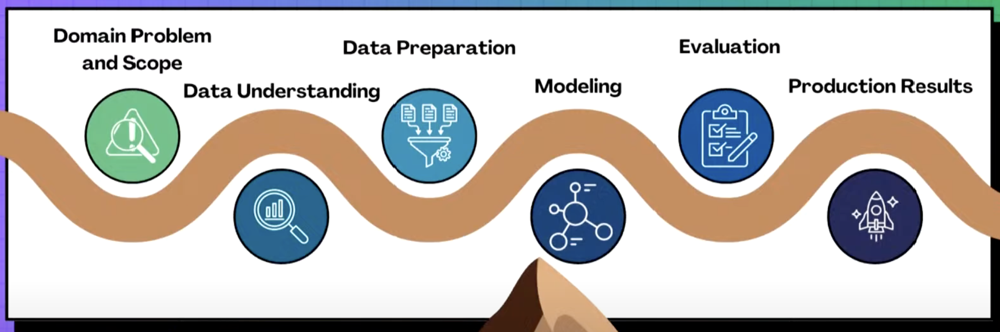
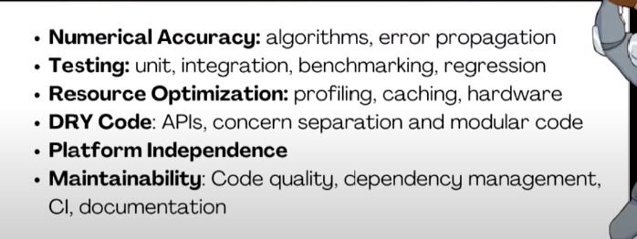
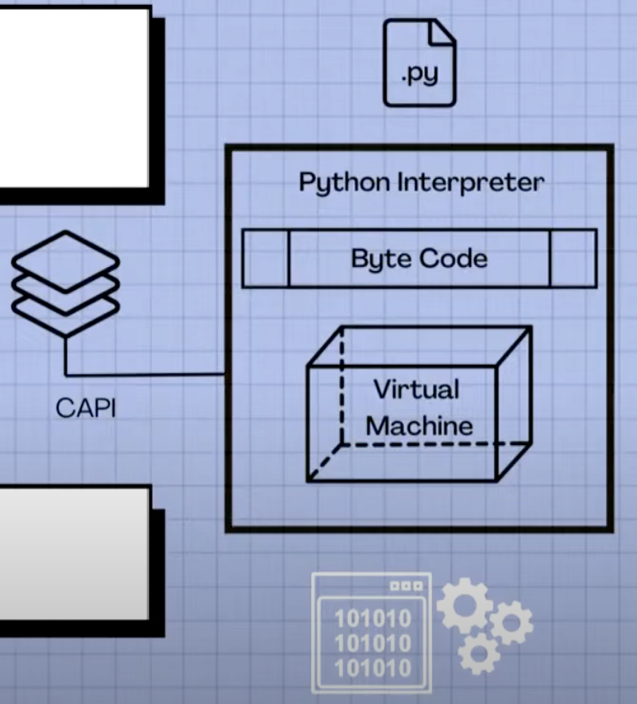
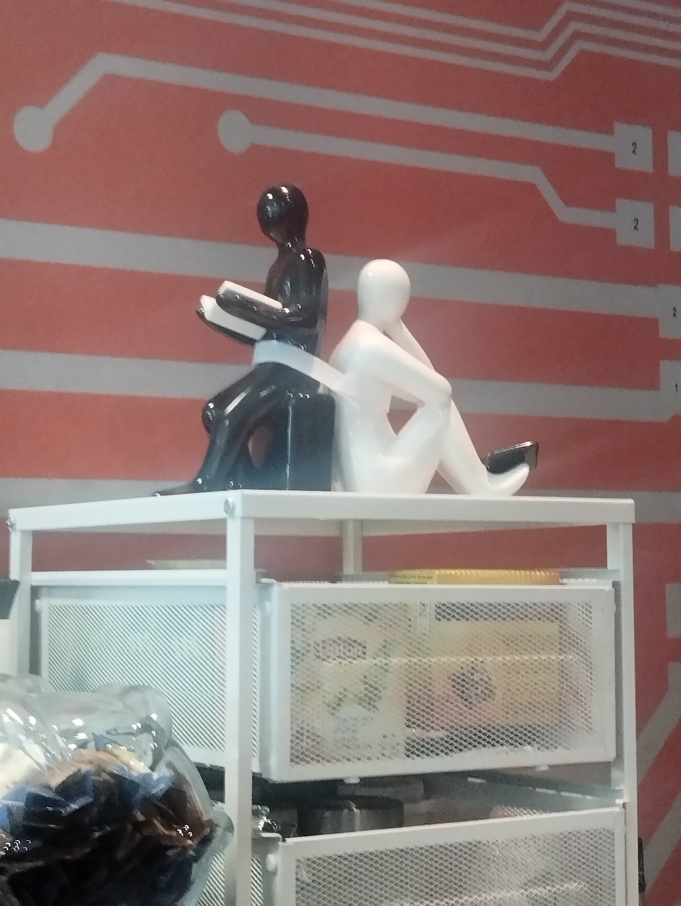
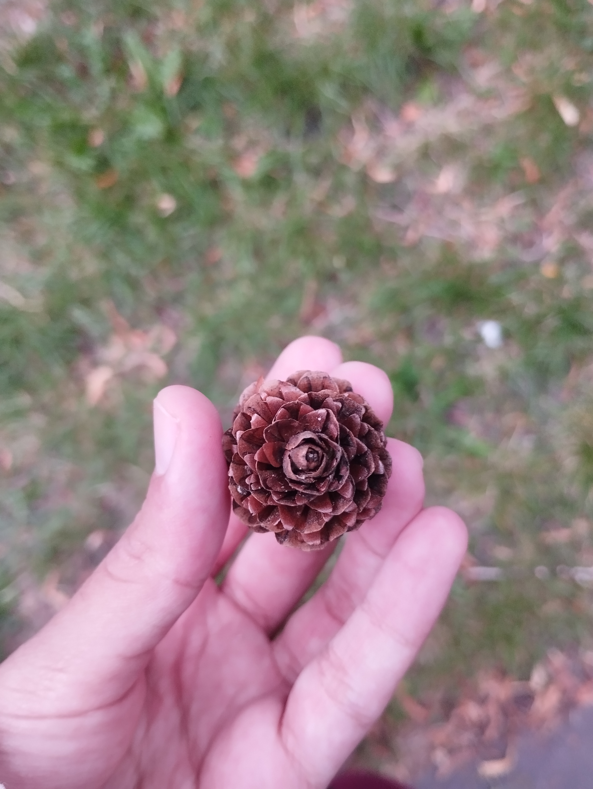
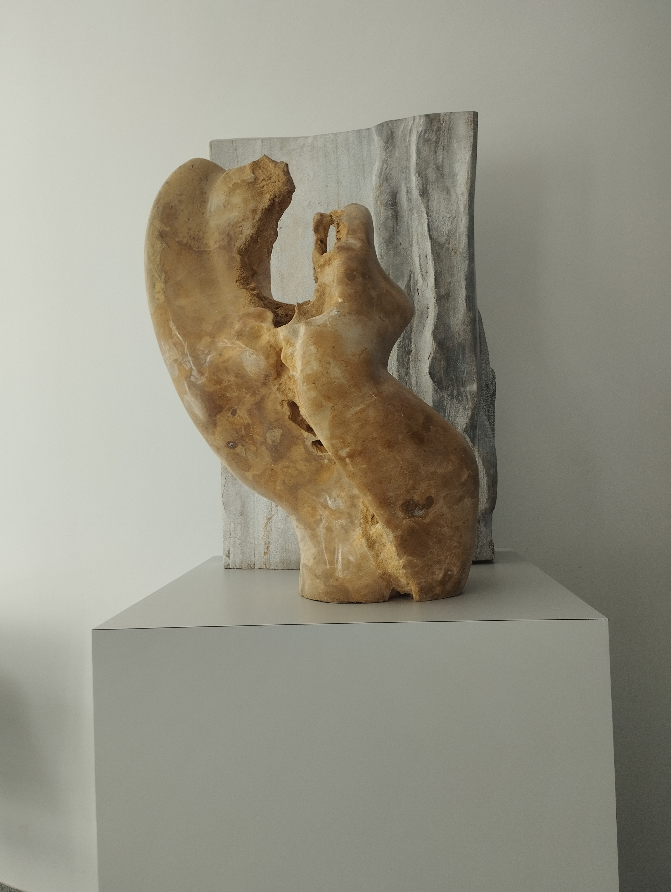
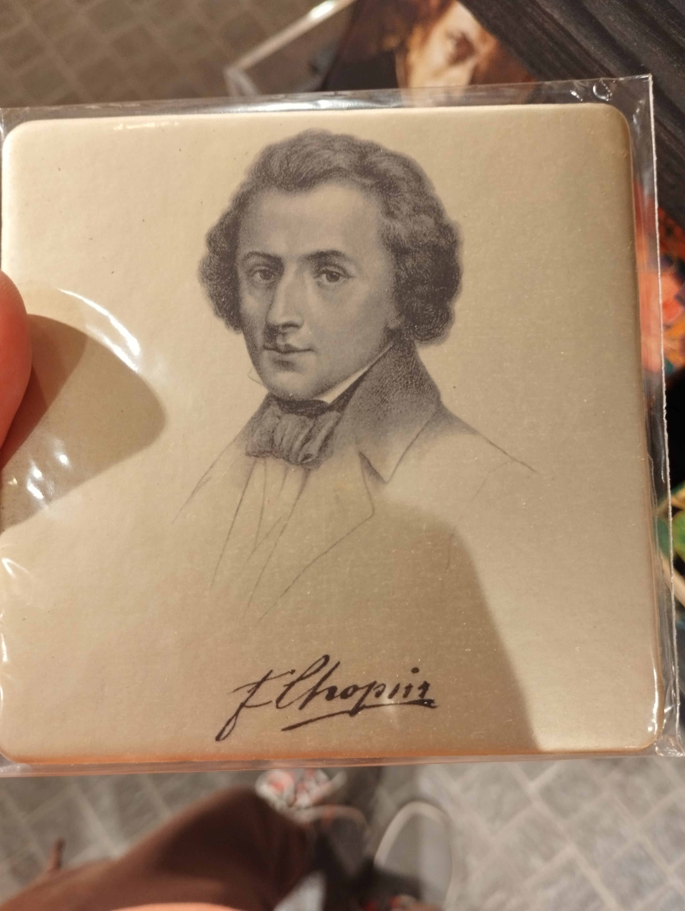
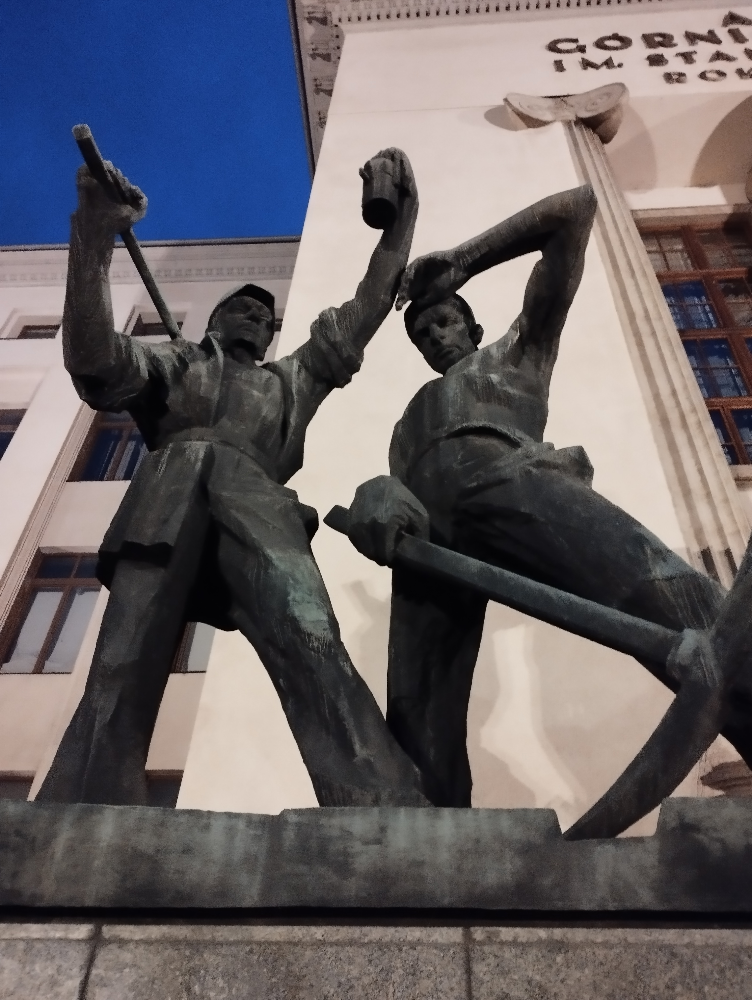

# [WIP] EuroSciPy 2025 blog/notes

## Day 1 and 2: Tutorials

- Napari tutorial was nice— also contributed a little during sprints to napari and I was just going through the documentation and talking with maintainers, etc.

### Rough notes from napari sprints 

- in console: `viewer.layers['blobs'].data = threshold(viewer.layers["image"].data,threshold=0.2)`
- ```python
  def threshold(
    layer: napari.layers.Image, #this can be a string as well
    sigma: float = 0.5,
    threshold: float = 0.3,
  ) -> list[napari.types.LayerDataTuple]:
  ```

- `02_magicgui.py` file gives this error for blobs (maybe create an issue for it) :
  <details>
    <summary>Error message</summary>
        ```
         
        ---------------------------------------------------------------------------
        TypeError                                 Traceback (most recent call last)
        File src/psygnal/_signal.py:1309, in _run_emit_loop()

        File src/psygnal/_signal.py:1338, in _run_emit_loop_immediate()

        File src/psygnal/_weak_callback.py:411, in cb()

        File ~/Desktop/napari-tutorial-euroscipy2025/.venv/lib/python3.13/site-packages/magicgui/widgets/_function_gui.py:235, in FunctionGui.__init__.<locals>._disable_button_and_call()
            234 try:
        --> 235     self.__call__()  # type: ignore [call-arg]
                self = <FunctionGui threshold(layer: napari.layers.image.image.Image = <Image layer 'blobs' at 0x1518f9950>, sigma: float = 0.55, threshold: float = 0.26999999999999996) -> list[napari.types.LayerDataTuple]>    236 finally:

        File ~/Desktop/napari-tutorial-euroscipy2025/.venv/lib/python3.13/site-packages/magicgui/widgets/_function_gui.py:351, in FunctionGui.__call__(self=<FunctionGui threshold(layer: napari.layers.imag...9999999996) -> list[napari.types.LayerDataTuple]>, *args=(), **kwargs={})
            350 with _function_name_pointing_to_widget(self):
        --> 351     value = self._function(*bound.args, **bound.kwargs)
                self = <FunctionGui threshold(layer: napari.layers.image.image.Image = <Image layer 'blobs' at 0x1518f9950>, sigma: float = 0.55, threshold: float = 0.26999999999999996) -> list[napari.types.LayerDataTuple]>
                bound = <BoundArguments (layer=<Image layer 'blobs' at 0x1518f9950>, sigma=0.55, threshold=0.26999999999999996)>
                self._function = <function threshold at 0x154d6f060>    353 self._call_count += 1

        File <string>:14, in threshold(layer=<Image layer 'blobs'>, sigma=0.55, threshold=0.26999999999999996)

        TypeError: numpy boolean subtract, the `-` operator, is not supported, use the bitwise_xor, the `^` operator, or the logical_xor function instead.

        The above exception was the direct cause of the following exception:

        EmitLoopError                             Traceback (most recent call last)
        File ~/Desktop/napari-tutorial-euroscipy2025/.venv/lib/python3.13/site-packages/magicgui/widgets/bases/_value_widget.py:69, in BaseValueWidget._on_value_change(self=PushButton(value=False, annotation=None, name='call_button'), value=False)
            67 if value is self.null_value and not self._nullable:
            68     return
        ---> 69 self.changed.emit(value)
                value = False
                self.changed = <SignalInstance 'changed' on PushButton(value=False, annotation=None, name='call_button')>
                self = PushButton(value=False, annotation=None, name='call_button')
        File src/psygnal/_signal.py:1231, in emit()

        File src/psygnal/_signal.py:1326, in _run_emit_loop()

        File src/psygnal/_signal.py:1309, in _run_emit_loop()

        File src/psygnal/_signal.py:1338, in _run_emit_loop_immediate()

        File src/psygnal/_weak_callback.py:411, in cb()

        File ~/Desktop/napari-tutorial-euroscipy2025/.venv/lib/python3.13/site-packages/magicgui/widgets/_function_gui.py:235, in FunctionGui.__init__.<locals>._disable_button_and_call()
            233 self._call_button.enabled = False
            234 try:
        --> 235     self.__call__()  # type: ignore [call-arg]
                self = <FunctionGui threshold(layer: napari.layers.image.image.Image = <Image layer 'blobs' at 0x1518f9950>, sigma: float = 0.55, threshold: float = 0.26999999999999996) -> list[napari.types.LayerDataTuple]>    236 finally:
            237     self._call_button.enabled = True

        File ~/Desktop/napari-tutorial-euroscipy2025/.venv/lib/python3.13/site-packages/magicgui/widgets/_function_gui.py:351, in FunctionGui.__call__(self=<FunctionGui threshold(layer: napari.layers.imag...9999999996) -> list[napari.types.LayerDataTuple]>, *args=(), **kwargs={})
            349 self._tqdm_depth = 0  # reset the tqdm stack count
            350 with _function_name_pointing_to_widget(self):
        --> 351     value = self._function(*bound.args, **bound.kwargs)
                self = <FunctionGui threshold(layer: napari.layers.image.image.Image = <Image layer 'blobs' at 0x1518f9950>, sigma: float = 0.55, threshold: float = 0.26999999999999996) -> list[napari.types.LayerDataTuple]>
                bound = <BoundArguments (layer=<Image layer 'blobs' at 0x1518f9950>, sigma=0.55, threshold=0.26999999999999996)>
                self._function = <function threshold at 0x154d6f060>    353 self._call_count += 1
            354 if self._result_widget is not None:

        File <string>:14, in threshold(layer=<Image layer 'blobs'>, sigma=0.55, threshold=0.26999999999999996)

        EmitLoopError: 

        While emitting signal 'magicgui.widgets.PushButton.changed', an error occurred in a callback:

        TypeError: numpy boolean subtract, the `-` operator, is not supported, use the bitwise_xor, the `^` operator, or the logical_xor function instead.
        --------------------------------------------------------------------------------------------------------------------------------------------------

        SIGNAL EMISSION: 
            /Users/aditi/Desktop/napari-tutorial-euroscipy2025/.venv/lib/python3.13/site-packages/qtpy/_utils.py:53 in possibly_static_exec
            return args[0].exec()
            /Users/aditi/Desktop/napari-tutorial-euroscipy2025/.venv/lib/python3.13/site-packages/magicgui/widgets/bases/_value_widget.py:69 in _on_value_change
            self.changed.emit(value)  # <-- SIGNAL WAS EMITTED HERE

        CALLBACK CHAIN:
            src/psygnal/_signal.py:1309 in _run_emit_loop
            ... 4 more frames ...
            <string>:14 in threshold
        # <-- ERROR OCCURRED HERE 
        ```
  </details>

- 
- pint for units
- padding deleting points --> need to change layer controls
- only use qt-py not qt
- TODO: try section 7 and 8 again on my own-- didn't understand those fully.
- plug-in: https://github.com/brisvag/napari-tutorial-euroscipy2025-plugin/blob/main/src/napari_tutorial_euroscipy2025_plugin/tutorial_code.py
- python_name: napari_hello:show_hello_message --> go to napari_hello and call show_hello_message (python entry-points referencing .toml files -- adopted in spatch?)
- https://github.com/brisvag/napari-tutorial-euroscipy2025/tree/main

### Learning from people

- Nefta's work-- lock configurations— traces as graphs— and finding clustering in that, new algorithm created inspired by k-means - https://github.com/NeroCorleone/k-traceoids
- Kalyani Mehta- getting neutrino data from space using underwater detectors— one in Italy and other in france (KM3NeT) - https://scitechdaily.com/a-deep-sea-telescope-just-detected-the-most-energetic-ghost-particle-ever/ 
- a lot of people working on image data; super-resolution stuff (https://phys.org/news/2025-07-nobel-prize-idea-super-resolution.html); bio-medical imaging
- someone working on ocean image data - https://github.com/OceanParcels/Parcels
- Mridul: working with neutrino data as well, and notebooks— talked about why we should not put lockfiles (locked dependencies) in our pypi packages
- a masters student (bristol university)-- building CNN models to study glacier algae images

## Day 3 and 4: Talks

- Keynotes were nice :)
    - Keynote 1 notes:
        - jupiter: first exascale computer (part of GSC alliance -- 3 national supercomputing centres in germany : HLRS(Stuttgart), LRZ(Garching), JSC(Julich)).
        - Things to do while listing jobs to attract more people from URGs: 
            - avoid long list of requirements
            - highlight all sides/benefits of the job
        - Who opened the new Bengalore WHPC chapter?
        - Super(computing)heroes sessions at ISC24, SC24, ISC25, SC25
        - JuWinHPC blogs
        - https://womeninhpc.org/community/jobs
        - Gender dimension in AI event; wikipedia write'athon (increasing female visibility)
        - JuLab, MaTSE
            <p align="center">
        
        </p>
    
    - second keynote notes: 
        - https://www.youtube.com/live/AGdrXUwAGfs?si=Udm443lqF0Li9M2i
        - nice overview of scientific open-source ecosystem and how it has evolved :)
        - scientific problem solving steps
            <p align="center">
        
        </p>

        - creating scientific software
            <p align="center">
        
        </p>

        - Python Interpreter's working
            <p align="center">
        
        </p>

        - GDAL - lots of geospatial formats
        - 
            <p align="center">
        
        </p>

        - nice slides!
- "Maintaining people not just projects" maintainer session by Kai was nice— liked the discussions it started! 
- Mridul's talk was nice-- about units and how they are important and the whole ecosystem of units and stuff
- Then just worked on my slides-- dispatching talk:
    - Demo got messed up -- slow laptop
    - a question/concern about using dunders (especially when/if smaller packages do it-- i.e. adopt this approach of adding backend name/implementation to backend specific object via dunder) — the `__networkx_backend__`, `__array_ufunc__`, `__array_function__` dunders-- an ambigous answer by Sebastian-- for numpy, `__numpy_function__` might have been a better name than `__array_function__` (indicating it's specific to numpy and not core Python) -- but don't use dunders if you don't feel like it :)
    - I think people were a bit sleepy after lunch and we bombarded them with a lot of info in a short span of time :)
- BrainGlobe talk was nice- it had nice brain visualisations at the end!
- A lot of nice posters and lightening talks— 
    - on lambert's problem
    - a talk about how python's `datatime` is a bit weird when it comes to daylight saving hours -- `tzone` gets ignored for some cases - https://frank.sauerburger.io/2024/12/04/Python-datetime-timezone.html
    - Jost Migenda's talk on SNEWPY - Supernova Neutrino Early Warning Models for Python , https://github.com/SNEWS2/snewpy
    - nice!- games movements (by Jolanta Sliwa) - RPG game design (imagination games--ordinal regression)
    - PyRun
    - ParaView -- nice! (PySDM)
    - lucas's talk on building numpy with pixi-build
    - multiple nice talks on creating presentations-- running code in presentation via terminal-- quarto
    - GLASS poster
    - SymPy bug fix talk
    - nvmath-python poster
    - ... and many more :)

<p align="center">
  
  
  
</p>

## Day 5: Sprints

### notes from napari sprints:

<p align="center">
  
  
  
</p>

### important links

- tutorial: https://github.com/brisvag/napari-tutorial-euroscipy2025-plugin
- to get started with plug-ins: https://napari.org/stable/plugins/technical_references/contributions.html#contributions-readers
- find plugins at: https://napari-hub.org/
- https://github.com/BodenmillerGroup/napari-networkx/blob/main/src/napari_networkx/napari.yaml
- https://napari-hub.org/plugins/napari-skimage
- https://napari.org/stable/naps/9-multiple-canvases.html#definitions
- https://github.com/napari/napari-plugin-engine
- https://napari-plugin-engine.readthedocs.io/en/latest/api.html
- https://realpython.com/python-pyqt-gui-calculator/#additional-tools
- https://napari.org/0.4.15/guides/magicgui.html
- PR created: https://github.com/napari/napari-plugin-template/pull/93
- https://data-apis.org/array-api-extra/index.html
- napari_hook_implementation
- https://github.com/brisvag/blik

After napari sprints I talked to a few people-- Rumanu, Kai-- 

- Also the `NETWORKX_BACKEND_PRIORITY` environment variable was not working— maybe it was my system or colab— not sure— no errors but it wasn’t dispatching to the backend— because it wasn’t printing logging messages and also it was slow-- I was trying to figure it out-- 
- I’ll try it out again and create an issue, if needed

## Random interesting-looking things

<p align="center">
  
  
  
</p>

<p align="center">
  
  
  
</p>

Wielkie dzięki :)