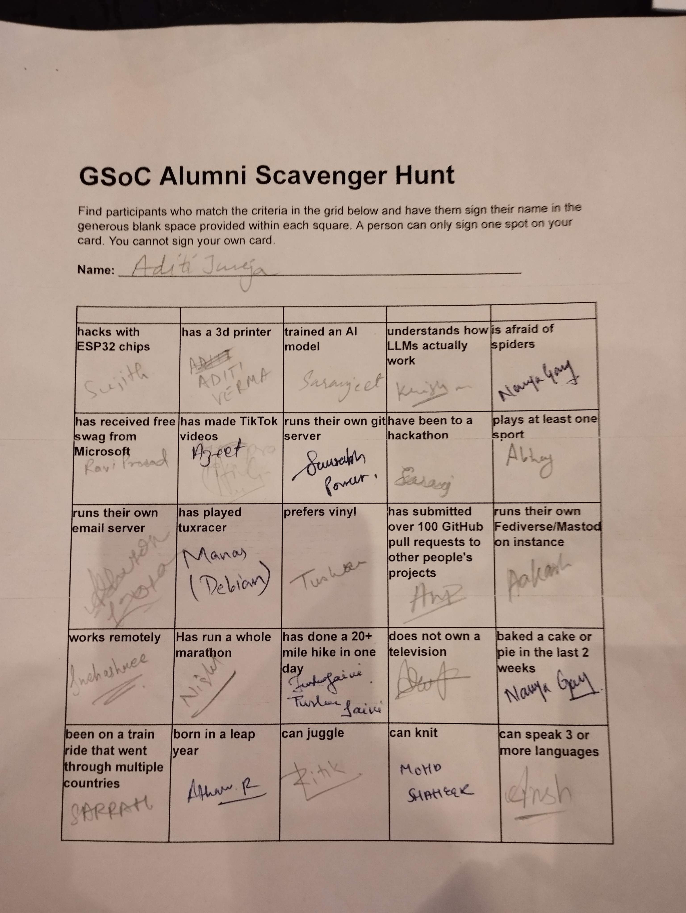
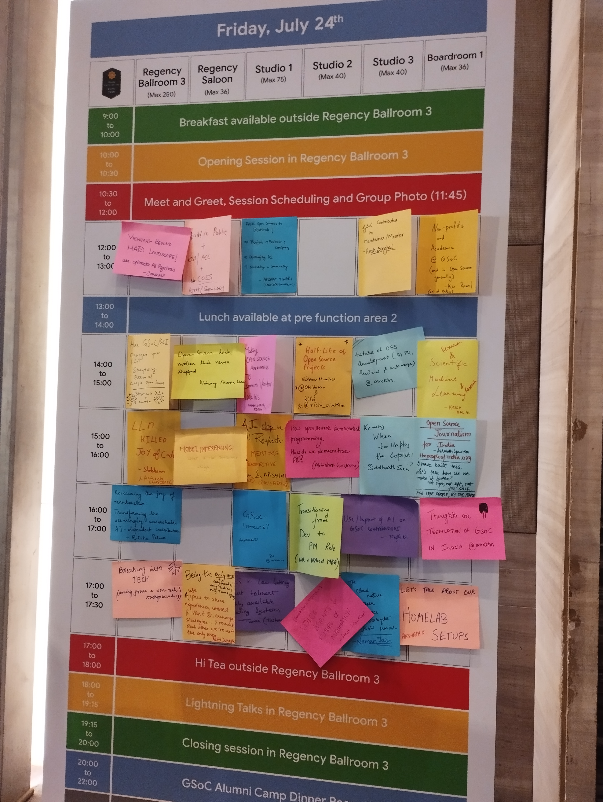
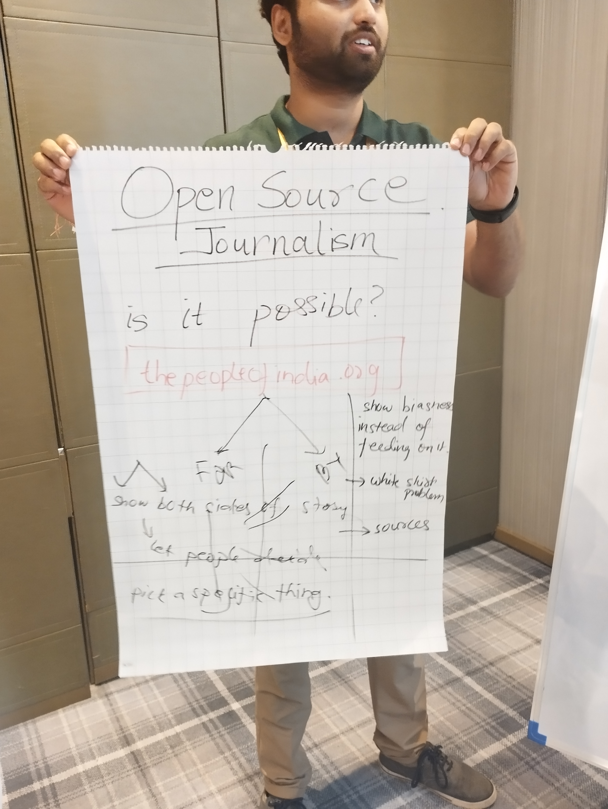
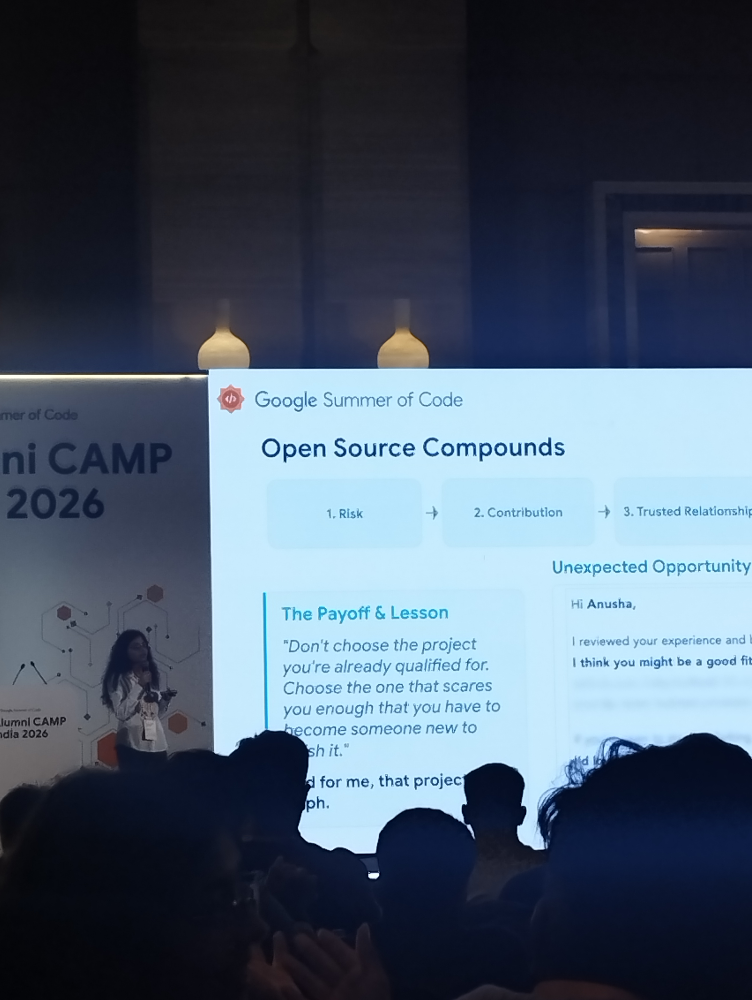
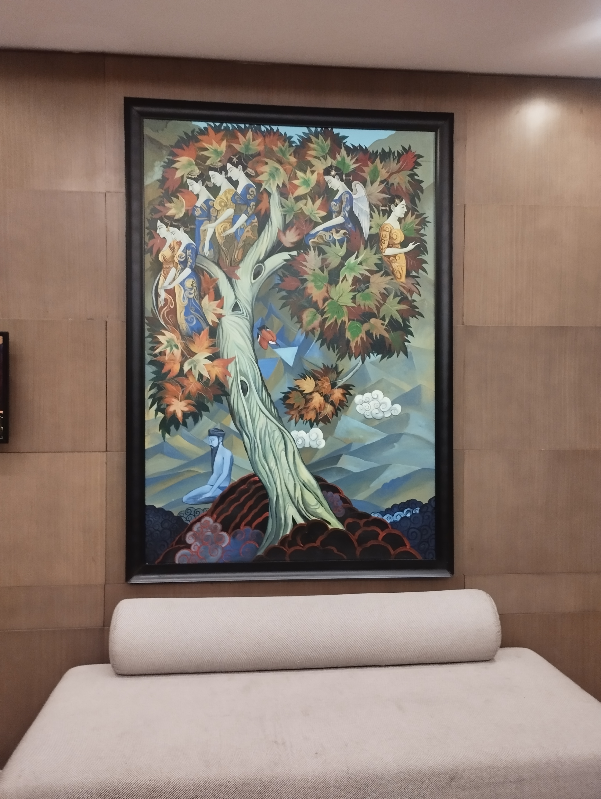
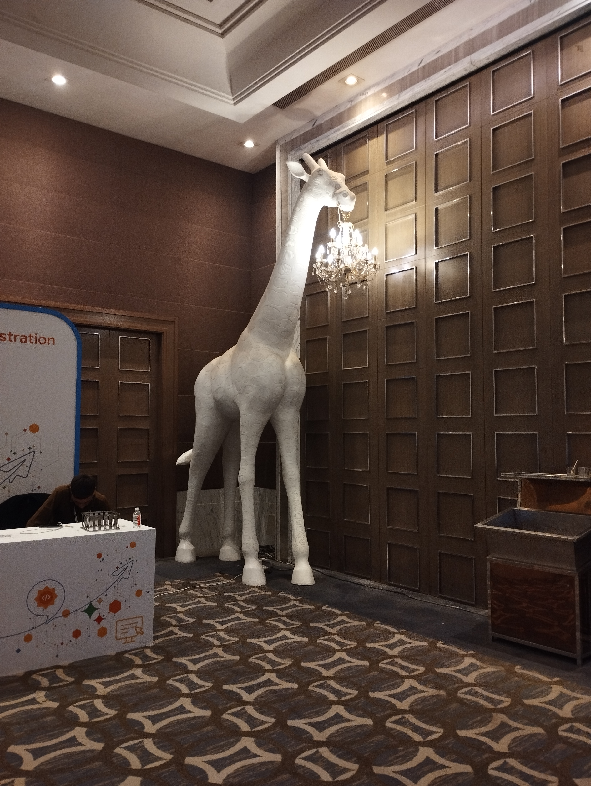
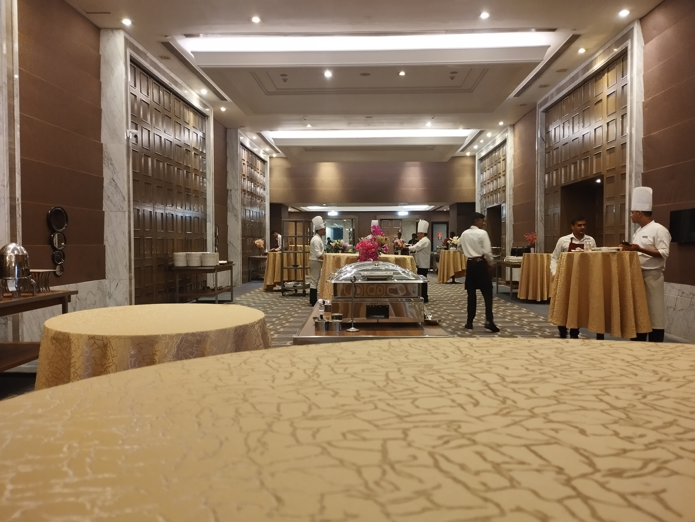

# [WIP] GSoC Alumni CAMP 2026 - New Delhi

After the morning notes-- a scavenger hunt happened and it was fun!

Then we proposed different unconference sessions for the day:

Some nice unconference sessions I attended:

- open-source journalism
- JEEfication of GSoC in India
- Being the “only one” Session (My session)
  - 

<b>Session pitch:</b>
 Being the "only one" (only female, only trans/queer, only Indian): A safe space to share experiences, connect or vent :) , exchange strategies.. and remind each other we're not the only ones.

  - 

<b>Session Summary:</b>

    This was a small, intimate gathering where people came together to share moments in their lives when they had felt like they were “the only one” in the room. Everyone brought their own experiences and perspectives, and the conversation became a space where people could be open, honest, and listened to without judgment.

    The discussion went through different areas -- from personal stories and experiences of belonging to deeper philosophical reflections around identity, life, death, and anime!

    The small group size allowed for more meaningful conversations, deeper sharing, and a sense of comfort among everyone present. It gave each person the space and opportunity to contribute, be heard, and feel valued (I hope!). Alongside the serious and thoughtful discussions, there were also plenty of moments of humour and fun! I think, over snacks and conversations, we created a space where people could listen, reflect, learn, and connect with each other beyond surface-level interactions.

    

- democratising AI  
- non-profits and academia @ GSoC
- how GSoC changed ur life 
- SciML

 

---

lightening talks were nice!

---

Some resources:

- SU2code/SU2 org
- deeprunner.ai
- ONDC
- thepeopleofindia.org
- ceph/ceph org

---

photos:

  
  

  

---

At the end, filled the guest notebook-- and there was a lot of good food and conversations, and inspiring people showcasing their work- met a lot of people from a diverse set of orgs.. and there were really nice tiny pastries-- with really light-airy cream! dosas, idlis, tiny somosas, really rich kheer, brownies, biscuits, nice tomato soup-- everything was great!
