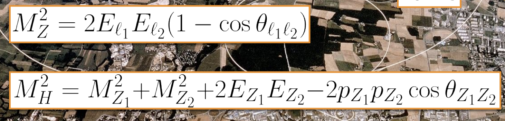

Disclaimer: These are rough notes from the workshop. You may or may not understand these. Also, some things might also be wrong below!

# Day 1

https://indico.cern.ch/event/1529191/timetable/#20250915

## conversations with Henry...

- another nice event: https://indico.cern.ch/event/1566263/
- https://github.com/scikit-hep/iminuit needs a maintainer
- https://github.com/scikit-hep/uproot5
- https://scikit-hep.org/
- https://cliutils.gitlab.io/modern-cmake/README.html

## Introduction of High Energy Physics software and data analysis
~ By Verena Ingrid Martinez Outschoorn

---

- slides: https://indico.cern.ch/event/1529191/contributions/6579973/attachments/3135047/5562464/HEPSW_DataAnalysis_Chandigarh_MartinezOutschoorn.pdf
- Mostly focused on LHC - this workshop
    - Proton proton collisions
- Can go upto 14 TeV
- Detectors sites at LHC: CMS, LHCb (b for beauty), ATLAS, ALICE
- Muon: in cosmic ray showers
- Top quark - heaviest (tungston atom mass of an electron’s size)
- Neutrinos are massive but extremely light! What does this mean?
	- Neutrinos mass is less than electrons? But neutrinos makes the mass of a matter? (future me: that's neutrons, idiot.)
- DUNE - stanford
- TeV
- Nice animation: particles detected at different layers of the detector - hits
- Silicon chips - detector

- Heavy material used in calorimeter because we want them to interact and leave trails
- Filled with liquid argon— uses tiles

- Higgs boson —> decays into -> 2 z-boson —> + leptons  and -leptons (electron mouns)	

- The following 4 blue lines are 4 leptons

- How is mass detected of particles? —> we pass the particles through electromagnetic field and the based on how much they deviate we can calculate their mass
- It’s mostly probability distributions that we get— it’s never just one Higgs boson getting emitted

X axis: detected number of times we detected mass of 4 leptons

Y axis: number of events

- From search LLM: “The mass of a lepton varies significantly depending on the specific type. The electron, the lightest lepton, has a mass of approximately 0.511 MeV/c². The muon, a heavier lepton, has a mass of about 105.7 MeV/c². The tau lepton, the heaviest known lepton, has a mass of 1777.09 ± 0.14 MeV/c², which is nearly twice the mass of a proton and about 3477 times that of the electron. The three neutrinos associated with these charged leptons have masses that are extremely small, close to zero.”
- 2 protons collide Higgs boson is created— decays into 2 zeptons— decays into 2 leptons each
- In the above image gamma is the photon— get’s absorbed by the spectrometer— 
- Event 50, 100 : https://ispy-webgl-masterclass.web.cern.ch/
- 4 red, 4 green, 2 green 2 red; green --> electron ray
- Joint mass of 2 should be 91+-5 and mass of all 4 should be 125+- 4 —> then it’s Higgs boson
- m_H : number of times mass of Higgs observed
- Zepton+gamma and Zepton+zepton observed
- Zepton + X (idk?-- noise maybe)
- But how does this proof the Higgs boson exists? -- talk with Liv Helen Vage
    - energy getting converted into mass when 2 protons with high acceleration collide-- so a particle is getting created for a short while and then it gets decayed really fast
    - also trying out colliding Pb attoms - it's stable and heavy-- so maybe we could get a more bigger and more stable higgs boson like particle
    - Liv Helen Vage (Princeton University (US), desy(germany)): https://github.com/gnn-tracking/gnn_tracking
    - qvB = m(v^2)/r ; r = mv/qB
    - beam dynamic
- CMS uses GPUs, ATLAS doesn’t yet
- Jets

	
- Skimming: getting only a subset of data(e.g. only the events with 4 rays and 
- HL-LHC : High Luminosity - Large hadron collider 

- interoperability: things could be mixed and matching
- 2e 2 muon decay of Higgs boson

---

- https://iris-hep.org/fellows/ReikDas.html
- ragged - wrapper around Awkward Array ; array api standard - https://github.com/scikit-hep/ragged

---

## Python tutorial

- python's float is by default double precision
- E = m(c)^2/(1-(v/c)^2) ; beta = v/c
- https://github.com/scikit-hep/hepunits
- https://github.com/research-software-collaborations/courses-hsf-india-september2025
- Python tutorial for physics phd -- got to empathise with physics people-- got to experience how they use softwares and python--
- minkowski

---

- on the way back -- talks with Soni didi- Working on noise reduction algorithms 
    - plannar and coaxial detectors
    - geant4

- https://cms25.web.cern.ch/institutes/Panjab-India/

