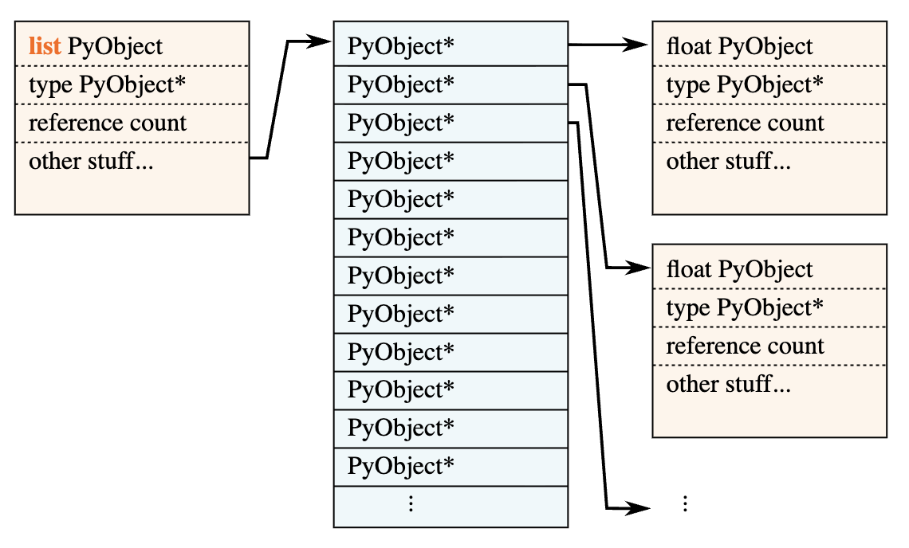
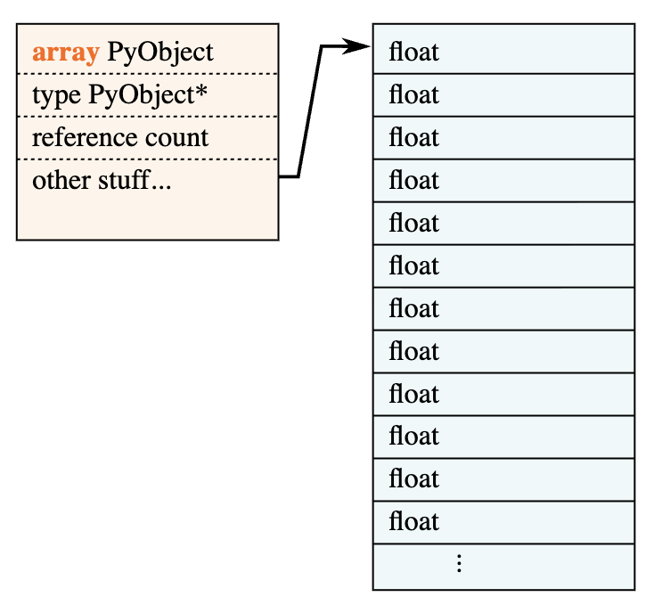
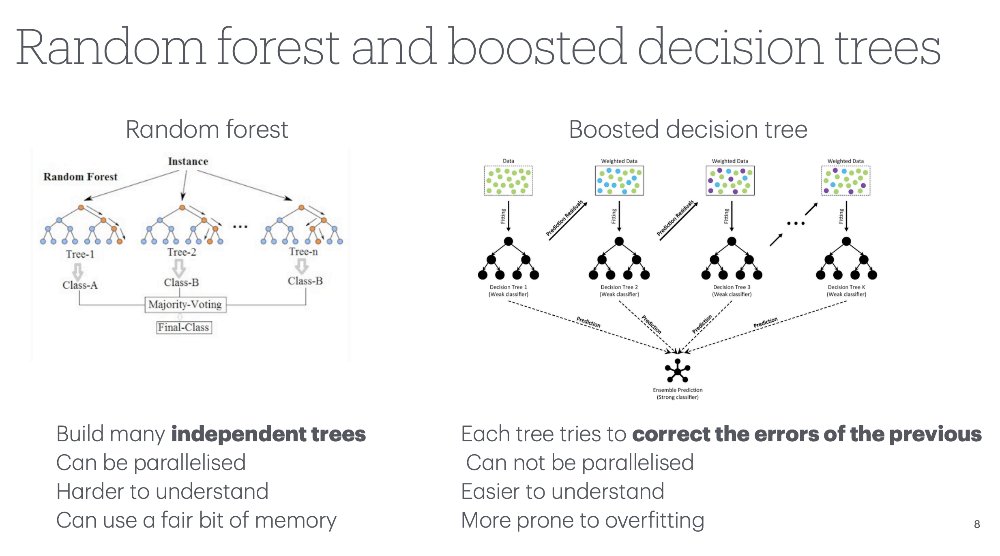
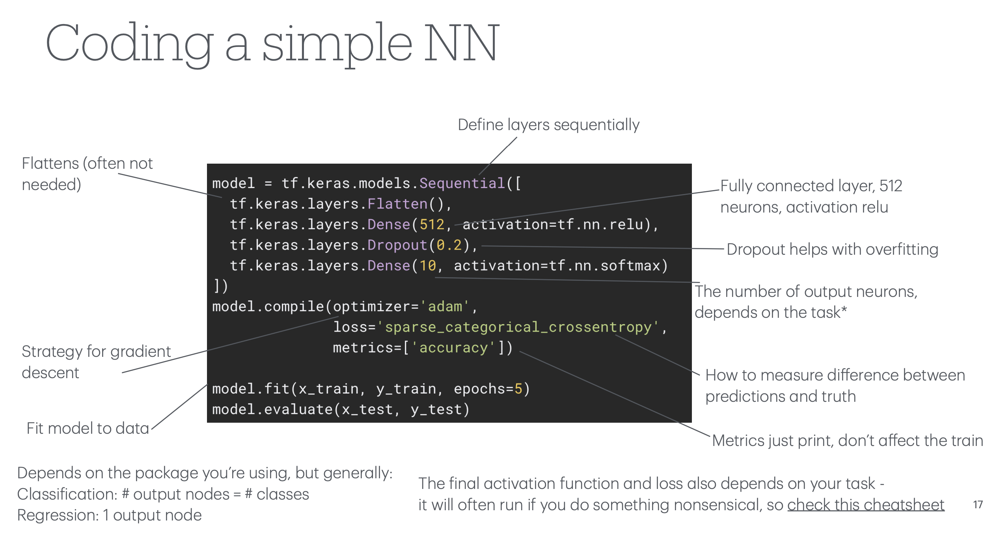
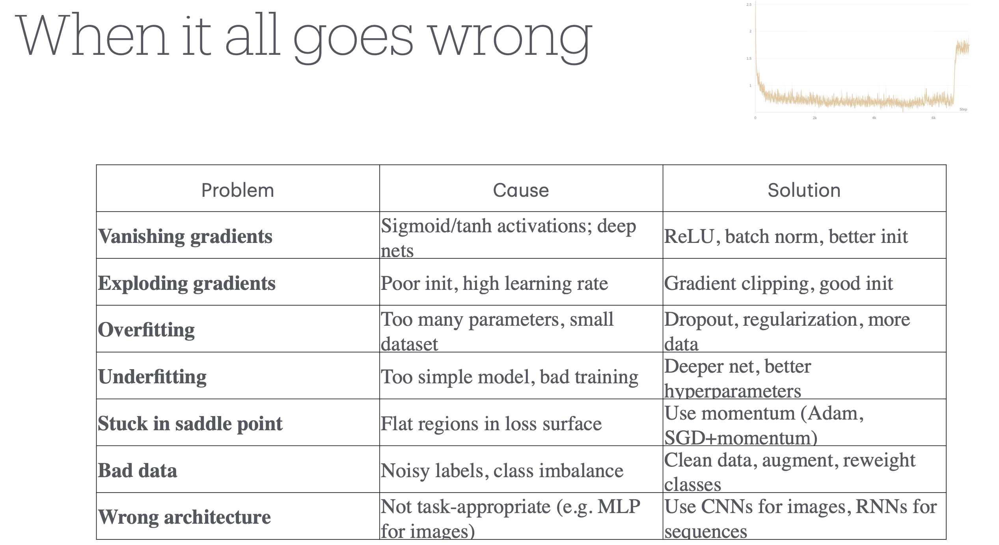

Disclaimer: These are rough notes from the workshop. You may or may not understand these. Also, some things might also be wrong below!

# day 2

## Array programing
~ by Henry

They are _styles_, and they're useful because they each bring different programming concepts into the foreground:

| Paradigm | Emphasizes |
|:-:|:-:|
| imperative/procedural | low-level algorithms |
| object-oriented | large-scale program structure |
| actor-based | temporal locality |
| literate | human instruction |
| event-driven | cause-and-effect |
| declarative | properties of desired result |
| symbolic | formula transformations |
| functional | data transformations |
| array-oriented | data distributions |

- APL: concise but hard to read
- array-oriented programming
- more important to have readable code than writable code-- because we read more code than we write
- https://hist.readthedocs.io/en/latest/user-guide/quickstart.html
- ufuncs : same dimensional array returned and element-wise operations. eg: sqrt, 
- Since all scalar → scalar operators (and scalar → scalar functions in np.*) are promoted to elementwise operations on arrays, any closed form expression duck-types between scalars and arrays.
- broadcasting
```
a = np.random.uniform(5, 10, 1000000)
b = np.random.uniform(10, 20, 1000000)
c = np.random.uniform(-0.1, 0.1, 1000000)

quadratic_formula(a, b, c)
quadratic_formula(a, 15, c)
```

- imperative: hard coding the elementwise operations

- `%%` magical operation in jupiter -- `%%timeit`
- 
```
%%timeit

output = [quadratic_formula(a_i, b_i, c_i) for a_i, b_i, c_i in zip(a, b, c)]
```

1.86 s ± 10.2 ms per loop (mean ± std. dev. of 7 runs, 1 loop each)

- array.flags --> OWNDATA=True
- array[-1:].flags --> OWNDATA=False (doesn't make a copy)


- type PyObjects* and float-- list layout in python and array in numpy





- https://blog.codingconfessions.com/p/cpython-object-system-internals-understanding
- https://docs.python.org/3/reference/datamodel.html
- https://realpython.com/python-memory-management/
- all objects points towards the globals()-- circular pointers
- type is an info of the python object

- reductions are not ufuncs

- 
```
from hist import loc

pv_hist[loc(0.2):loc(0.3), loc(0.3):loc(0.5), ::sum].plot2d_full();

pv_hist[0.2j:0.3j, loc(0.3):loc(0.5), ::sum].plot2d_full(); # --> only possible in hist not numpy
```

- moving from imperative(for-loop like thing) to thinking in an array programming way
- you have to use `&` for "and", `|` for "or", `~` for "not"--> better bcoz numpy needs bit-wise operators only; advantage for numpy
    - This is unfortunate because the comparison operation (`==`, `!=`, `<`, `>`, `<=`, `>=`) has to be surrounded by parentheses for the right order of operations.
    - `zmass_mumu[(e1_charge + e2_charge == 0) & (mu1_charge + mu2_charge == 0)]`

---

- parquet
- pyarrow
- 
```
> ragged[3, 1, -1, 2]
> ak.type(ragged)
ArrayType(ListType(ListType(ListType(NumpyType('float64')))), 4, None)
```

- ak.sum(events) --> works in awkward
- events.sum() --> doesn't work in awkward but works in numpy
- events.electron.deltaR --> extending awkward functionality via Vector

- In NumPy, there is strides and offsets to store the array-- in awkward arrays there is also start and stop in addition to that-- as some algorithms for awkward arrays are faster with using strides and offsets and some are faster with starts and stops.


- axis in array - how we sum along an axis and run operations across an axis and how is awkward arrays doing these things?
- maybe numpy can 
- https://playground.tensorflow.org/

---

[Nick] A note on numpy and memory allocations: one option is to try to maximize re-use of existing allocations, e.g.

```
%%timeit

tmp1 = np.negative(b)
tmp2 = np.square(b)
tmp3 = np.multiply(4, a)
tmp3 *= c
tmp2 -= tmp3
del tmp3
np.sqrt(tmp2, out=tmp2)
tmp1 += tmp2
del tmp2
tmp1 /= a
tmp1 *= 0.5
```

The performance of this is somewhere between the ctypes and simple numpy version 

---

## ML workshop
~ by Liv

- most important questions at the top of the tree -- we find that by entropy
- https://mlu-explain.github.io/decision-tree/
- introduce more trees to improve the results or different combination of weights
- random forest and boosted decision tree





- neural networks dataset 
- double decent: https://arxiv.org/pdf/1806.07572
- Pytorch lightning




- bridge pooling, max pooling-- if something too big
- feature engg. -->  one-hot encoding
- physics informed NN: put info in loss function
- no-free lunch theorem: CNN can be used for 
- use neural networks-- have data-- what can i do with it?
- hep ml living review: https://iml-wg.github.io/HEPML-LivingReview/

- talked to David and Peter about the SciPy India and their experiences conducting HSF-India workshops. 
    - LIGO India -- for gravitational waves-- new one in Maharashtra
- upcoming nice hackathon in hyderabad : https://indico.cern.ch/event/1580053/

- https://inspirehep.net/

- https://github.com/anujraghav252/H-to-WW-NanoAOD-analysis
