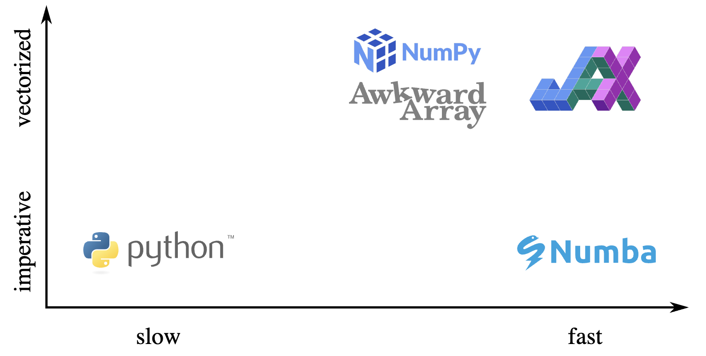
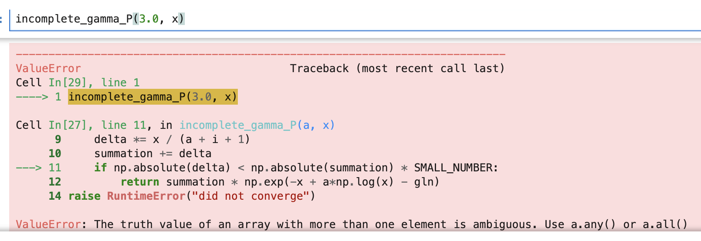
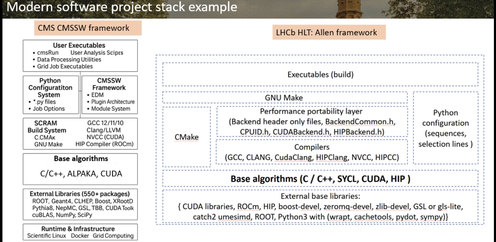
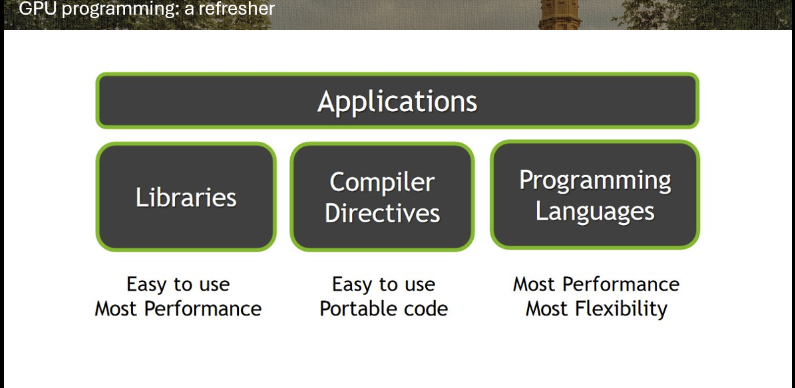

Disclaimer: These are rough notes from the workshop. You may or may not understand these. Also, some things might also be wrong below!

# Day 3

## scaling
~ Henry

- `!cc quadratic_formula_c.c -shared -lm -o quadratic_formula_c.so` --> compiling code in linux
    - to use the above file use ctypes library(python library)
    - 
      ```
      import ctypes

      quadratic_formula_c = ctypes.CDLL("./quadratic_formula_c.so")
      quadratic_formula_c.run.argtypes = (ctypes.POINTER(ctypes.c_double),) * 4
      quadratic_formula_c.run.restype = None
      ```

- due to memeory second one is slower-- creating and deleting a lot of arrays takes time
    ```
    quadratic_formula_c.run(*[arg.ctypes.data_as(ctypes.POINTER(ctypes.c_double)) for arg in (a, b, c, output)])

    (-b + np.sqrt(b**2 - 4*a*c)) / (2*a)
    ``` 

- best way to make c++ extensions for python - pybind11
- `@nb.njit` , `@jax.jit`, `@nb.vectorize`
- jax uses a funtional programming pyradim
- Numba is more of a vectorised -- parallelism not considered


- 


- on GPUs, bookkeeping is often more costly than just doing the thing for everything; Tricky bookkeeping usually isn't helpful—it's usually better to let array-oriented code do unnecessary calculations than try to keep track of which calcuations are necessary. But imperative code lets you do exactly what you want.

---

## GPU 

- 
```
void CPUFunction()
{
  printf("This function is defined to run on the CPU.\n");
}

__global__ void GPUFunction()
{
  printf("This function is defined to run on the GPU.\n");
}

int main()
{
  CPUFunction();

  GPUFunction<<<1, 1>>>();
  cudaDeviceSynchronize();
}
```

- `helloGPU<<<2, 4>>>();` --> 2 blocks, 4 threads
    - each block has same number of threads --> for easy parallellisations
        - GPUs mostly have embarassingly parallel stuff

- The `__global__` keyword in CUDA C++ is used to declare a function that runs on the GPU and is called from the host (CPU) code using a kernel launch syntax, such as `kernel<<<gridDim, blockDim>>>()`. A function declared with `__global__` is also known as a kernel, and it is executed by multiple threads in parallel, with each thread having a unique thread ID accessible via built-in variables like threadIdx. The execution of a `__global__` function is initiated from the host, and the number of threads and blocks is specified in the kernel launch configuration.

- Amdahl's law
- task and data parallelism(SIMD--)
- concurrency --> non-ordered, scheduled fairly
- parallelism
- lock step
- parallel but not concurrent -> simd
- GP-GPU (general purpose gpu)
- gpu functions - aka- kernel





---

## Dinner discussions

- nice and insightful talk with Kiran didi:
  - working in cyclotron lab
  - learned about how the pipeline for using a detectors work-- request/proposal with the specific experiements a researcher wants to perform and the type of things they want to detect and then it takes really long time to get the results back from the detector.
  - works with fortran code mostly--
  - talked a bit about what scipy india could do for them? -- workshops like these and support after workshops as well if they face any difficulties in the future-- Soni didi and Katyayni didi also said the same thing earlier in the day.
  - felt quite empathetic towards physicists-- and it was really nice to be around like-minded physics people :)

---
