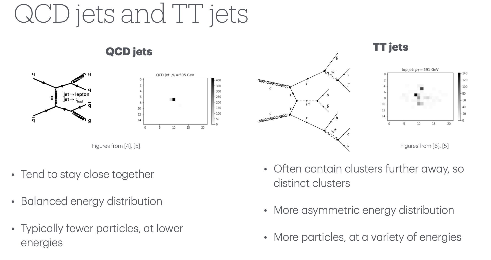

Disclaimer: These are rough notes from the workshop. You may or may not understand these. Also, some things might also be wrong below!

# Day 4

## ML hackathon
~ Liv

- QCD
- if loss function is going up after going down--> highly likelihood of overfitting
- ROC curve

- very often we have more background than signal
- 

- related to Soni didi's research -- software for ML fitting of jet peaks-- ignoring background; LAMPs:
    - https://www.tifr.res.in/~pell/lamps.html
    - http://www.ambar-chatterjee.com/DAQ2022/index.htm
    - http://www.ambar-chatterjee.com/

- https://poloclub.github.io/transformer-explainer/
- 

- 

  - key and query makes a correlation matrix and heads are different weight matrices adn the weight matrices gets combined at the end and fed into a neural network and GD, etc.
  - num_head --> is the weight matrix
  - value is the actual value of the words
  - embeddings ; meaning and context of a word

--

- ensemble learning- combines multiple models to create a more robust predictor.
- learning rate -- influence models a lot-- because it determines how fast you go around the feature space

- The ideal relationship between training accuracy and validation accuracy is that both should be high and close to each other, indicating that the model has learned the underlying patterns in the data well and can generalize effectively to unseen data.

- https://geant4.web.cern.ch/

- histograms are important in HEP
- ortec detector

  
  

---

from discussions on hardware modules with Soni didi:

  
  
  

---

- anam-ai projects iit ropar ANNAM.AI – CoE under Ministry of Education

- https://agenda.infn.it/event/47944/
- https://garfield.web.cern.ch/garfield/
- fullSimLight is a simulation program with a command line interface that uses G4 as the simulation engine. It was developed within ATLAS.

- geomodelexplorer- fullsimlight GUI
- gmex- geometry explorer --> to look into the detector in animation-- zooming in too much- at the particle-level view-- going into inner and inner layers
    - https://geomodel.web.cern.ch/home/fullsimlight/gmclash/
    - https://homepages.gac.edu/~hvidsten/gex/index.html

- delta rays? -- muons
    - delta rays are the major source of background
- fullsimlight
- calorimeter
- accordian shaped simulator (from monday talk by Verena-- 2nd image in day1 blog)-- takes most computing resources -- we saw in the simulations (in the bottom right corner)

- high renuality calorimeter?

- gmgeantino

- https://geant4.web.cern.ch/docs/advanced_examples_doc/index#purpose

- minimum bias event: In high-energy physics (HEP), a minimum bias (min-bias) event refers to a data sample collected with the fewest possible selection cuts, essentially capturing the most inclusive set of proton-proton or proton-antiproton collisions. This means the data sample is not biased towards specific, rare, or high-energy processes, but instead includes a broad range of interactions, including those with low transverse momentum and low particle multiplicity.

- trt- 
- atlas - silicon detector

- helix : low energy particles
- 200 events together-- with new accelerator

- cintalator
- does geant4 take in any data to create the simulation? or has any pre-built-in models or something

- A3D3 postdoctoral fellowship

