Disclaimer: These are rough notes from the workshop. You may or may not understand these. Also, some things might also be wrong below!

# Day 5

## ML notebook presentations

- a lot of binary trees to start with means a lot of parameters and higher loss to begin with and hence longer to time to train

---

## environments and packaging
~Henry

- microsoft terminal: CLI11
- binderhub--> environments and hardware given 

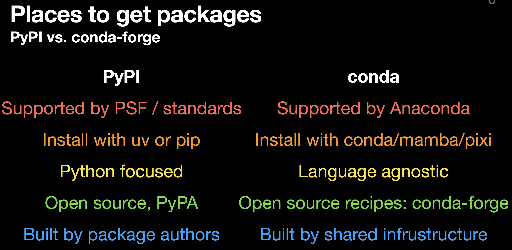

- installers and distributing packages
- brew, etc. - third party package management
- 

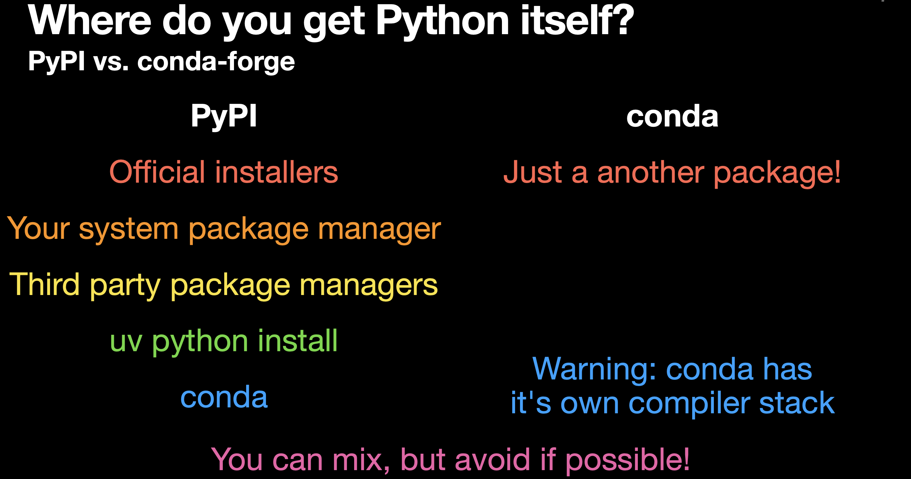
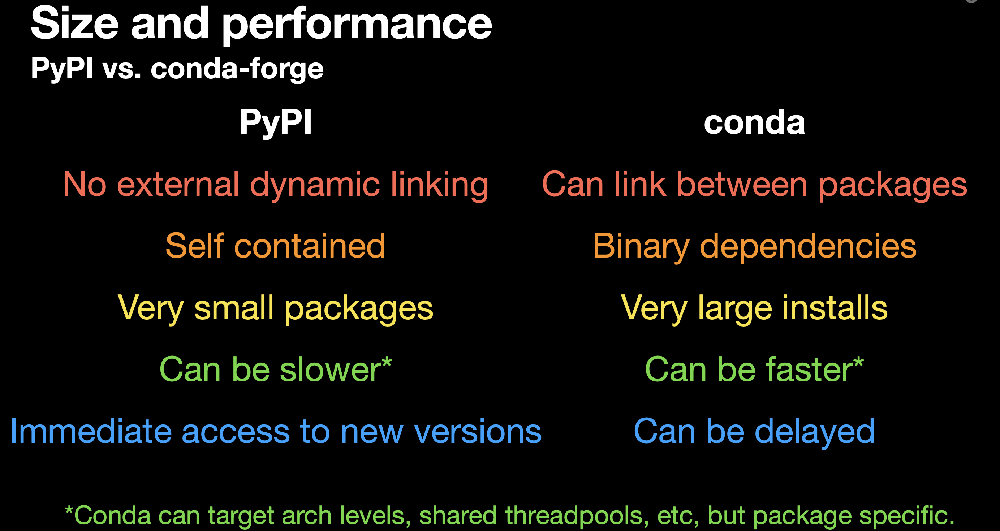

- Conda faster -- could support GPUs
- ROOT: on conda, not pypi
- install compliers package-- don't use your system's complier

- 
  - conda: also slow
  - mamba: uses CLI11
  - pixi: only high-level; conda and mamba is low-level

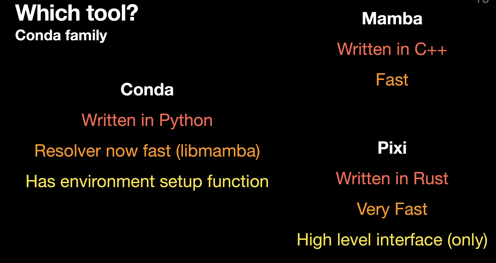

- conda-forge channel: open-sourced, conda-default channel have to pay to anaconda
- 
  - awkward is on conda-- just for example installed by pip here
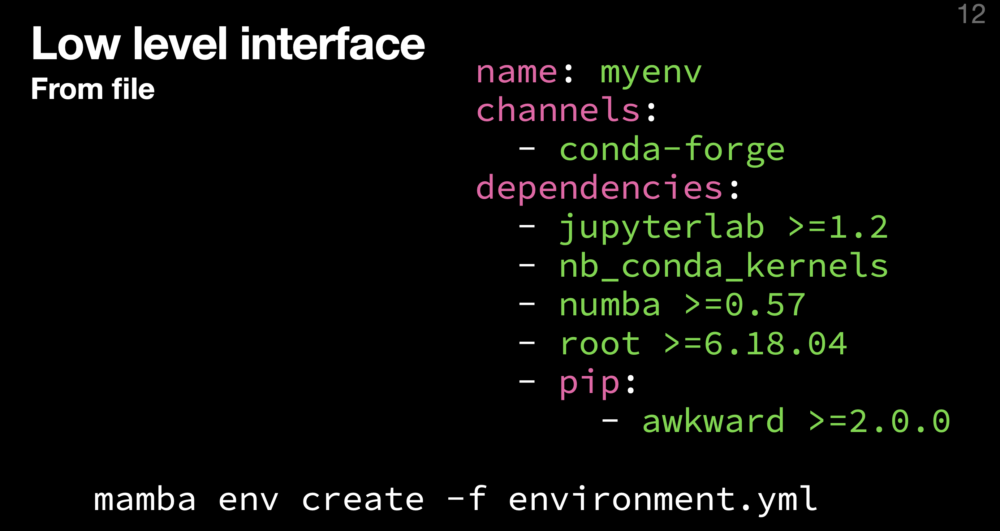

- reproducible env: 
    - standard solution: lock files
    - limiting date(pixi and uv has something like this)-- some tools offer this
    - high level tools makes this easier

- pixi init --> creates a pixi.toml and lockfile (pixi run task)
    - platforms-- locks for given platforms

### Lower level interface

- pixi is considering a lower level now-- uv started with low level
- uv: caches quickly-- designed around performance

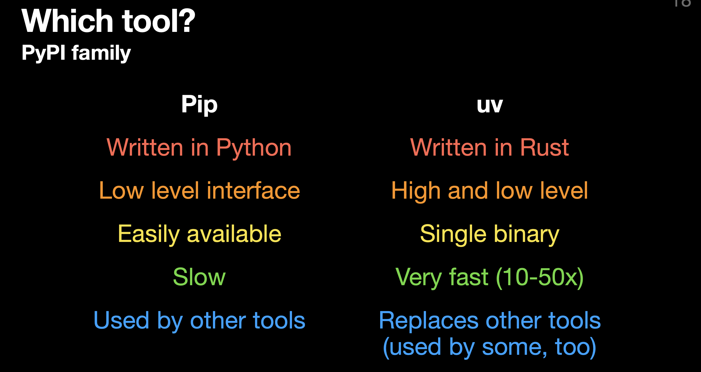

- uv defaults to `.venv` environment name-- can activate package after `uv pip install`
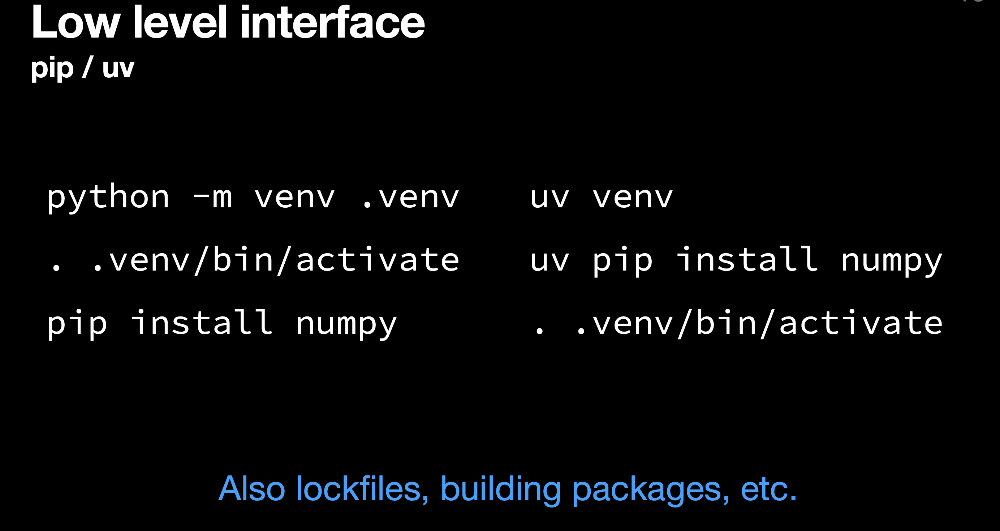

- python virtual env looks like a mini-operating system
- uv is just a single binary- could be installed via brew

- uv's high level interface is similar to pixi's interface(pixi is high level)
- 
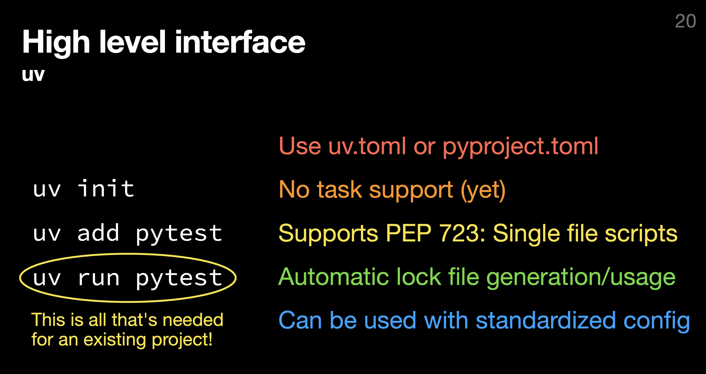

- pip install doesn't give lockfiles

- PEP 723 

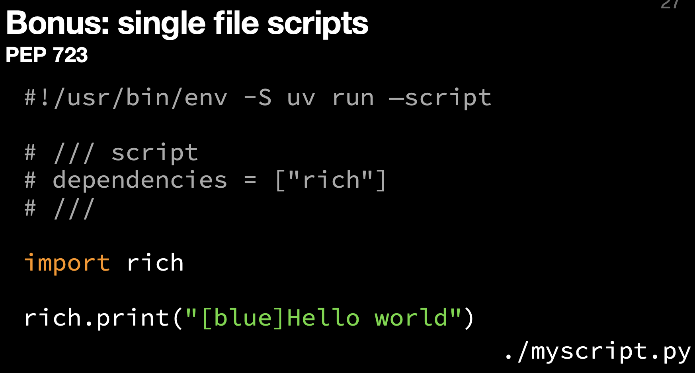

- pixi and uv both install PyPI application
    - pipx :: uvx
    - download the package in a separate environment-- expose/run just the executable
    - tools included globally and isolated
    - `pixi tools`, `pixi global`

- expects to run from outside-- doesn't install anything: uv
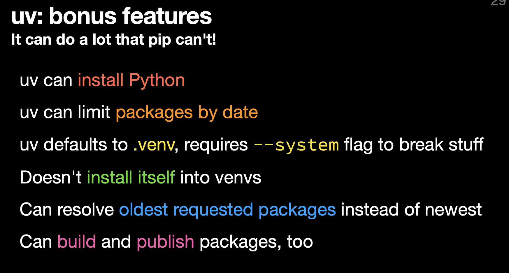

- pixi made task runners obselete-- might happen with pip in a few years
- ty: very new type checker

- `uvx cookiecutter gh:scientific-python/cookie` --> installs and runs the cookie cutter repo

---

## GEM detector and cyclotron lab visit

  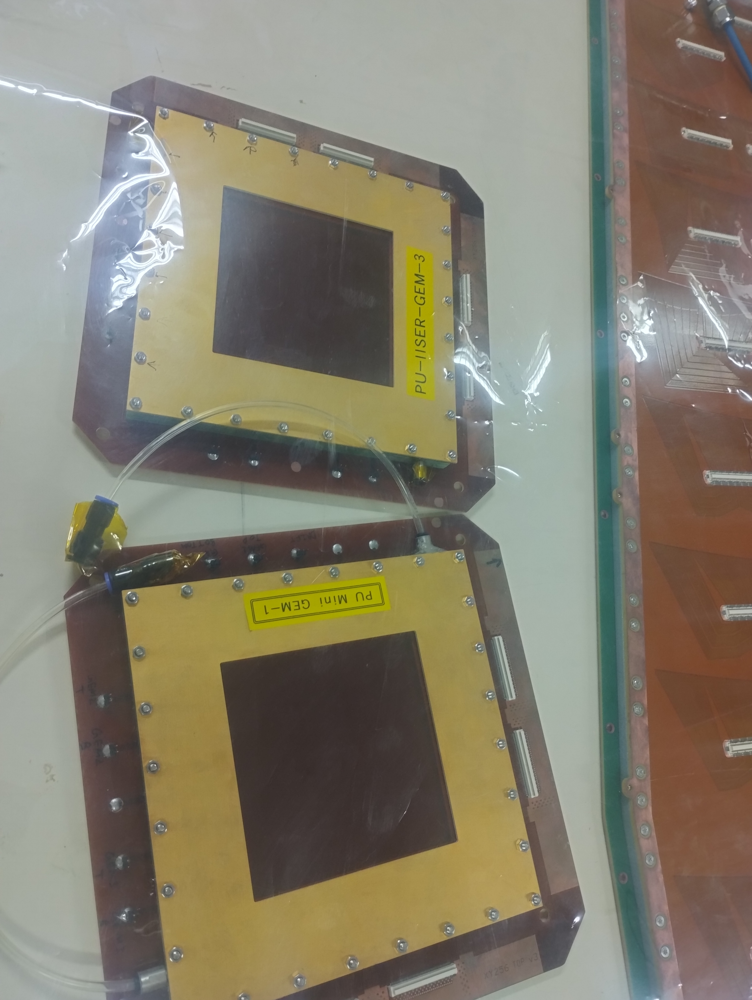
  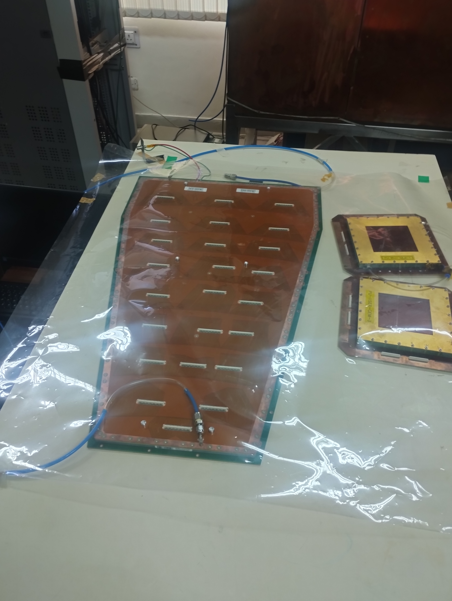
  

  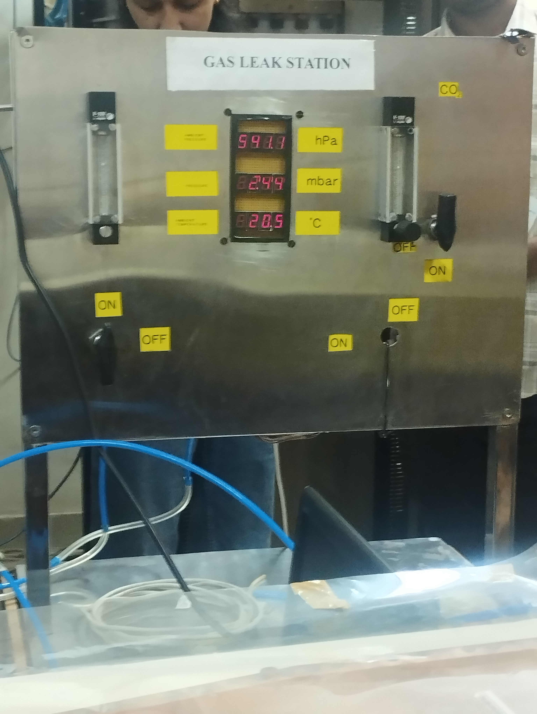
  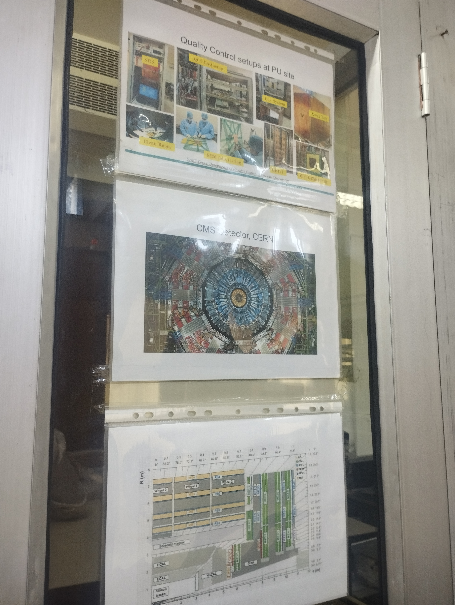
  

- cyclotron lab--> cooler outside and inside there is light beam getting defleected and accelerated.
- argon gas passed in the space and then radiation goes in and breaks into electrons(which gets passed detected by the copper and space layer and reacts with the argon and then leaves a tragectory)-- detector used in the chamber.
- delhi university also have a detector lab like this

---

## Pics from chandigarh

  
  
  

  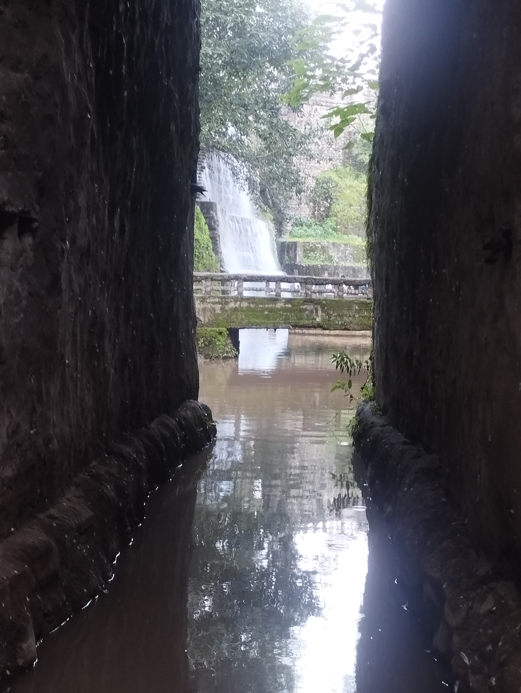
  
  

  

---

Thank you :)
