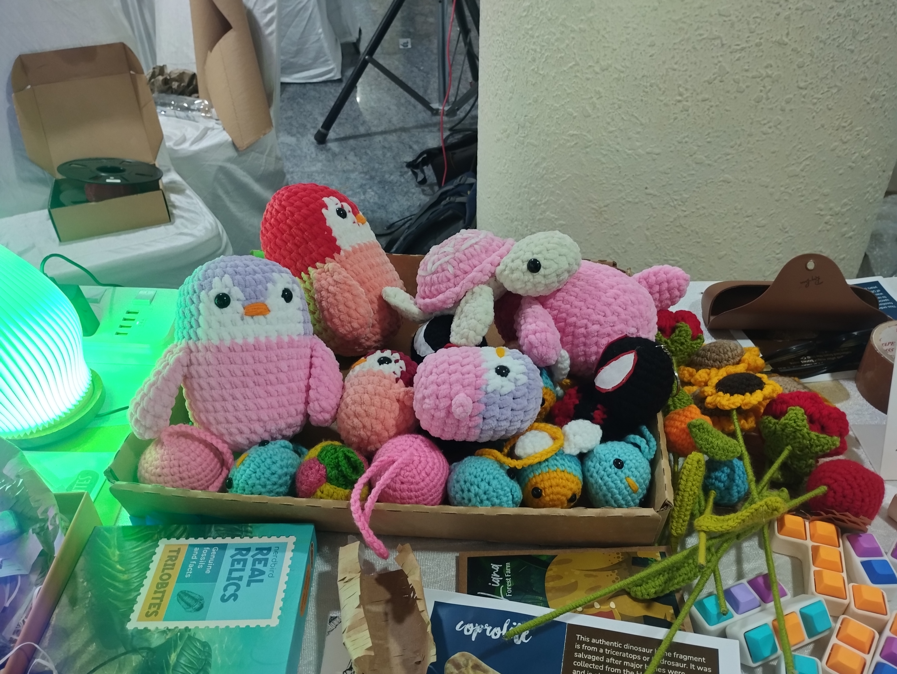
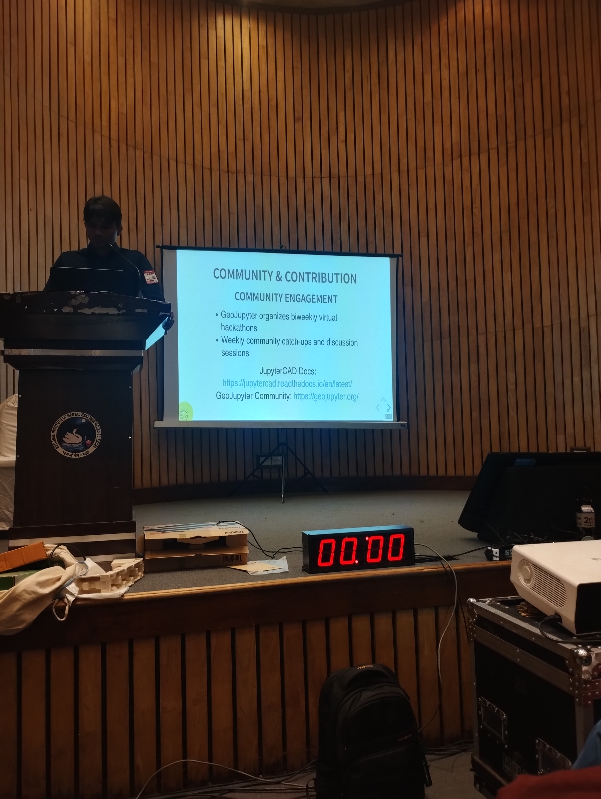

# [WIP] IndiaFOSS 2025 blog/notes

## Day 1

Nice talks!

- Arizona university professor —> motion: https://github.com/Mesquite-Mocap/
- conf conf : conference for conference organisers; fosdem
- High court judge talk: red-hat server, RSS feed for judgement updates, linux, apache tomcat
    - Allahabad HC
    - Ubuntu and linux difference(linux better)
    - Judicial officer? Are given laptops
    - libre office (open version of Microsoft office)
    - means are more important than the end
    - R v IRC Expert Rossminster Ltd 1979 (3) All ELR 385 
        - "Good end does not justify bad means" ; lawful means are fundamental
    - Consolidate your strong points(4 races; tortoise wins, hare wins, path with river— tortoise win, one on top of other— end the race faster— changing the definition of winning)
    - Make love not war
    - Originality is always copied
    - Biography of linux—by ??
    - making audience speak the main message of your talk
    - Compliance? SBOMS
    - DELL - linux laptops-- not alot of people to fix these laptops
- Don't underestimate the dumbphone: an introduction to the KaiOS ecosystem
- panel
    - Neha — frappe (Audi 1 talk)— panel
    - employees making contributions Vs unpaid contributions 
    - https://floss.fund/ , https://fundingjson.org/ , https://nlnet.nl/propose/
    - fair source
    - Foss pledge
- Librefin UPI app
    - 52 Labs: 2023 india foss talk to introduce this
    - call for hackers
    - All UPI apps uses-- Common library
    - PSP API, UPI Lite, UPI LiteX, UPI circle
    - sec 52(1) (ab) of the copyright act; legal and security
    - decompile, spec, implement, debug
    - cron jobs to pay rent
    - financial freedm > ackwoledgeed risk 
    - CommonLibrary WASM demo
    - get challenge and get credential
    - CL string
    - NPCI
    - Reverse engineering?
    - other UPI apps?
    - WASM
- https://wellfound.com/jobs
- https://www.behance.net/manasamurari
- struddle-- fun talk!
    - https://md.itihas.xyz/s/oJMD38aKT#
    - https://strudel.cc/learn/getting-started/
    - https://strudel.cc/
    - Cm# B A B
    - humanizing using late() and early()
    - motion parameterisation: e.g. phone up and down to control the pitch and intensity of the music piece
    - high heart?
    - euclidian rythms
    - hcf on beat: cubian rythm-- because it doesn't divide so sounds lop-sided
    - hydra - generatives visualisations
    - https://flok.cc/s/petite-peach-spoonbill-7e80d116
    - $ 
    - https://kaustubh.page/
    - https://azan-n.com/

- it was nice to finally meet Sanket and Arjun in-person :)
    - murders in delhi project
        - unique stirations pattern on bullet and shell (by hammer) -- can detect which murders happened from the same gun
        - microscope image cleaning of hammer imprints
        - got project via smart india hackathon
        - deep learning model -- dissimilarity facetor
        - NumFOCUS EU?
    - simular 
    - Xtensor

---

## Day 2

- first half of the day spent on managing the FOSS in Science devroom and second half went into visiting booths and talking to people
- FOSS in Science devroom
    - CAD and GIS talk-- really nice talk with lots of interesting demos :)
    - Zarr 
        - interoperability, extensibility and high latency storage
        - office hours
        - zarr - V3 spec-- sharding and extensibility - https://zarr-specs.readthedocs.io/en/latest/v3/core/index.html
        - store-- ABC store
    - feedback on dispatching talk: have less text and slides; illustrations over text; instead of putting all text on slides-- write less text and explain slides by speaking-- because people try to read the text -- and less attention is to what's being spoken.
    - https://core-stack.org/use-apis/
    - https://airflow.apache.org/docs/apache-airflow/stable/core-concepts/dags.html
    - codec entry point -?
- met Anand
    - flashbacks from Anand's string art booth at RootConf 2025

        

            
            
            
        

    - he showed his flexing cube-- he let me and Ishaan play with it for a while :)
    
        

            
        

    
    - It was similar to the cube below, but when we folded it, the faces turned out to be triangular rather than parallelogram- or rhombus-shaped, as in the following cube flexing thing (also Anand's flexing cube had a peacock feather pattern on one side and some orange pattern on the second and some blue galaxy-like pattern on the third!)

        

            
        

    - and then i showed him my cube puzzle after the conference (this array of small cubes(connected by a red elastic string, going through each small cube) needs to be put together so that they form a 3*3 cube)
    
        

            
            
            
        

    - it is supposed to look like this :

        

            
        

    - https://cfl.in/
    - https://github.com/anandology/stringart-templates/blob/main/main.py

- Ishaan let me draw stuff at his booth :) Later I also tried Inkscape myself to make this colorful version of the networkx logo:

    

            
    

- scan code, gardener booths, dwani, story telling booths
    - https://dwani.ai/
    - https://en.m.wikipedia.org/wiki/SAP_ERP
    - https://bio.link/gardenercloud
    - https://github.com/aboutcode-org
    
- Absurd industries booth -- fun stuff!
    - https://absurd.industries/
    - https://github.com/balub/CoryDora

    
     
    
    
    

- https://www.mosdac.gov.in/
- https://www.gojek.io/
- https://zerodha.tech/projects/
- https://compilertech.org/schedule

- someone using networkx for visualisation of disease and people (bharat fellowship person); and garderner booth person also told he used networkx in college for something--
- parv app -- communication app-- in playstore
- https://github.com/couchbase/indexing -- varuni working (worked) on this
- I didn't know open source projects could also set up booths at indiafoss-- next time I think I'll also submit booth proposal for a scientific python booth 

---

## Snaps from the conference

  
  

  
  
  

Thanks for stopping-by :)
