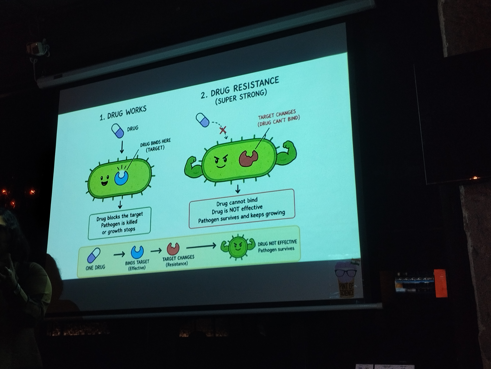
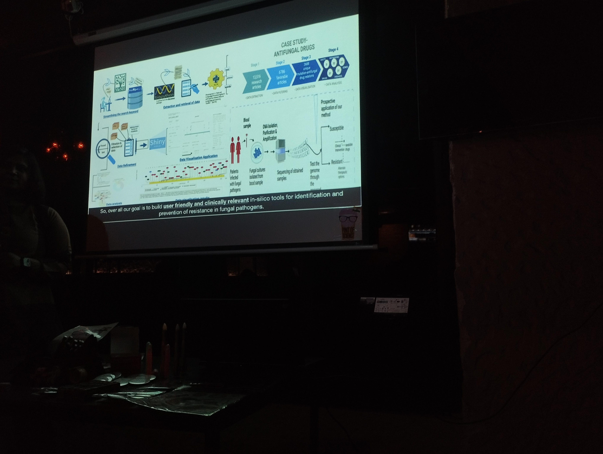
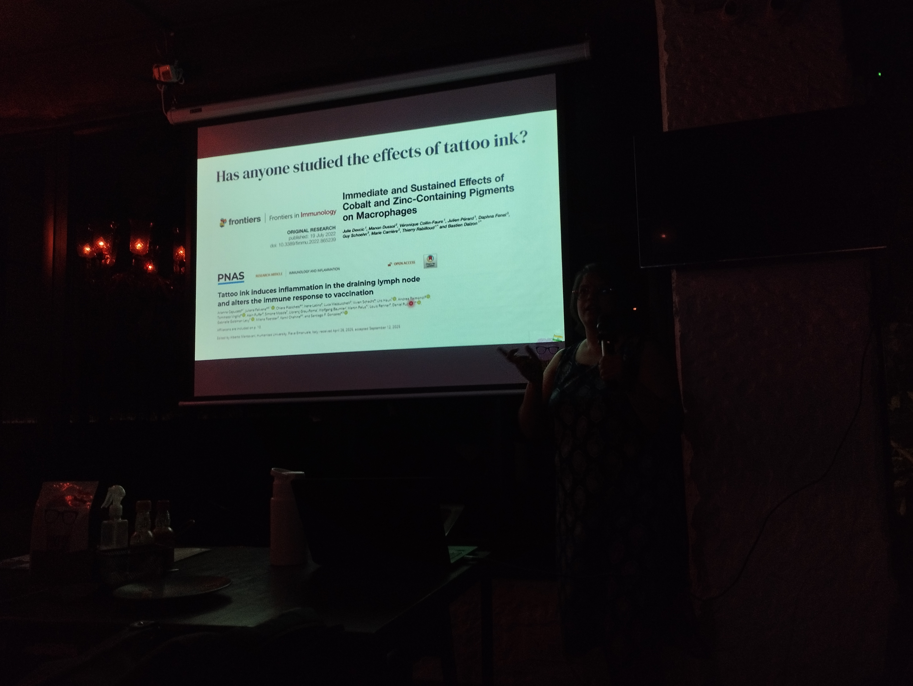
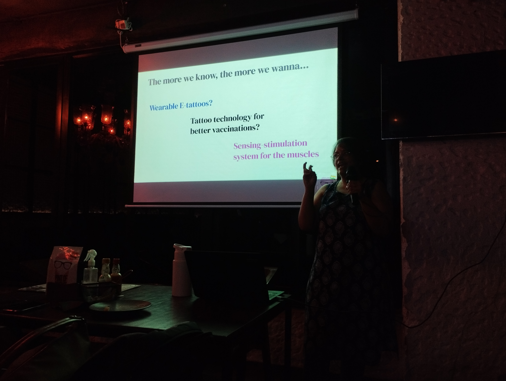
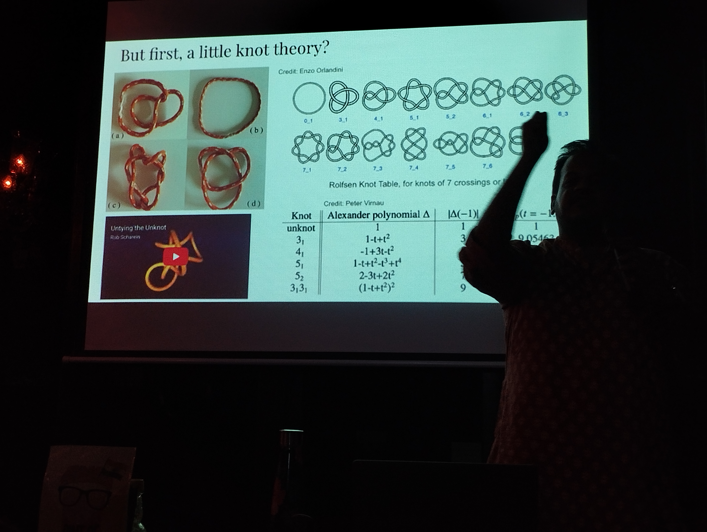
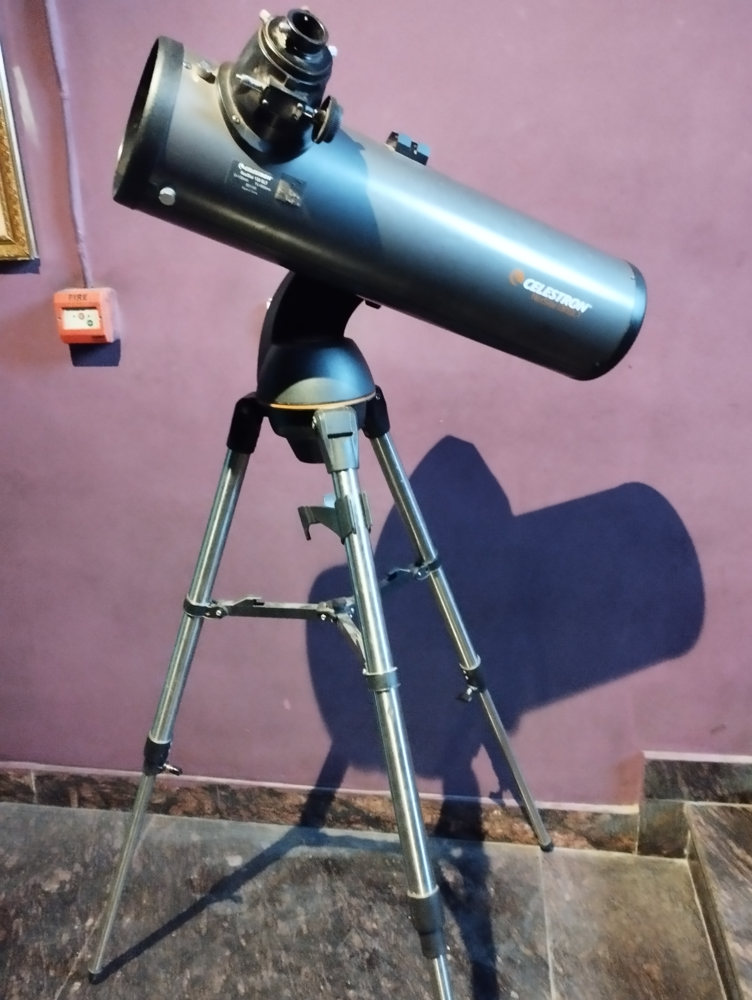

# [WIP] Pint of Science 2026 - New Delhi

**Disclaimer:** These [rough notes](./rough_notes.pdf) are for my reference; probably won't be understandable by everyone. Not written with general public in mind. Also everything in these might not be correct-- and probably lots of spelling mistakes as well!

## Day 1

  

  

for talk 2 i didn't click any pictures but it was quite interesting and interactive! See rough notes for more.

## Day 2

  

  

  

## Day 3

The talk on stars was nice!

  

