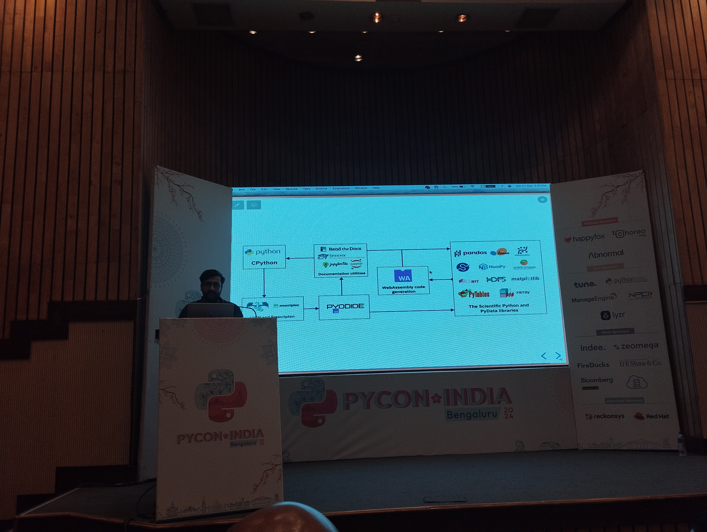

# [Draft] PyCon India 2024

### 21st Sept, 2024 to 23rd Sept, 2024

## Day 1

In the breakfast we got really nice-thick and crispy Dosa-s and there was also some melon-y milk kind-of drink that was also really nice <3

booth: physics experiments, mother board and stuff: SEELab3 app 
<table>
    <tr>
        <td></td>
        <td></td>
    </tr>
</table>

Lunch was a bit of a dilemma—- pyladies exclusive lunch. and you can't be at both the lunches-- on different floors. Could have set up the lunch coupon counter so that people can go to both floors instead of choosing one of them. I was conflicted about attending the PyLadies-exclusive lunch since it meant missing out on conversations at the general lunch area. Btw, food was great!

people from pydelhi and Sebastian encouraged me to give a lightening talk and also said that I should mentor other people.

pyodide session
<table>
    <tr>
        <td></td>
        <td></td>
    </tr>
</table>

Apart from the great talks, meeting and talking to people was the nice part :)

Towards the end, it was raining and we all stood near the big glass window talking about random stuff-- and I was zoning out in the nice Bengalore weather <3

## Day 2

Mars lee's keynote was fun, engaging, insightful and inspiring, and I thoroughly enjoyed it, and it really encouraged me to give a lightening talk

lightening talk - Mars lee came to see it(she was sitting in the first row)! I showed her my comics...

_Thanks Ishaan for the picture_

I spent most of the day with Somashree..

I also attended a comic-making workshop led by Mars Lee, where we all created small comics about how we got started in tech/open-source/python!

- cython session
<table>
    <tr>
        <td></td>
        <td></td>
    </tr>
</table>

- sunpy talk
<table>
    <tr>
        <td></td>
        <td></td>
    </tr>
</table>

## Day 3 : Sprints

NetworkX sprints discussions: anti-money laundaring graph algorithm-- used by banks; de shaw- quansight's customer, use networkx's graph object to store their financial stock data; discussions on a GNN backend for networkx; and many more discussions.

NumPy sprints:

During lunch- talked with Sebastian and Mars Lee about how their conducting the sprint experience was like, there were a lot of common things like most of our interested contributors wanted an issue that they could fix by the end of the day (which Mridul did tell me but I didn't think it was true, I believed people would want to take on long-term issues and stay connected) and we had a lot of discussions on how could the barrier to contributing to numpy could be lowered for people who are just starting out and how numpy doesn't have "good-first-issue" label but instead have "sprintable". I made [this PR](https://github.com/numpy/numpy/pull/27469) related to those conversations. One interesting (and very useful, I think) thing I got to learn was that we can skip some CI tests in numpy by adding some info(like, `[skip actions]`) in our commit messages (more info on this - [here](https://docs.github.com/en/actions/managing-workflow-runs-and-deployments/managing-workflow-runs/skipping-workflow-runs)). I didn't know commit messages could be used like that. I wonder what else is possible to do with commit messages!

during lunch - talked to mars lee, discussed a lot about making comics, some useful resources she shared: 
- https://en.wikipedia.org/wiki/Making_Comics
- https://archive.org/details/UnderstandingComicsTheInvisibleArtByScottMcCloud/page/n19/mode/2up
- https://store.wizardzines.com/products/how-git-works
- https://search.brave.com/images?q=binary%20tree%20search%20comic

Later she also called me an "artist", which was really nice of her :)

nice talk with the person who was conducting zulip sprints.. Inviting(Forcing :D) Sebastian to come to the conference, was me trying to share some parts of the experience that I had at EuroSciPy with everyone, I guess... 

Ratan was around except he went for django sprints for sometime. made 2 PRs, gcd problem- water gallon problem- can be solved from graphs:

- his website on DSA and graphs
- https://tor-https.eff.org/

I met chandan from python pune and he knew ratan, they worked in the same company.

talked to Sayan, one of the organisers, about his work on flatcar and some other talk with sayan, sebastian and Sakthi.

