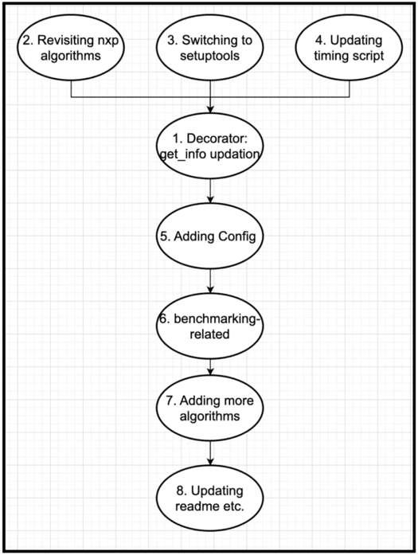

# GSoC’24 Proposal - NetworkX: Revisiting and expanding nx-parallel

## - By Aditi Juneja([@Schefflera-Arboricola](https://github.com/Schefflera-Arboricola))

## 1. Abstract

nx-parallel is a newly added parallel backend for NetworkX. This proposal goes over how nx-parallel can be improved and expanded. Currently, most of the implementations in nx-parallel use the default parallel configurations of [`joblib.Parallel`](https://joblib.readthedocs.io/en/latest/generated/joblib.Parallel.html). However, adding a config manager to allow users to play around with these default config parameters, like `n_jobs`, `backends`, `verbose`, `batch_size`, etc. would heavily enhance the nx-parallel project by increasing its usability. A second goal of this project is to revisit the current ASV benchmarks and improve them so that they run within a reasonable time. Other benchmarking goals include adding benchmarks for more parameters like `n_jobs` i.e. the number of CPU cores, running all benchmarks in GitHub workflow and hosting them for future reference, and adding more benchmarks on SNAP datasets. Apart from config and benchmarks, other smaller revisiting and expanding goals include, improving the timing script used to generate the speedup heatmaps, revisiting previously added algorithms for improving speedups, adding more algorithms, adding get_chunks to existing algorithms, using setuptools instead of hatch to build nx-parallel, adding and updating scripts to automatically update the get_info function, handling functions whose sequential implementations are already really fast and/or their parallel implementation don’t show any speedups, and expanding the current README and Contributor’s guide, etc. The proposal also contains some more ideas that could be played around with if in case all the proposed things are achieved well before the final week of the internship.

## 2. Technical details

1. Decorator that does the following:
    - The issue of nxp’s additional docs not showing up on Networkx’s docs website is resolved by [PR#57](https://github.com/networkx/nx-parallel/pull/57) by adding a script that we need to run manually. But, draft [PR#55](https://github.com/networkx/nx-parallel/pull/55) proposes to automatically update the `_nx_parallel/__init__.py` file by adding it to pre-commit. But, there are various issues with this approach as well as discussed in the PR conversations. So, probably I’d not use pre-commit but instead, take some inspiration from how nx-cugraphs does it. (From automation issue: [comment](https://github.com/networkx/nx-parallel/issues/62#issuecomment-2102256774))
    - Revisiting how we should `name` functions with a different name while dispatching. The proposed changes in [PR#32](https://github.com/networkx/nx-parallel/pull/32) let users use nx_parallel as a package(as explained in the PR’s desc) but it breaks the way nx-parallel currently creates the `get_info` function and how it automatically generates the algorithms list in the `README`. (ref. [PR#56](https://github.com/networkx/nx-parallel/pull/56),  [PR#32](https://github.com/networkx/nx-parallel/pull/32)) (add "name" parameter to the above decorator)
    - Having a decorator or something else for automatic graph conversion, instead of checking and converting the graph in all the functions, like this:

        ```.py
        if hasattr(G, "graph_object"):
            G = G.graph_object
        ```

    - [this might not be in the same decorator, but will be a different decorator] Handling functions in nx-parallel that don’t show any speedups for the random graphs we use in the current timing script or whose sequential networkx implementation is already really fast(`number_of_isolates`, `all_pairs_shortest_path_length`, `global_reaching_centrality` and `local_reaching_centrality`). Like experimenting with bigger chunk sizes, using something like `should_run = False`([PR#7257](https://github.com/networkx/networkx/pull/7257)), or adding a note in the docs about it.

2. Revisiting nx-parallel algorithms(PR#63):
    - Revisiting some of the older functions like `tournament_is_strongly_connected` and `tournament.is_reachable`, because like `global_reaching_centrality` (ref. [PR#44](https://github.com/networkx/nx-parallel/pull/44)) they also call `joblib.Parallel` within a `joblib.Parallel` call and that’s probably why they take a lot of time. So, experimenting with the chunk size and/or reducing the levels of parallel processes or letting the user decide that, or trying experimenting with different joblib’s backends, whichever way would seem to give the best speedups. (ref. [ques](https://stackoverflow.com/questions/78016770/why-does-recursively-running-joblib-parallel-increases-the-computation-time))
    - Adding get_chunks kwarg to the 5 algorithms(`number_of_isolates`, `local_efficiency`, `closeness_vitality`, `is_reachable` and `tournament_is_strongly_connected`) in nx-parallel that currently don’t have it and adding additional tests for the same. (like done in [PR#29](https://github.com/networkx/nx-parallel/pull/29) for `betweenness_centrality`)
    - Revisiting the automatic generation of extra docstring, because it has really rigid rules(ref. [Docs syntax - nxp's Contributing guide](https://github.com/networkx/nx-parallel/blob/main/CONTRIBUTING.md#documentation-syntax)). Try to keep them aligned with the Sphinix docstring rules, as much as possible.
    - Updating the `ParalleGraph` object. Currently, nx.Graph object needs to be passed in `nxp.ParallelGraph()` to create a parallel graph instance and something like `H = nxp.ParallelGraph()` gives a `TypeError: ParallelGraph.__init__() missing 1 required positional argument: 'graph_object'`. Various operations on an `nx.Graph` object, like, [`add_weighted_edges_from`](https://github.com/networkx/networkx/blob/76c3e9bc00fb7d159b00e4c71c7274d185fcb254/networkx/classes/graph.py#L1049), [`clear_edges`](https://github.com/networkx/networkx/blob/76c3e9bc00fb7d159b00e4c71c7274d185fcb254/networkx/classes/graph.py#L1542), etc. could also be parallelized but then using such a `ParallelGraph` in nx-parallel’s parallel implementations might lead to the same issue of slowing down because of too many parallel processes, as mentioned in the 2nd point of the “Things to revisit” section.

3. Switching to setuptools

    Using setuptools instead of the currently used hatch for building nx-parallel. As nx-parallel grows and matures it’d be better to use Setuptools because of its better feature support, flexibility, compatibility, and interactive capabilities as compared to Hatchling.

4. Updating timing script

    having consistent heatmaps and improving the timing script, seeing how the timeit function works, and if that will be an appropriate choice (ref. [issue#51](https://github.com/networkx/nx-parallel/issues/51))

5. Adding config:

    Adding backend configurations: adding Config class to nx-parallel with the default configs of joblib.Parallel by either extracting from the `joblib.parallel_config` context manager or by setting them manually so that it’s flexible enough to restrict the use of particular parameters by the user and allow some config parameters to be modified in the function call instead of the global config, and also adding relevant tests and documentation. Also figuring out which and how to allow the backend_kwargs for different backends that can be used through `joblib.Parallel`.

6. Benchmarking related:
    - Revisiting and improving the current ASV benchmarks so that they run in a reasonable time.
    - running all benchmarks for specific commits in the GitHub workflow(as done in this [PR#7268](https://github.com/networkx/networkx/pull/7268)) for specific PRs with a “benchmark” label so that with every release of nx-parallel, networkx, joblib, python, and other libraries we could see how the speedups of our parallel implementations change over time.
    - on various config(joblib) parameters, like `n_jobs`, `batch_size`, etc.
    - benchmarking parallel algorithms on [SNAP datasets](https://snap.stanford.edu/data/index.html)

7. adding more parallel algorithms:
    - `boruvka_mst_edges`
    - `average_clustering`
    - `approximate_average_clustering`
    - `transitive_closure_dag`
    - `compute_v_structures`

8. Updating README and docs

    Expanding on the current `README` and `Contributing.md` with more details on the nx-parallel’s usage and installation, and on how the config and dispatcher are set up and works inside nx-parallel.

### Development branches

1. Decorator: Automating `get_info` updation
2. Revisiting nxp algorithms([PR#63](https://github.com/networkx/nx-parallel/pull/63))
3. Switching to setuptools([PR#67](https://github.com/networkx/nx-parallel/pull/67))
4. Updating timing script([PR#61](https://github.com/networkx/nx-parallel/pull/61))
5. Adding config
6. benchmarking-related things
7. Adding more algorithms
8. Updating readme etc.

### My ideal workflow



## 3. Experimental and more(if time permits)

1. Adding distributed graph algorithm: Right now, for all the algorithms in nx-parallel, joblib’s default backend(loky) is being used. A potential issue with that is that when some n parallel processes are created then n copies of the same graph(and all other variables in the namespace) are also created because all processes run independently. So, it won’t be very memory efficient to have so many copies of the same graph when the graph is really huge. So, using a different joblib’s backend like dask or ray, etc., and dividing the huge graph into subgraphs and then giving those to independent parallel processes to run the algorithm, and then combining the results might be more efficient. Also, then having something like a [MapReduce model](https://en.wikipedia.org/wiki/MapReduce) in nx-parallel would make sense, as proposed in [PR#7](https://github.com/networkx/nx-parallel/pull/7).
2. Cleaning/refactoring the backend dispatch section of the networkx repo to make it more understandable.
3. Adding benchmarks based on the memory usage by multiple CPU cores.
4. cleaning up processes once the parallel algorithm is done running and seeing if that improves the performance(both in terms of time and memory) in any way. (ref. [issue](https://github.com/joblib/joblib/issues/945))
5. Adding a “shared resource-based” algorithm (using threading backend) for the future, to observe the improvements, if GIL gets removed in Python’s next release and having threads would actually improve the speedups.
6. Experimenting with default values: Using bellman-ford as the method (instead of the default dijkstra) in the `all_pairs_all_shortest_paths` algorithm improves speedups in nx-cugraphs. So, I wanted to try and see if that’s also the case in nx-parallel.
7. Adding a tutorial NB or setting up a Sphinx website for nx-parallel
8. A more comprehensive heatmap(or any other visual for showcasing speedups) for the nx-parallel’s README.md (inspiration from nx-cugraph and nx-graphblas)

## 4. Schedule of deliverables

### Community bonding period(May 1 - 26)

- Revisiting nxp algorithms
- setuptools PR
- timing script update PR
- Decorator: automating get_info updation PR

### Phase 1(May 27 - July 12)

- (Continued) Decorator: automating get_info updation PR
- understanding how different parallel backends work and how to integrate them in nx-parallel
- Understanding and modifying(if necessary) config([PR#7225](https://github.com/networkx/networkx/pull/7225), [PR#7363](https://github.com/networkx/networkx/pull/7363)) and how joblib and config should be integrated in nx-parallel.
- Setting up Config in nx-parallel

### Phase 2(July 12 - August 19)

- Benchmarking things
- Adding more algorithms

### Final Week(August 19 - 26)

- Updating README
- Wrapping up my work, compiling and organizing blogs, merging [PR#7226](https://github.com/networkx/networkx/pull/7226)
- creating issues/PoC PRs for any future todos/project ideas for future contributors

Summarising and documenting the work done in blogs throughout, as mentioned in the requirements in [NumFOCUS’s GSoC Contributing Guide for Students](https://github.com/numfocus/gsoc/blob/master/CONTRIBUTING-students.md#during-the-summer).

## 5. Development Experiences

1. Independent contractor at NumFOCUS

    I have been contributing to NetworkX and nx-parallel since October 2023 and I contributed extensively to nx-parallel during Jan and Feb 2024 as an Independent Contractor at NumFOCUS. And my contract was for 4 months but I completed my hours of service in the first 2 months. During the course of the two months, I added parallel implementations of 12 NetworkX algorithms using joblib. I also set up an ASV benchmarking infrastructure for the backend, and I explored other projects as well to understand how it should be done. While implementing the algorithms I played around with the question of whether and when should we “chunk”(ref. [PR#42](https://github.com/networkx/nx-parallel/pull/42)). This also led me to understand several concepts in parallel computing and parts of joblib’s codebase. I also had fun working on/co-reviewing some of the PRs in the main NetworkX project as well, especially [PR#7305](https://github.com/networkx/networkx/pull/7305). [Here’s a detailed blog on it.](https://schefflera-arboricola.github.io/Schefflera-Arboricola/NetworkX-Internship-Working-on-nx-parallel)

2. Grocery Store App

    Code: https://github.com/Schefflera-Arboricola/Grocery-Store-Site

    It’s a comprehensive Flask-based e-commerce web application. It includes CRUD APIs for managing products and categories, Swagger documentation for API reference, and RBAC authentication using flask-login. The application is well-organized using Flask's views and blueprints. Similar product listings for every product's pages, and product recommendations for customers based on order history, are generated by implementing the TF-IDF technique. Additional features include scheduled emails using Flask-mail and Celery, and integration with external APIs like Stripe(for online payments) and Twilio(for OTPs). There are 5 user types with diverse functionalities. The HTML templates utilize Jinja2 with CSS and JS for frontend design, while SQLAlchemy manages the database. The app can be hosted locally either using the bash scripts or Docker.

## 6. Why this project?

I previously ended my contract with NetworkX because I didn’t think I had the adequate knowledge and experience to add more to the nx-parallel project. So, it seemed better to move on to some other project in GSoC to which I could make quality contributions. But, after reflecting I started to see how I could move forward nx-parallel. And, I couldn’t get enough time to contribute to any other projects, so I’ve only applied to NetworkX in GSoC’24. I should have been more responsible in managing my time and thinking about my future implementation plans.

Also, I think adding these things(especially adding config) would really enhance the nx-parallel project and would let users play around with a lot of “parallel” settings, and hence would attract more people to use it and contribute to it.

## 7. Time commitments

Exams: The date sheet is not released yet but there will be 5 exams from 21st May to 7th June 2024, as per the academic calendar. And after that, I have a summer break, and then my degree will be over. ([Academic Calendar](https://www.du.ac.in/uploads/new-web/09112023_AcdemicCalender-UG.pdf))

## 8. More Information

1. My Contributions
    - [in NetworkX](https://github.com/search?q=repo%3Anetworkx%2Fnetworkx+involves%3ASchefflera-Arboricola&type=pullrequests)
    - [in nx-parallel](https://github.com/search?q=repo%3Anetworkx%2Fnx-parallel+involves%3ASchefflera-Arboricola&type=pullrequests)

2. Relevant blogs
    - [Starting Contributing to NetworkX](https://schefflera-arboricola.github.io/Schefflera-Arboricola/Starting-Contributing-to-NetworkX)
    - [NetworkX Internship: Working on nx-parallel](https://schefflera-arboricola.github.io/Schefflera-Arboricola/NetworkX-Internship-Working-on-nx-parallel)
