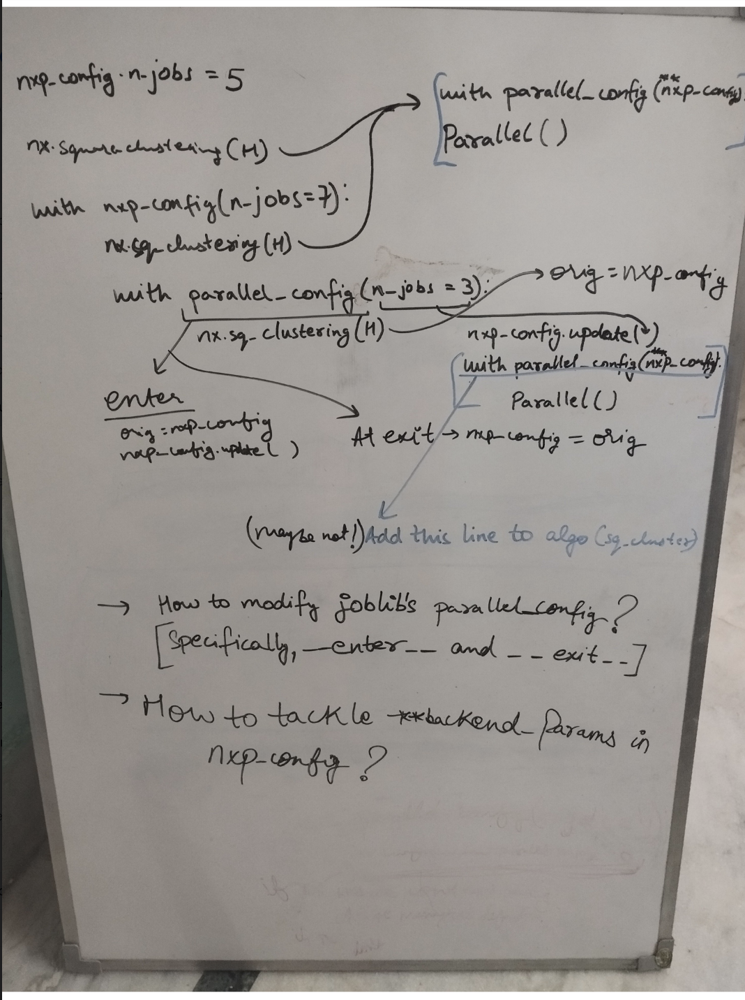

# Blog6: GSoC (nx-parallel)

## Week 11-12 (12th July to 27th July, 2024)

### GSoC - Coding Period (Phase 2)

## 1. Config in nx-parallel

In this section, I'll share my thoughts and progress on integrating configuration management in nx-parallel, particularly using joblib as a backend library. My initial goals were:

- **Ease of Use**: Ensure that the configuration system is user-friendly for those familiar with parallel computing libraries in Python.
- **Concise Structure**: Minimize redundancy and improve efficiency while making the configuration system flexible and inclusive, ideally compatible with all parallel libraries supported by joblib and potentially others.
- **Accessibility for New Contributors**: Make it easy for first-time contributors to understand and work with.
- **Maintainability**: Reduce the maintenance burden by keeping nx-parallel as independent as possible from changes in joblib or other parallel libraries, while also providing the support for them.

### 1.1 A little tour of NetworkX's current configuration facility provided for backends

The configuration facility for NetworkX backends was recently added in [PR#7225](https://github.com/networkx/networkx/pull/7225). It allows a dictionary or a Python `dataclass`(inherited from the `networkx.Config` class), to be returned by the function pointed to by the `networkx.backend_info` entry_point (i.e., the `get_info` function), with the key name `"default_config"`. Like this:

```py
def get_info():
    """Return a dictionary with information about the package."""
    return {
        "backend_name": "parallel",
        "project": "nx-parallel",
        "package": "nx_parallel",
        "url": "https://github.com/networkx/nx-parallel",
        "short_summary": "Parallel backend for NetworkX algorithms",
        "default_config": {
            "n_jobs": None,
            "backend": None,
            "verbose": 0,
            ....
        },
        "functions": {
            "number_of_isolates": {
....
```

Alternatively, you can define default configs like this:

```py
from .config import _configs

def get_info():
    """Return a dictionary with information about the package."""
    return {
        "backend_name": "parallel",
        "project": "nx-parallel",
        "package": "nx_parallel",
        "url": "https://github.com/networkx/nx-parallel",
        "short_summary": "Parallel backend for NetworkX algorithms",
        "default_config": _configs,
        "functions": {
            "number_of_isolates": {
....
```

In this example, `_configs` is an instance of the `ParallelConfig` Python `dataclass`

```py
from networkx.utils.configs import Config

@dataclass
class ParallelConfig(Config):
    backend: str = None
    n_jobs: int = None
    verbose: int = 0
    ...

_configs = ParallelConfig()
```

These configurations are set as the default in the global NetworkX config for all installed backends at the time of NetworkX's import:

```py
>>> import networkx as nx
>>> nx.config
NetworkXConfig(backend_priority=[], backends=Config(parallel=ParallelConfig(backend=None, n_jobs=None, verbose=0, temp_folder=None, max_nbytes='1M', mmap_mode='r', prefer=None, require=None, inner_max_num_threads=None, backend_params={})), cache_converted_graphs=True)
```

And like this for when we directly set a config dictionary in the `"default_config"` key:

```py
>>> import networkx as nx
>>> nx.config
NetworkXConfig(backend_priority=[], backends=Config(parallel=Config(backend=None, n_jobs=None, verbose=0, temp_folder=None, max_nbytes='1M', mmap_mode='r', prefer=None, require=None, inner_max_num_threads=None, backend_params={})), cache_converted_graphs=True)
```

The `Config` class in NetworkX also supports subclassing to create specific configurations with documented attributes and type annotations. It offers strict mode (where only predefined configurations can be set) and flexible mode (allowing the addition and deletion of configurations). Configurations can be accessed and modified using attributes or dictionary-like syntax. A `_check_config` method can be defined in subclasses to validate configuration values.

Recently, [PR#7363](https://github.com/networkx/networkx/pull/7363) introduced context management support in the `Config` class, enabling temporary configuration changes within a block of code:

```py
with nx.config.backends.parallel(n_jobs=6, verbose=15):
    nx.square_clustering(G, backend="parallel")
    ...
```

### 1.2 Failed Approaches and Brainstorming

#### 1.2.1 My initial expectation 

My goal was to integrate a configuration system in nx-parallel so that [joblib's `parallel_config`](https://joblib.readthedocs.io/en/stable/generated/joblib.parallel_config.html) context manager could seamlessly work alongside NetworkX's global configurations and NetworkX's context manager for configs. Ideally, I envisioned a setup where configurations could be dynamically adjusted, as illustrated in the following example:

```py
nx.config.backends.parallel.backend = "loky"

with joblib.parallel_config(n_jobs=6, verbose=15):
    nx.square_clustering(G, backend="parallel")
    ...
    with nx.config.backends.parallel(n_jobs=8, backend="threading"):
        nx.betweenness_centrality(G, backend="parallel")
        ...
        with joblib.parallel_config(n_jobs=-2):
            nx.number_of_isolates(G, backend="parallel")
            ...
```

#### 1.2.2 Initial Approach

To achieve this integration, I first attempted to integrate NetworkX's config in nx-parallel by passing in a dictionary of all the parameters of `joblib.Parallel` class, along with their default values, through the `get_info` function. Additionally, I implemented a function to fetch the global configurations and pass them into the `joblib.Parallel` call within the `square_clustering` algorithm, as shown below:

```py
# Inside `square_clustering` in nx-parallel

configs = nxp.get_global_configs()
result = joblib.Parallel(**configs)(
    delayed(_compute_clustering_chunk)(node_iter_chunk)
    for node_iter_chunk in node_iter_chunks
)
```

Here, the `get_global_configs` function simply returned the value of `nx.config.backends.parallel` as a dictionary.

Side Notes:

- The intention was to first ensure the `square_clustering` algorithm worked and then apply the same modifications to other algorithms, ensuring consistency and ease of development and review.
- Initially, I created a Python `dataclass` for nx-parallel's configuration but still extracted all default configurations from the class and included them in the `get_info`'s return dictionary. I later realised it would be more efficient to simply set the `default_config` in `get_info` to an instance of the `dataclass`. Consequently, I had to move the `config.py` from the `utils` module in `nx_parallel` to the `_nx_parallel` module.

#### 1.2.3 Challenges Encountered

While this worked with NetworkX's config, it did not work with `joblib.parallel_config`. This was happening because when we directly pass `**configs` into `joblib.Parallel`, the configurations specified in the `joblib.parallel_config` were overridden by the global configurations. leading to using the wrong configs while running the parallel algorithm. So, something like this won't work as expected:

```py
...
with joblib.parallel_config(n_jobs=6, verbose=15):
    nx.square_clustering(G, backend="parallel")
    ...
```

Additionally, the parameters accepted by `joblib.Parallel` and `joblib.parallel_config` are not entirely identical. This discrepancy further complicated the compatibility between `joblib.parallel_config` and `nx.config.backends.parallel`, as the latter takes parameters intended for `joblib.Parallel`.

Another concern was the inefficiency of importing a function from a different module to extract the global configurations for every function call.  It felt like it should be in the global namespace and should not be extracted inside every function.

#### 1.2.4 Refining the Approach

Recognizing these challenges, I shifted focus towards making the configuration compatible with `joblib.parallel_config` and then integrating the global configurations. This seemed more feasible, as joblib recommends using `parallel_config` for modifying parallel parameters when `joblib.Parallel` is used within another library. Given that `joblib.Parallel` calls are already present in all nx-parallel algorithms, this approach seemed promising to me.

To do this, I just had to not pass anything in the internal `joblib.Parallel` call. However, I still needed the value of `n_jobs` provided by the user to perform default chunking, which depends on the value of `n_jobs`. To address this, I utilized the `joblib.parallel.get_active_backend()` function, which, although not documented, was available in `joblib/parallel.py`. During this process, I also identified a need for separate default configurations, testing configurations, and current configurations. However, I ultimately managed to work with a single configuration set, as they were quite similar. At the end, these changes allowed the following to work as expected:

```py
with joblib.parallel_config(n_jobs=6, verbose=15):
    nx.square_clustering(G, backend="parallel")
    ...
```
However, no global configurations were considered. Therefore, any nx-parallel function call outside any context manager(s) would not utilize the configurations from `nx.config.backends.parallel`. And I didn't know how I could pass the global configs in the `joblib.Parallel` call without explicitly passing them in the `joblib.Parallel` call. I could have, of course, run a `joblib.parallel_config` context manager internally before each function call, but then also the same issue of `joblib.Parallel` and `joblib.parallel_config` not having the same args would have occurred.

#### 1.2.5 Understanding the problem a little better

So there were 3 key scenarios for which I wanted to decide how they should be handled:

- The code that is not inside any context manager(s) but in the main execution space
- The code inside a `joblib.paralle_config` context manager
- The code inside a `nx.config.backends.parallel` context manager

The first scenario was a bit tricky, prompting questions in my mind about handling configuration changes mid-execution or within context managers. For example, should we provide functionality for changing global configurations within a context manager, and if so, how should this be done properly? Consider the following example:

```py
with joblib.parallel_config(n_jobs=6, verbose=15):
    nx.config.backends.parallel.n_jobs = 4
    nx.square_clustering(G, backend="parallel")
    ...
```

In this case, should `n_jobs` be 6 or 4 for the `square_clustering` function? Some might argue for 6, as the context manager's configurations should take precedence over global configurations, while others might suggest 4, since the global configuration was changed within the context manager. This led to further questions: Should we even allow this? Should a change in the global configurations be undone upon exiting the context manager? In Python, changes to a global variable within a function persist even after exiting the function. Should we apply the same principle to context managers and global configurations?

Now coming back to the second and third scenarios, it was clear that the context manager should acquire the config parameters' values from the context manager that is just outside it (either `joblib.parallel_config` or `nx.config.backends.parallel`) and then override only the ones specified by the user within that context manager. Or if no parent context manager exists, configurations should be acquired from the `nx.config.backends.parallel`. And for the first scenario also, we need to acquire from the `nx.config.backends.parallel`. So, this part requires synchronizing the configurations in joblib's and NetworkX's configuration systems.

#### 1.2.6 Brainstorming another approach - nx-parallel's own context manager

I considered creating a custom context manager that integrated both joblib and NetworkX's backend configuration systems, thereby providing a unified configuration manager instead of giving users two options. This seemed like an efficient way to maintain consistent configuration parameter values.

I started to think about how I could acquire from the previous (or outer) context manager efficiently. After trying to figure this out for a while, I went back to the joblib's codebase and discovered that joblib's context manager already handled this via the `self.old_parallel_config` variable, which stored configurations at entry and restored them at exit. This seemed like a nice clever little trick because I haven't worked with building context managers a lot. I have used them. It seems obvious now, but while I was trying to figure it out, it wasn't very obvious to me. 

#### 1.2.7 Inheriting from joblib's context manager

While examining joblib's code, I realized that most of the functionality I needed was similar to that of joblib's `parallel_config`. This led me to consider inheriting from joblib's context manager instead of creating my own. The only significant difference was the `default_configs` at the start of `joblib.parallel_config`. However, modifying these default configurations to align with the configs in `nx.config.backends.parallel` proved challenging, possibly due to their relation to the defaults used in `joblib.Parallel`.

Handling two context managers was challenging because it was difficult to distinguish between user-specified and default configurations. The only method I knew to extract configurations from a context manager was to retrieve them as a dictionary, but this doesn't indicate which configurations were user-specified and which were defaults. Consequently, I struggled to determine how to override configurations from the previous context manager, particularly when a configuration variable was set back to its default value. How could I know, just from the configurations, whether the user had set it back to default or if it was a default setting?

After being overwhelmed by all these questions and uncertainties, I decided to step back a little and get back to these open threads next morning.

### 1.3 Current state

I revisited the three main scenarios where configurations can be utilized and outlined the necessary steps to incorporate each approach into nx-parallel.

#### Scenario 1: Code Outside Any Context Manager

So, here, to ensure that the global configurations are applied correctly, we would have to wrap the nx-parallel function call in a `joblib.parallel_config` context manager and pass the global configurations into it. For example, the following code:

```py
nx.config.backends.parallel.backend = "loky"
nx.config.backends.parallel.n_jobs = 8

nx.square_clustering(G, backend="parallel")
```

would be internally evaluated as:

```py
nxp_configs = nx.config.backends.parallel
with joblib.parallel_config(**nxp_configs):
    nx.square_clustering(G, backend="parallel")
```

#### Scenario 2: Code Inside `joblib.parallel_config` Context Manager

In this scenario, we would first store the initial global configurations before entering the context manager. Then, we would adjust the configurations according to the configs specified by the user in the context manager, execute the code using those updated configs, and finally reset the configurations to their original state after exiting the  `joblib.parallel_config` context manager.

#### Scenario 3: Code Inside `nx.config.backends.parallel` Context Manager

This scenario is handled similarly to Scenario 1, as the `nx.config.backends.parallel` context manager just temporarily modifies the global configurations.

**Assumption** : In all these cases, the default configurations are considered to be the arguments in `joblib.parallel_config` rather than `joblib.Parallel`, as `joblib.parallel_config` can control the parameters in `joblib.Parallel`.

Seeing the joblib.parallel_config context manager appear in all three scenarios led me to integrate it directly into the algorithm and then extract the global configs and pass those in the internal `joblib.parallel_config` context manager.

Consequently, users can use the `nx.config.backends.parallel` context manager as a proxy for the `joblib.parallel_config` context manager, as both have the same configuration arguments. This means users don't need to use the `joblib.parallel_config` context manager. Instead, they can use the `nx.config.backends.parallel` context manager. 

This is what the code in [PR#68](https://github.com/networkx/nx-parallel/pull/68) currently implements. In the coming days, I will be making the examples in the `Config.md` more comprehensive and will be expanding on them, and we are also discussing what should be the default configs in the review comments.

### 1.4 Limitations of the current approach

1. If we want to add configurations that are not related to joblib in the future, we would need to update the code in each function. To address this, it might be beneficial to establish a separate division for joblib-specific configurations, so that something like this is possible in the future:

    ```py
    nx.config.backends.parallel.joblib.backend = "threading"

    nx.config.backends.parallel.cugraph.dtype = np.float64 
    # here `dtype` is not a config parameter but a backend specific kwarg but I've just used it as an example

    nx.config.backends.parallel.openmp.OMP_THREAD_LIMIT = 5
    ```

2. As discussed earlier, importing a function from another module to extract the global configurations within each nx-parallel function feels inefficient. However, given the 12-week GSoC timeline and the other tasks I need to complete, I may have to stick with this approach for now.

### 1.5 Summary

- Approach 1 - making just the networkx config work
- Approach 2 - making just `joblib.parallel_config` work
- Approach 3 - creating a custom context manager from scratch
- Approach 4 - inheriting from the joblib's context manager
- Approach 5 - adding a `joblib.parallel_config` inside each function and using the config options in `nx.config.backends.parallel` as that of `joblib.parallel_config`. (not the most efficient, but the best one so far)

### 1.6 Some Whiteboard Scribblings : "Configs in nx-parallel"



## 2. Looking back at my GSoC proposal

I began coding during the GSoC community bonding period and had been actively contributing to the nx-parallel backend and NetworkX's dispatching side since October 2023. Over the past 12 weeks, I have made significant progress on my GSoC project. With the midterm evaluation now complete, it seemed an opportune moment to reflect on my [GSoC proposal](./A_Juneja_GSoC24_proposal.md) and evaluate my progress.

### 2.1 Proposal Overview and Progress

In my proposal, I outlined eight main objectives. After discussing with my mentor (Dan), we agreed that completing the benchmarking aspect within the GSoC timeframe might be challenging. However, I kept it in the proposal with the hope of making some headway. While this seems less feasible now, I have made substantial progress on other proposed items. The proposal also included a section for experimental ideas, which allowed me to undertake additional refactoring and documentation in the backend.py code (Point 2 from the proposal -- "Cleaning/refactoring the backend dispatch section of the NetworkX repo to make it more understandable"), in collaboration with Erik through several co-authored PRs.

#### Merged deliverables:

- Revisiting nxp algorithms([PR#63](https://github.com/networkx/nx-parallel/pull/63))
- Switching to setuptools([PR#69](https://github.com/networkx/nx-parallel/pull/69))

#### Work in Progress:

- Adding config([PR#68](https://github.com/networkx/nx-parallel/pull/68))
- Updating readme etc. - Added a `Config.md`([PR#68](https://github.com/networkx/nx-parallel/pull/68))

#### Upcoming Tasks:

- Decorator: Automating `get_info` updation([PR#55](https://github.com/networkx/nx-parallel/pull/55))
- Updating timing script([PR#61](https://github.com/networkx/nx-parallel/pull/61))
- Adding more algorithms

### 2.2 Future Plans

I aim to complete the ongoing configuration work by the next blog update and also focus on automating `get_info` updates. For the timing script, I plan to remove all heatmaps with less than 4x speedup from the current `timing` folder and then use NetworkX's VM to run an updated timing script utilizing `timeit.default_timer` instead of `time.time`. And then showcase these new heatmaps either in the README or in a file in the `timing` folder only.

Regarding the "adding more algorithms" task, I plan to address it towards the end. The 5 algorithms that I proposed are embarrassingly parallel, so implementation should be quick. One algorithm that I proposed was `compute_v_structures`, and it was recently deprecated in the main NetworkX library, making its implementation in nx-parallel unnecessary.

### 2.3 Beyond GSoC

In the last couple of weeks, I also worked on [PR#71](https://github.com/networkx/nx-parallel/pull/71)(MAINT: updated readme with conda installation guide). And some lose threads from this PR and the Switching to setuptools [PR#69](https://github.com/networkx/nx-parallel/pull/69) needs to be addressed. This includes fixing styling with Prettier and adding more lint and Ruff settings to the `pyproject.toml`.

I also plan to document potential expansions for nx-parallel beyond joblib and engage more in the [discussions](https://github.com/scientific-python/spatch/issues/1) currently going on in the `spatch` repository. Also, document insights from discussions with Erik into the `spatch` repo, as mentioned in my previous blog. Post-GSoC, I intend to also include some of the configuration details discussed in the above `Section 1.1` into the official NetworkX configuration documentation.

## 3. Other Activities in the Community

- Gave a 30-min talk on "Building backends using `entry_points` and NetworkX's parallel backend" on 20th July, 2024 at PyDelhi meet-up!
- My PyData Amsterdam's [talk proposal](https://amsterdam2024.pydata.org/cfp/talk/ABHQDF/) got accepted!
- **Opened** [PR#334](https://github.com/scientific-python/specs/pull/334) - Updated SPEC 2
- **Opened** [PR#981](https://github.com/scipy-conference/scipy_proceedings/pull/981) - Poster: Parallel Graph Algorithms and Building Backends with Entry Points
- **Reviewed** [PR#7556](https://github.com/networkx/networkx/pull/7556) - Add `Introspection` section to backends docs
- **Reviewed** [PR#7568](https://github.com/networkx/networkx/pull/7568) - Log "can/should run" and caching in dispatch machinery
- **Reviewed** [PR#7494](https://github.com/networkx/networkx/pull/7494) - Ensure we always raise for unknown backend in `backend=`
- **Reviewed** [PR#7572](https://github.com/networkx/networkx/pull/7572) - DOC: Fix typo in the code snippet provided in the docstring of nx_pydot.pydot_layout().
- **Merged** [PR#7567](https://github.com/networkx/networkx/pull/7567) - DOC: Added `default_config` in `get_info`'s description
- Worked on [coco](https://github.com/Schefflera-Arboricola/coco)

PS: I wanted to consolidate all the configuration experimentation into one blog, hence the date range is "(12th July to 27th July, 2024)" instead of "(12th July to 25th July, 2024)".

Thank you for reading till the end :)
