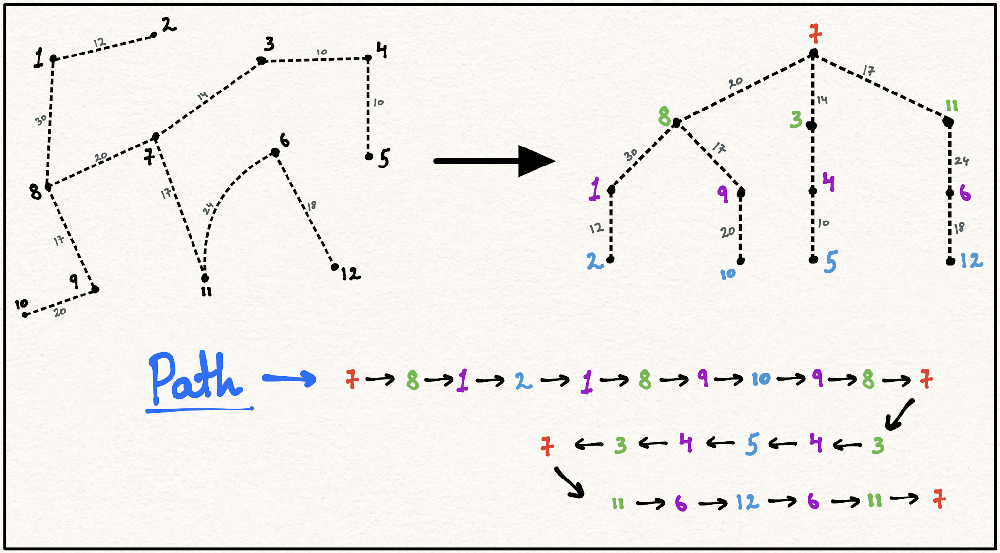
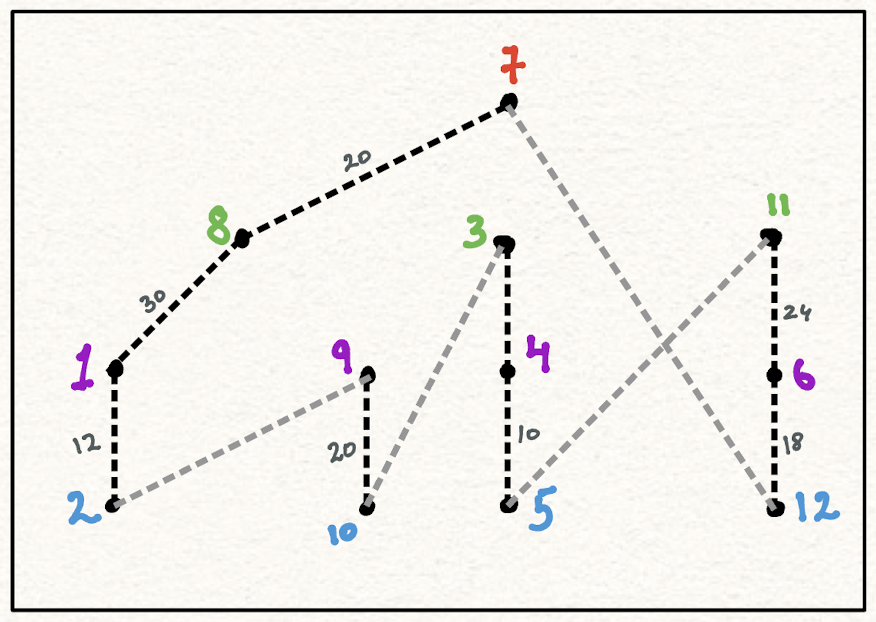
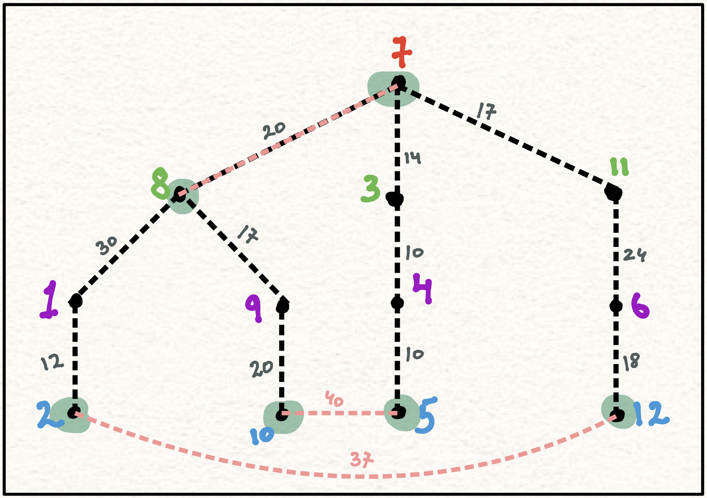
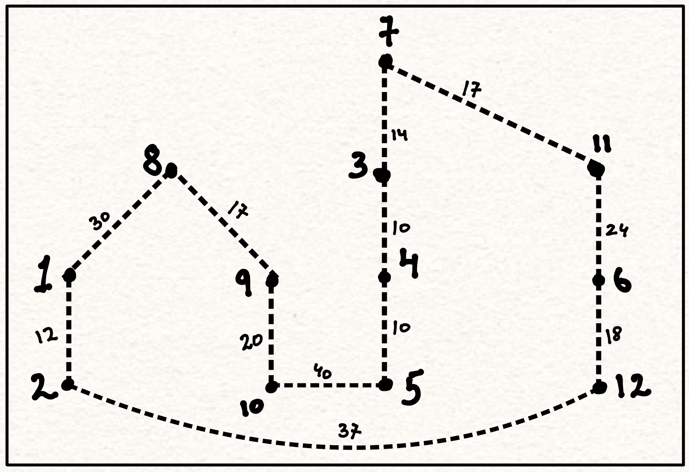

At the end of the [last blog](https://schefflera-arboricola.github.io/Schefflera-Arboricola/Carving-out-a-path-in-a-garden), I left off urging you to find a minimal cost cycle, instead of a minimal cost tree. You might have figured out by now that it's not as trivial as it seems and as it turns out it's actually pretty hard, like [NP-hard](https://youtu.be/YX40hbAHx3s?si=fISrIjRXhHa0-AD9) hard!
    
It's more commonly known as the [Travelling salesperson problem(TSP)](https://en.wikipedia.org/wiki/Travelling_salesman_problem), as if a salesperson wants to travel across all the cities with the least possible cost. The brute-force way to solve TSP would be to find the cost of all possible \((n-1)!/2\) cycles(where n is the number of cities) and then select the one with the minimum cost(time complexity : \(O(n!)\)). And the [greedy way](https://networkx.org/documentation/stable/reference/algorithms/generated/networkx.algorithms.approximation.traveling_salesman.greedy_tsp.html) would be to start with an initial node and then in every iteration add a node whose connection to the previous node in the cycle minimizes the cost of the cycle(time complexity : \(O(n^2)\)). It won't give us the most optimal solution but we can use it as a starting point to get to a better approximation. But, let’s look at some of the more interesting approaches, like the [approximation algorithms](https://youtu.be/MEz1J9wY2iM?si=Pv4kWbVIToOxQrS6) for TSP.
  
Let's use the MCST from the last blog to approximate the minimum cost cycle. If the salesperson were to use this tree to travel across all cities then they would have to go through each edge at least twice.
          <figure>
            
            <div style="text-align: center;line-height: 1;">
              <figurecaption style="font-size: 12px;">
                  here, we're traversing the tree in a depth-first manner. Note that the tree has \(11\) edges and the path has \(11 * 2 = 22\) edges. So, the cost of traveling = \(2 * cost\_of\_MCST\) i.e \(2 * 192 = 384\)
              </figurecaption>
          </div>
          </figure>

\( cost\_of\_MCST < cost\_of\_TSP\_cycle \) (Why? Think about it...)  
\( => 2 * cost\_of\_MCST < 2 * cost\_of\_TSP\_cycle \)  
\( => cost\_of\_approx\_path\_for\_TSP < 2 * cost\_of\_TSP\_cycle \)
   
But, it's not a valid solution because the solution of TSP has to be a valid cycle(without repeating nodes, except the starting node). So, let's try to better it by somehow avoiding the repeating nodes.
  
But, let's set some assumptions before proceeding further:

1. Triangle inequality holds true(it's a real-world graph) : \(d(a,b) + d(b,c) >= d(a,c)\) (The graph in last blog does not follow this!)
2. Graph is complete : \(d(a,b) > 0\)
3. Graph is symmetric : \(d(a,b) = d(b,a)\)

So, the first repeating node in the above path is \(Node 1\), and to avoid visiting it again I am going to choose to go directly from \(Node 2\) to \(Node 8\), and I can do that because the graph is complete and it would also reduce the cost because of the triangle inequality assumption. So, we get the following cycle :

Cycle(\(C\)) : 7 - 8 - 1 - <b>2 -</b> 9 - <b>10 -</b> 3 - 4 - <b>5 - </b>11 - 6 - <b>12 -</b> 7
            <figure>
              
              <div style="text-align: center;line-height: 1;">
                <figurecaption style="font-size: 12px;">
                  2-times approximation for TSP like this using the MCST
                </figurecaption>
            </div>
            </figure>

here, \( cost\_of\_C <= cost\_of\_approx\_path\_for\_TSP\)

And from before we know : \( cost\_of\_approx\_path\_for\_TSP < 2 * cost\_of\_TSP\_cycle \) 

So, we can say \( cost\_of\_C < 2 * cost\_of\_TSP\_cycle \) 

So, we can get a 2-times approximation for TSP like this using the MCST. But, let's try to better it a bit more by the following approach.
          
In [Christofides algorithm](https://youtu.be/zM5MW5NKZJg?si=_zqM2v2uJ7tT1Ad_), we again start with the MCST and then we create a subgraph \(O\) of all the nodes with odd degree. Note that the \( cost\_of\_TSP\_cycle(O) < cost\_of\_TSP\_cycle(Graph) \). Then we find a minimum cost [perfect matching](https://en.wikipedia.org/wiki/Perfect_matching) for this subgraph \(O\). And then we combine the edges of MCST and the perfect matching of odd degree nodes to form the following multigraph.
          <div class="image-container">
            <div class="image">
                
            </div>
          </div>

Next, we form an Eulerian circuit in this graph and then convert it into a valid cycle by skipping repeated nodes.
                <figure>
                  
                  <div style="text-align: center;line-height: 1;">
                    <figurecaption style="font-size: 12px;">
                      Cost : 249
                    </figurecaption>
                </div>
                </figure>

If we remove an edge from the above cycle, we get a spanning tree \(T\) and then :

\( cost\_of\_T >= cost\_of\_MCST \) <br>
\( => cost\_of\_T <= cost\_of\_TSP\_cycle \) <br>  

If we see the perfect matching in the above graph by alternating edges and group them into 2, then the \( cost\_of\_Perfect\_matching <= (1/2) * cost\_of\_TSP\_cycle \). Adding the costs of MCST and Perfect_matching gives the cost for the approximate cycle. So, \( cost\_of\_approx\_TSP <= (3/2) * cost\_of\_TSP\_cycle \).
            
<!---------------------------------------------------------------------------------------->

<br>
<hr>
<br>

# Further exploration : 

- What happens when we try to apply [christofides algorithm](https://en.wikipedia.org/wiki/Christofides_algorithm) to a graph that does not satisfy the triangle inequality assumption?

```python
# nx implementation of the graph with triangle inequalities : 
import networkx as nx
graph = nx.Graph()
graph.add_nodes_from(list(range(3)))
graph.add_weighted_edges_from([(0, 1, 1), (0, 2, 3), (1, 2, 1)])
print(nx.approximation.traveling_salesman_problem(graph))  
>>> [0, 1, 2, 1, 0]
```
[Learn more](https://github.com/networkx/networkx/blob/e370e5aeff507ba1f2547ed56a8b851c7669f6ac/networkx/algorithms/approximation/traveling_salesman.py) about networkx implementation of the travelling_salesman_problem() function.

- [Simulated annealing](https://www.baeldung.com/cs/simulated-annealing) approach is inspired by the annealing process in metallurgy, where a material is heated and then slowly cooled to reduce defects. In the context of optimization, it is a stochastic search algorithm that gradually explores the solution space while allowing for occasional worse solutions in the hope of reaching a global optimum.([learn more!](https://www.fourmilab.ch/documents/travelling/anneal/))

```python
SA_tsp = nx.approximation.simulated_annealing_tsp
method = lambda G, wt: SA_tsp(G, "greedy", weight=wt, temp=500)
path = tsp(G, cycle=False, method=method)
path in ([4, 3, 2, 1, 0, 8, 7, 6, 5], [5, 6, 7, 8, 0, 1, 2, 3, 4])
>>> True
```

```python
method = lambda G, wt: SA_tsp(G, "greedy", weight=wt, temp=500)
```

- "greedy" in this context means that we are using the greedy algorithm to quickly come up with an initial solution for TSP, and then using it as the starting point for the simulated annealing process.
- "temp" in this context refers to the temperature parameter which controls the randomness or exploration-exploitation trade-off. When it is high (e.g., 500), then the algorithm is more likely to accept worse solutions. As the temperature decreases during the execution of the algorithm (cooling schedule), the algorithm becomes more selective and tends to converge towards a better solution.

- [Threshold accepting](https://networkx.org/documentation/stable/reference/algorithms/generated/networkx.algorithms.approximation.traveling_salesman.threshold_accepting_tsp.html) is a stochastic optimization algorithm similar to SA. It is a variation of SA where, instead of using a cooling schedule, it employs a fixed threshold value.
  
- And, here’s the dynamic programming approach([Held-Karp algorithm](https://youtu.be/-JjA4BLQyqE?si=QrNupu0Ig4YL89U5)) for TSP(time complexity \(O(n^2 * 2^n)\)).
      <div class="image-container">
        <div class="image" style="width: 100%; margin: 0px; padding: 0px; border:1px solid black;">
          
        </div>
      </div>

- [Asadpour algorithm](https://blog.scientific-python.org/networkx/atsp/completing-the-asadpour-algorithm/) is an approximate solution for ATSP(Asymmetric TSP i.e. we have different flyovers(weights) to go from city 1 to city 2 and to come back from city 2 to city 1) 

- Here's an [interesting approach](https://medium.com/stanford-cs224w/tackling-the-traveling-salesman-problem-with-graph-neural-networks-b86ef4300c6e) for solving TSP using [GNNs](https://youtube.com/playlist?list=PLV8yxwGOxvvoNkzPfCx2i8an--Tkt7O8Z&si=sBhkeVOBvuvtkncj) by training them to learn to mimic dynamic programming.
