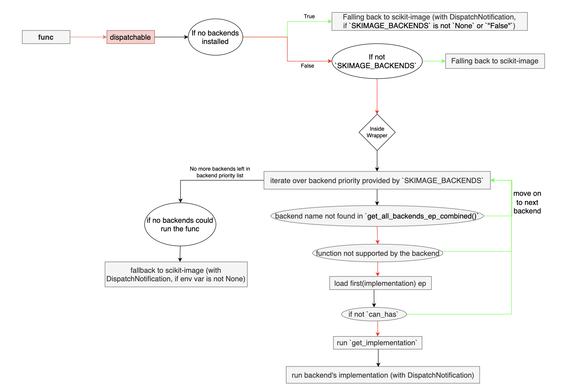

# Final Report: NumFOCUS's Small Development Grant (2024, Round 3; scikit-image)

**Project title**: Incorporating a Dispatching Mechanism into scikit-image
**Author**: Aditi Juneja
**Project Period**: 28 November 2024 – 19 March 2025
**PI**: Stéfan van der Walt

- **Grant Proposal**: https://github.com/Schefflera-Arboricola/blogs/blob/main/archive/grant_proposals/scikit_image_NumFOCUS_SDG_R3_2024.md
- **Report back form link**: https://numfocus.typeform.com/to/ZC5YEN
- **Final report**: https://github.com/Schefflera-Arboricola/blogs/blob/main/scikit-image/Dispatching(NumFOCUS_SDG_2024_R3)/final_report.md

# 1. Tell us what you achieved. (This question is required.*)

## Introduction

The scikit-image project received a $10,000 grant through NumFOCUS’s Small Development Grant program (Round 3, 2024) to support the initial development of a dispatching mechanism, that would enable function calls in scikit-image to be routed to an alternative and a faster backend implementations, such as cuCIM.

Aditi Juneja (me, GitHub: https://github.com/Schefflera-Arboricola , Email: aditijuneja7@gmail.com) was hired as an Independent Contractor via NumFOCUS, from 28th November, 2024 to 19th March, 2025 to work on incorporating an initial implementation of the dispatching mechanism in scikit-image, with Stéfan van der Walt (GitHub: https://github.com/stefan; email: stefanv@berkeley.edu) as the PI, and the following were the work items (as per the contract):

- Co-ordinate and communicate work with mentors and community contributors, via GitHub and at regular dispatch working meetings.
- Participate in dispatching-related code-review and discussions on GitHub. 
- Help establish a first dispatching framework for scikit-image.
- Experiment with different APIs and implementation approaches.
- Implement tests and write documentation for the new infrastructure.
- Support other general activities of the broader scikit-image project. 

The next section, “Initial Research and Work Done,” presents the prior work and research that preceded the contract period, to provide context for the following section, “Work Done.” That section outlines and summarizes the different work responsibilities carried out during the contract period—including implementation details, design choices and trade-offs considerations, future development scope, stakeholder and community coordination, and a shift in focus towards general scikit-image contributions. This section ends an hour-wise breakdown of how time was allocated across different areas; followed by an outline of both short-term and long-term goals for advancing dispatching in scikit-image and within the broader Scientific Python ecosystem. The last section "Conclusions" offers some final thoughts and an overview.

## Initial Research and work done

### Context and Precedent

Prior to the official contract period, groundwork began during the EuroSciPy 2024 sprints, where, after intensive discussions with senior developers — Gregory (cuCIM), Erik (nx-cugraph), and Lars (scikit-image) — I opened [PR#7513](https://github.com/scikit-image/scikit-image/pull/7513) with an initial prototype implementation of an [entry-point](https://packaging.python.org/specifications/entry-points/) based dispatching mechanism. However, this PR received limited visibility among the broader core development community, and discussion gradually consolidated around [PR#7520](https://github.com/scikit-image/scikit-image/pull/7520) instead. As attention shifted, I realigned my focus and began contributing to the review process there. I later summarized the development trajectory and some of the early brainstorming in [this post](https://discuss.scientific-python.org/t/api-dispatching-in-scikit-image-summary-and-future-enhancements/1497). Collectively, these early collaborative efforts shaped the direction of the work and eventually led to applying for the NF’s SDG.

### Array API standards vs. entry-point-based dispatching

At first glance, scikit-image might appear to be a strong candidate for adopting the [Array API Standards](https://data-apis.org/array-api/latest/#) ([NEP-47](https://numpy.org/neps/nep-0047-array-api-standard.html)), since NumPy arrays are central to the library – nearly all algorithms operate on image objects that are nothing but `numpy.ndarray` instances.

These standards have already been adopted in libraries such as [SciPy](https://docs.scipy.org/doc/scipy/dev/api-dev/array_api.html) and [scikit-learn](https://scikit-learn.org/stable/modules/array_api.html). However, when compiled code is involved — array conversions become necessary, because the compiled functions usually expect NumPy arrays. Scikit-image makes extensive use of Cython extensions (https://data-apis.org/array-api/latest/design_topics/C_API.html), and converting between array types (e.g., CuPy ↔ NumPy) in such contexts can introduce substantial overhead. For some cases, this overhead might also end up canceling out the performance gains offered by GPU acceleration. Additionally, certain array conversions could also be lossy. Moreover, adopting the Array API standards would require significant refactoring across the codebase, increasing the reviewer burden and long-term maintenance complexity. Additionally, it's also worth noting that a dedicated GPU-accelerated alternative to scikit-image– cuCIM – already exists– that we can dispatch the scikit-image calls to.

Given these constraints, an entry-point-based dispatching mechanism– similar to that in NetworkX– implemented via Python entry-points– emerged as a more practical alternative for speeding up scikit-image workflows. This approach seemed promising because in NetworkX it allowed for both type-based dispatching and explicit selection of a backend package with a lightweight dispatching layer, and minimal `Graph` object conversions and minimal disruption to the existing codebase. (Refer https://discuss.scientific-python.org/t/support-for-array-types-other-than-numpy/134/10?u=schefflera-arboricola , https://discuss.scientific-python.org/t/a-proposed-design-for-supporting-multiple-array-types-across-scipy-scikit-learn-scikit-image-and-beyond/131?u=schefflera-arboricola).

Also, initially, [dask-image](https://image.dask.org/en/latest/coverage.html) was a candidate backend I considered. However, its user API closely mirrors that of `scipy.ndimage`, so therefore, it was not actively discussed as a backend for scikit-image in the community.

### Scikit-image: A mix of backend-name-based and type-based dispatching

#### 1. Two ways of thinking about dispatching

- From a maintainer’s perspective: the choice is between adopting the Array API standards (type-based dispatching) or introducing an entry-point–based mechanism (can be both type-based and backend-name-based dispatching). Note that by adopting Array API standards, the developer of the main library still have some control because dispatch happens only through internal calls, and results can still be validated at multiple stages; whereas With backend-name–based entry-point dispatching, backends receive full authority to implement functionality however they choose, reducing main library's direct oversight.
- From a user’s perspective:
    - Type-based dispatching: The backend is selected automatically based on the input type (e.g., a `cupy.ndarray` always dispatches to the CuPy implementation). Each type maps to a single backend.
    - Backend-name-based dispatching: The user explicitly inputs a backend name to which they want to dispatch the function call(s). Multiple backends may handle the same input type, giving more flexibility.

#### 2. Scikit-image’s hybrid approach

From the start, scikit-image decided not to expose a `backend=` keyword argument to users. This decision indicated that we wanted to keep the user API aligned with type-based dispatching (similar to Array API standards). Internally, however, scikit-image relies on an entry-point mechanism, which is generally associated with backend-name–based dispatching. This combination creates a hybrid model:
    - User-facing API leans toward type-based dispatching.
    - Internal mechanisms leverage entry-points (usually associated with backend-name-based).

This created a nice challenge at the intersection of the two types of dispatching and hence made it interesting to work on. At the same time, everyone had different ideas on how much of each dispatching should be reflected in the user-API as well as in the background dispatching logic, which often made it difficult to reach a clear consensus on various design decisions.

#### 3. NetworkX and scikit-image

In NetworkX, type-based dispatching is done by extracting the backend name from the `__networkx_backend__` attribute of the input Graph object. But, in scikit-image it's not feasible to do the same because the input arrays come from external libraries (NumPy, CuPy, etc.), so scikit-image cannot modify them directly to store backend information/name. Instead, it must rely on external mappings between the array type(s) and the backend(s) that support those type(s), or get the backend name from the user, to dispatch to the correct backend. Additionally, it's easier to convert between graph objects as compared to array conversions.

In NetworkX, caching the converted backend graph object makes sense because most algorithms do not modify the existing graph but instead simply perform operations on the graph object and return objects like lists, dicts, dict-of-dicts, etc. The graph object persists across operations, so the converted backend graph can be stored and reused. Whereas, in scikit-image, most algorithms return a modified image object, which breaks the caching pattern, making caching expensive and less effective.

In short, NetworkX is to graphs what NumPy is to arrays. NetworkX can embed backend information directly into its own objects, while scikit-image is fundamentally an array-consuming library that must work with array types it does not control. This distinction explains why dispatching, conversion, and caching are more straightforward in NetworkX and significantly harder in scikit-image.

## Work done

The initial implementation section talks about the initial implementations and features in the PR7513 and 7520– and the continued development section discusses the developments carried forward in PR7727 and the design choices in that PR and the reasoning behind them. Then the next section goes over the community management work done as part of this grant, and the section next to that briefly touches upon the general maintenance work done in scikit-image. Followed by an hourly breakdown of the work done in different areas of the projects. Then the next section lists some prospective goals/challenges to address, related to dispatching, for scikit-image and the broader scientific Python ecosystem, before concluding the report.

### Initial Implementation

The first prototype of entry-point based dispatching was introduced in [PR#7513](https://github.com/scikit-image/scikit-image/pull/7513), building on top of [PR#7466](https://github.com/scikit-image/scikit-image/pull/7466). The earlier PR had only minimal logging support and a proof-of-concept for dispatching to only the cuCIM library: it wrapped scikit-image functions with decorators that explicitly tries to import cuCIM and invoked the cuCIM equivalents of those functions.

PR#7513 moved beyond this by introducing an entry-point–based approach. In this design, each backend was expected to define an entry-point in the group `skimage.backends`, where:
- The entry-point name corresponded to the backend’s name.
- The entry-point object referenced a namespace containing all the callable objects for all the supported algorithms, as attributes. These attributes are expected to have the same name as their corresponding function names in scikit-image. (Assumption: scikit-image has a flat namespace)

For completeness, I also introduced a `__skimage_backend__` attribute for array objects—similar to NetworkX’s `__networkx_backend__`. This attribute would store the backend name and allow for type-based dispatching. However, as explained in the above section this isn't a feasible option as scikit-image consumes arrays from external libraries (NumPy, CuPy, etc.), so embedding scikit-image's backend metadata directly into those arrays isn't a sensible approach. Additionally, if no backend was available, the call would fall back to the default scikit-image implementation.

At EuroSciPy 2024 sprints, after discussions with Erik and Gregory, I learned that a better way to identify array types was by using: `f"{type(nparr).__module__}.{type(nparr).__qualname__}"` (see [this commit](https://github.com/scikit-image/scikit-image/commit/fd41b4d60a6537492d5b88e1b8eaa2117f64c6ca)). However, even when we have identified the type(s) of the inputted array(s), we still cannot determine which backend to dispatch to unless we have a mapping of backends and their supported types-- one way could be to encode the array type in the entry-point naming convention. For e.g., having `skimage-cupy` as the entry-point name where `cupy` is the primary type supported by cucim. Note that this implies a one-to-one mapping between backends and array types i.e. one backend can support only one unique type. To bypass this we can have primary+secondary type(s) information in entry-point (inspired by `spatch`), where the primary type is reflected in the entry-point name while secondary supported types are listed separately in the object referenced by the entry-point. While this idea did not get explored much, I think it could be a useful design.

[PR#7520](https://github.com/scikit-image/scikit-image/pull/7520) similar to PR7513, along with the following additional and important features:

- `SKIMAGE_NO_DISPATCHING` environment variable was introduced to enable/disable dispatching (enabled by default).
- Instead of relying on type-checking or backend-name-extraction, the dispatcher iterated over all discovered(installed) backends (in alphabetical order) and attempted to run the function on the first backend that supported it.
- A `DispatchNotification` class was introduced for structured logging, replacing the earlier use of Python’s `logging` module.
- Fallback: if no backend was available, or if no backend’s `can_has` returned `True`, the call would fall back to the default scikit-image implementation.
- This PR created a distinction between two entry-points:
    - `skimage_backends`: provided a namespace with `can_has` and `get_implementation` functions.
        - `can_has` (inspired by NetworkX’s `can_run`) lets backend developers run a quick check of whether their backend implementation can support the given arguments/kwargs (their types, etc.), before loading and executing the backend implementation.
        - `get_implementation` is a function that takes in the function name and returns a callable object for that function’s backend implementation, or `None` if the function is not supported by the backend.
    - `skimage_backend_infos`: returns a `BackendInformation` instance with supported function metadata. Backends are expected to return an instance of this class from their entry-point reference, with:
        - An attribute `supported_functions`, containing a list of strings of the form `"skimage.module:function"` (e.g., `"skimage.metrics:mean_squared_error"`). Exception: “skimage.filters.rank” which also includes the submodule name.
        - Both `can_has` and `get_implementation`, take in function names in the same string format.

This separation was introduced to allow the backend metadata (like documentation, etc.) to be stored without importing the full backend implementation upfront. Additionally, right now, scikit-image simply forwards all `args`/`kwargs` to backend functions– without validating or checking– so additional backend-specific keywords can be processed by the backend.

Three main concerns were raised during this stage:

1. Instead of relying on the alphabetical fallback priority, it would have been nicer to let the user set their preferred backend/backend priority. (later implemented in [PR#7727](https://github.com/scikit-image/scikit-image/pull/7727))
2. Dispatching being off by default is advisable because enabling it by default could lead to unexpected results. A malicious package might be backend or the returned values might vary in precision levels. Although logging is in place, users might have logging disabled, further increasing confusion/risk. Since this feature is currently experimental, it is safer to require users to explicitly enable it. (later implemented in [PR#7727](https://github.com/scikit-image/scikit-image/pull/7727))
3. To optimise the dispatching workflow and minimise unnecessary overhead, it is best to load only the initial checks—such as `supported_functions` and `can_run`-- at the start, deferring the import of the full backend implementation (`get_implementation`) until it is actually needed. Hence, `can_ru`n and `info` could be combined into one lightweight entry-point, while the full backend implementations could be loaded from a separate entry-point later. This separation also clearly signals that `can_run` should perform a quick, efficient check without importing heavy code or the backend itself. It also encourages backend developers to keep this check fast and simple, preventing slowdowns in the entire workflow for users– even when a backend is installed but not actively used. Although this approach was not extensively discussed due to limited review time, and the current implementation was considered acceptable for an initial dispatching setup, by the community.


### Continued development: PR7727

After [PR#7520](https://github.com/scikit-image/scikit-image/pull/7520) seemed ready from my side, I opened a follow-up on its branch ([betatim/scikit-image#1](https://github.com/betatim/scikit-image/pull/1)), which was later opened as [PR#7727](https://github.com/scikit-image/scikit-image/pull/7727) on the scikit-image's main branch. This PR refined the dispatching framework, addressing concerns raised during the earlier stage and introducing additional configurability for both developers and users.

Key changes included:

- Environment variables changes
    - `SKIMAGE_NO_DISPATCHING` was renamed to `SKIMAGE_DISPATCHING`, reversing the default behavior. Dispatching is now disabled by default, requiring explicit opt-in. This ensures users consciously enable it, preventing unexpected changes in results when simply installing a backend.
    - A new variable, `SKIMAGE_BACKEND_PRIORITY`, was added to let users set backend/backend priority explicitly and hence offer more fine-grained user control. It accepts a single backend name or a comma-separated list, overriding the default alphabetically ordered priority list.
- Global configuration manager: A new `skimage.set_backends()` function/context was introduced to complement environment variables. It allows:

      ```
      skimage.set_backends("backend_1", "backend_2", dispatch=True)
      ```

  Users can enable/disable dispatching and set backend/backend priority, either globally or within a `with` block for localized configuration control.

    - Is a configuration manager needed? – There were questions about the necessity of configurations when environment variables already exist. Following are some motivations to have configurations:
        - Based on observations from NetworkX, backends often provide specialized functionality or performance benefits and typically implement only a subset of algorithms of similar kind(s). I suspect that the scikit-image backend ecosystem will evolve in a similar direction. If so, I think users may prefer to dispatch selectively-- applying backend configuration locally through the configuration manager rather than relying solely on global environment variables.
        - Environment variables are not always ideal, since they make code behavior dependent on settings outside the code files(i.e. dependent on the environment settings). Local, code-based configuration helps in such workflows– for example if a user only wants to enable dispatching for a few code files.
        - To summarize, both approaches have distinct use cases, requirements, and trade-offs. Since it is still too early to predict how widely each will be used, it seemed reasonable to support both for now.
    - There are still some more discussions needed on API. For example, currently `skimage.use_dispatch()` would not enable dispatching (one would have to pass in `dispatch=True` for that) but it might be more natural to think that it does enable dispatching. More at [this discussion](https://github.com/scikit-image/scikit-image/pull/7727/files#r2002627845). Right now, each global instance of `set_backends` is independent and only what’s in the latest instance is considered for the following function call(s).

- Improved usability and documentation
    - Both environment variables and context managers make it easier for downstream packages/projects to accelerate their scikit-image workflows without major code changes.
    - A dedicated [user guide](https://github.com/Schefflera-Arboricola/scikit-image/blob/patch-1/doc/source/user_guide/backends.rst) was added, explaining backend dispatching with examples and usage patterns.
    - Tests and documentation were updated to reflect the new functionality.
- Local experimenting done on [a dummy backend](https://github.com/Schefflera-Arboricola/skimage-j4f) : https://github.com/Schefflera-Arboricola/skimage-j4f/blob/main/rough.py

Overall, PR#7727 marked the transition from a proof-of-concept dispatcher to a configurable and user-facing system. It tackled early concerns (lack of user control, dispatching enabled by default, backend prioritization) while laying groundwork for future refinements.

The following diagrams summarize the dispatching infrastructure so far:




### Community and Stakeholders coordination

- Once the PR7520 seemed ready from my side, I opened an issue in cucim (https://github.com/rapidsai/cucim/issues/829) to initiate some communications to turn cucim into a scikit-image backend– the discussions also included some of the discussions related to the array conversations and weather cucim should support both numpy and cupy arrays or not– and how will both options look like from a user’s perspective and what checks or functionalities should be on scikit-image’s side and what type checks or conversion steps should be on cucim’s side. See the discussions under the issue for more.
- coordinated and scheduled meetings to help speed up the review process and get ideas and perspectives from different developers from different scientific python projects like scikit-image, networkx, numpy, sklearn (meeting notes: https://hackmd.io/4oRcgg9EQeWQ18Mv2sdfMA , calendar link: https://calendar.app.google/HnMpJCUP591xzTAn7). Although it wasn’t possible for cucim developer(s) and the PI to join these meetings– so most discussions with cucim happened under the [Issue829](https://github.com/rapidsai/cucim/issues/829), and updated PI and other community members in the general scikit-image community meetings and further interactions were done via github reviews. 
- Created [summary diagrams of scikit-image dispatching](https://drive.google.com/file/d/1xHLs6rK1P1XGt83ueL-DUbPO-dF0ZKFQ/view?usp=sharing) (open with `draw.io`) to brief everyone on the ongoing developments in the first meeting, and to discuss the debatable design decisions/questions and discuss future development plans.
- Lastly, requested a `#dispatching` thread in the scientific python discord server to have a space to informally talk about dispatching related things.

### Shifting focus towards general activities in the project

In addition to dispatching-related work, I contributed to general maintenance and development tasks throughout the contract period — with increased focus toward the later stages. This shift was based on communications with project maintainers, who indicated that the skimage2 project was the current project priority. Contributing towards skimage2 was also intended to help free up reviewer capacity for dispatching-related pull requests. While not the primary focus of this report, these efforts supported broader project goals and are listed below for reference:
    
- **[Merged]** Updated the "Image Deconvolution" example in scikit-image; resolving Issue#7564 : https://github.com/scikit-image/scikit-image/pull/7589
- **[Merged]** Use `ski` import convention in  `_regionprops_utils` docstring: https://github.com/scikit-image/scikit-image/pull/7741
- **[Merged]** CI pre-commit fix : https://github.com/scikit-image/scikit-image/pull/7631
- **[Ready for review]** Explicitly checking `dtype` as `bool` for algorithms in `morphology/isotropic.py`: https://github.com/scikit-image/scikit-image/pull/7748
- **[WIP]** Using `label_image` throughout scikit-image and added `rename_parameter` decorator for deprecations: https://github.com/scikit-image/scikit-image/pull/7747
- **[Issue under discussion]** Investigate unused assignment in show_rag: https://github.com/scikit-image/scikit-image/issues/7698
- **[Reviewed]** Test scikit-image on free-threaded Python using pytest-run-parallel: https://github.com/scikit-image/scikit-image/pull/7678


### Hours break-down

- 250 hours:
    - 200 hrs on technical work
        - 161 hours on dispatching work
        - 39 hours on scikit-image general work
    - 50 hrs on technical coordinated

### Future goals:

- Short-term (scikit-image oriented):
    - Iterate over [PR#7727](https://github.com/scikit-image/scikit-image/pull/7727).
    - Add `@dispatchable` decorator to more algorithms in scikit-image ([PR#7723](https://github.com/scikit-image/scikit-image/pull/7723)).
    - Continue coordination with the cuCIM team to get cuCIM working as a backend ([Issue#829](https://github.com/rapidsai/cucim/issues/829)).
    - Ongoing discussions in [Issue#7738](https://github.com/scikit-image/scikit-image/issues/7738) on **array conversions and backend testing**, including:
        - Backend testing and compliance: Backend results may differ slightly (in precision or exact values) from scikit-image’s implementations. Determining compliance with the scikit-image test suite may require making tests array-agnostic, so they can run across different array types.
        - Challenges of array conversion: Unlike graphs in NetworkX, arrays are costly to convert. Conversion functions provided by backends are possible but may be inefficient.
        - Potential approaches:
            - Using a variant of `numpy.ndarray` that also stores backend metadata (e.g., the name `"cucim"`).
            - Naming entry-points after their primary array type (e.g., `skimage-cupy`) while still allowing secondary types or conversion rules.
    - Explore approaches for including backend-specific documentation in the official scikit-image docs ([Issue#7550](https://github.com/scikit-image/scikit-image/issues/7550)).
- Long-term(scientific python ecosystem oriented):
    - Engaging with users to gather feedback on dispatching functionality's user API. (like, I briefly covered scikit-image's dispatching and dispatching in other projects like sklearn and NumPy during the PyConf Hyderabad 2025 talk. FYI, this talk(and conference's travel/lodging) was not covered by this SDGrant.)
    - Standardising dispatching in the ecosystem: Contributing more to `spatch` and SPEC 2 on API Dispatching, aligning scikit-image's dispatching efforts with broader Scientific Python ecosystem goals.

## Conclusions

This grant successfully laid the foundation for a dispatching mechanism in scikit-image, establishing the first version of a backend infrastructure and initiating discussions on design trade-offs between entry-point–based and type-based approaches. The work carried out—through PRs [#7513](https://github.com/scikit-image/scikit-image/pull/7513), [#7520](https://github.com/scikit-image/scikit-image/pull/7520), and [#7727](https://github.com/scikit-image/scikit-image/pull/7727)-- introduced a configurable dispatching framework, improved documentation, and provided a basis for future backend integration (e.g., with cuCIM - [Issue829](https://github.com/rapidsai/cucim/issues/829)).

The project also provided an opportunity to survey dispatching strategies across the wider Scientific Python ecosystem. While projects such as NetworkX, Dask, matplotlib, napari, and pytest plugins use entry-point–based mechanisms to enable extensibility or delegate functionality to alternative implementations in a backend library, NumPy employs type based dispatching, and projects like SciPy and scikit-learn adopted the Array API standards. Similar standardisation efforts are also being made for dataframe libraries (see [narwhals](https://github.com/narwhals-dev/narwhals)). Other libraries such as joblib support specific parallel backends through hard-coded pathways. Scikit-image’s approach– combining aspects of both type-based and name-based dispatching– reflects its unique position as a Cython-heavy, array-consuming library.

Looking forward, aligning these developments with community efforts such as `spatch` and SPEC 2 on API Dispatching will be essential to converge on shared standards and best practices across the ecosystem.

Finally, thanks to all the contributors and reviewers for their time, insights, and thoughtful discussions. This work was only possible through collective input, and the initial dispatching infrastructure established during this grant has hopefully provided a good starting point for future progress on dispatching in scikit-image and the broader Scientific Python ecosystem.

---


# 2. We’re curious about the trajectories these projects typically take. How did what you accomplished differ from what you originally proposed? Did you hit any roadblocks? If so, what were they? (This question is required.*)

The original grant proposal focused solely on implementing a dispatching mechanism in scikit-image. However, as the project progressed, several unforeseen factors influenced the trajectory of the work:
- **Review Bottlenecks and Shifting Focus to General Maintenance:** While several dispatching-related PRs were opened and iterated upon, their progress was constrained by the availability of core developers for reviews. To help core developers get more time to review dispatching-related PRs, I started contributing towards the higher-priority [skimage2]( https://github.com/scikit-image/scikit-image/wiki/API-changes-for-skimage2) project, along with general maintenance tasks. 
- **Community and Stakeholders Coordination Challenges:** More consistent engagement from the cuCIM side was anticipated, particularly around API design considerations for backend developers and users. Initial cross-project meetings (involving people from scikit-image, networkx, numpy, and scikit-learn) were productive and helped get the first dispatching PR merged. However, further discussions, without much cuCIM's involvement, particularly around API design, became less effective over time and often concluded without clear action items at hand. To support any future interest from cuCIM, [Issue#829](https://github.com/rapidsai/cucim/issues/829) documents detailed instructions on how to integrate cuCIM as a scikit-image backend and outlines the current state of the dispatching infrastructure in scikit-image for developers' reference.

Despite these challenges, the core goal of setting up an initial dispatching framework was achieved, and the groundwork has been laid for further development. 

---


# 3. Based on your experience, do you have any advice for other NumFOCUS project leaders? E.g.: "Be sure and do X" is valuable advice, as well as "Be sure not to do Y"

Be aware of the project’s priorities and resources, and have open communications about them early on and clearly—both before applying for the grant and throughout the grant period, as they evolve. This includes keeping all involved parties (the contractor, PI, and other developers involved) in sync on mutual expectations and aligning them toward a shared goal. In collaborative work, it’s especially important to define and align on responsibilities early on to support a productive and healthy collaboration for everyone involved.


---


# 4. Anything else you'd like to share with us about your experience with the small grant?

This grant provided a great opportunity to work on a technically challenging feature in the scikit-image project. It also highlighted the importance of community-driven development, where progress depends not just on individual contributions but also on coordination with a broader ecosystem.

One of the key takeaways was observing how the different Scientific Python projects require dispatching and backend selection and realizing the potential for cross-library coordination and improvements. I think the discussions and collaborations initiated during this project will continue beyond the grant period, shaping the future of dispatching in scikit-image and beyond.

Overall, I am truly grateful for the support from NumFOCUS in funding this work, and I look forward to continuing my involvement in the community!


---
