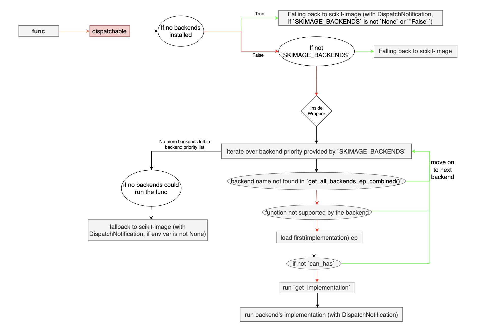
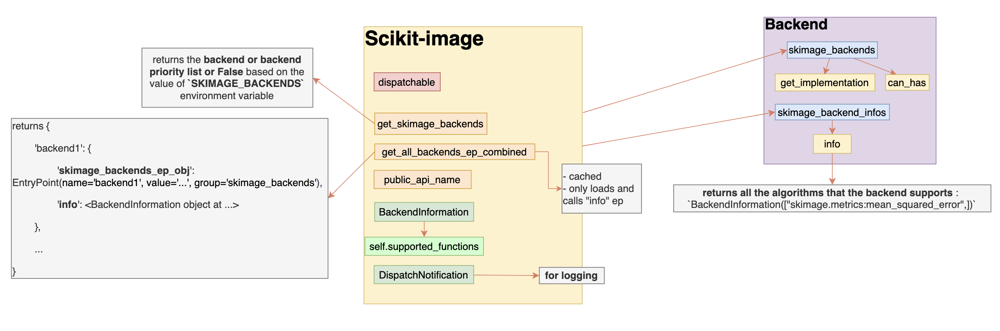
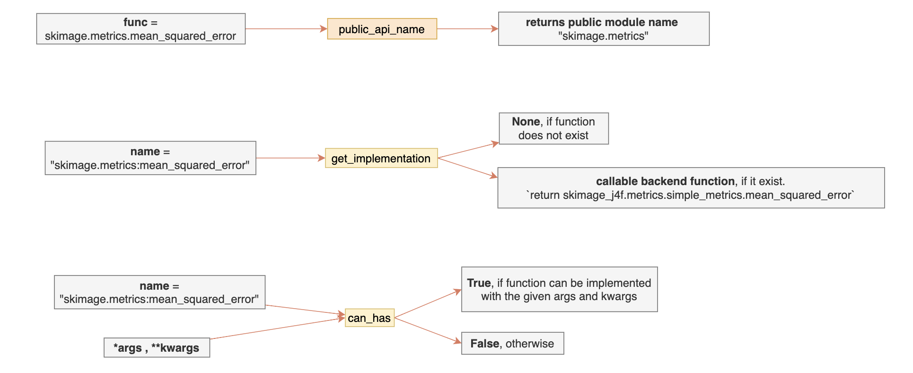

[WIP]
# Final Report: NumFOCUS's Small Development Grant (2024, Round 3; scikit-image)

**Project title**: Incorporating a Dispatching Mechanism into scikit-image
**Author**: Aditi Juneja
**Project Period**: 28 November 2024 – 19 March 2025
**PI**: Stéfan van der Walt

- **Grant Proposal**: https://github.com/Schefflera-Arboricola/blogs/blob/main/archive/grant_proposals/scikit_image_NumFOCUS_SDG_R3_2024.md
- **Report back form link**: https://numfocus.typeform.com/to/ZC5YEN
- **Final report**: https://github.com/Schefflera-Arboricola/blogs/blob/main/scikit-image/Dispatching(NumFOCUS_SDG_2024_R3)/final_report.md , https://hackmd.io/iky9PQtyQCO_zBbJUfEX-A?view

# 1. Tell us what you achieved. (This question is required.*)

## Introduction

The scikit-image project received a $10,000 grant through NumFOCUS’s Small Development Grant program (Round 3, 2024) to support the initial development of a dispatching mechanism, that would enable function calls in scikit-image to be routed to an alternative and a faster backend implementations, such as cuCIM.

Aditi Juneja (me, GitHub: https://github.com/Schefflera-Arboricola , Email: aditijuneja7@gmail.com) was hired as an Independent Contractor via NumFOCUS, from 28th November, 2024 to 19th March, 2025 to work on incorporating an initial implementation of the dispatching mechanism in scikit-image, with Stéfan van der Walt (GitHub: https://github.com/stefan; email: stefanv@berkeley.edu) as the PI, and the following were the work items (as per the contract):

- Co-ordinate and communicate work with mentors and community contributors, via GitHub and at regular dispatch working meetings.
- Participate in dispatching-related code-review and discussions on GitHub. 
- Help establish a first dispatching framework for scikit-image.
- Experiment with different APIs and implementation approaches.
- Implement tests and write documentation for the new infrastructure.
- Support other general activities of the broader scikit-image project. 

The next section, “Initial Research and Work Done,” presents the prior work and research that preceded the contract period, to provide context for the following section, “Work Done.” That section outlines and summarizes the different work responsibilities carried out during the contract period—including implementation details, design choices and trade-offs considerations, stakeholder and community coordination, and a shift in focus towards general scikit-image contributions. This section ends with a point-wise summary of achieved deliverables and an hour-wise breakdown of how time was allocated across the above mentioned areas. The last section "Conclusions" offers some final thoughts and future direction—outlining both short-term and long-term goals for advancing dispatching in scikit-image and within the broader Scientific Python ecosystem.

## Initial Research and work done

### Context and Precedent

Prior to the official contract period, groundwork began during the EuroSciPy 2024 sprints, where, after intensive discussions with senior developers — Gregory (cuCIM), Erik (nx-cugraph), and Lars (scikit-image) — I opened [PR#7513](https://github.com/scikit-image/scikit-image/pull/7513) with an initial prototype implementation of an entry-point based dispatching mechanism. However, that PR received limited visibility among the broader core development community, and discussion gradually consolidated around [PR#7520](https://github.com/scikit-image/scikit-image/pull/7520) instead. As attention shifted, I realigned my focus and began contributing to the review process there. I later summarized the development trajectory and some of the early brainstorming in [this post](https://discuss.scientific-python.org/t/api-dispatching-in-scikit-image-summary-and-future-enhancements/1497). Collectively, these early collaborative efforts shaped the direction of the work and eventually led to applying for the NF’s SDG.

### Array API standards vs. entry-point-based dispatching

At first glance, scikit-image might appear to be a strong candidate for adopting the [Array API Standards](https://data-apis.org/array-api/latest/#) ([NEP-47](https://numpy.org/neps/nep-0047-array-api-standard.html)), since NumPy arrays are central to the library – nearly all algorithms operate on image objects that are essentially `numpy.ndarray` instances.

These standards have already been adopted in libraries such as [SciPy](https://docs.scipy.org/doc/scipy/dev/api-dev/array_api.html) and [scikit-learn](https://scikit-learn.org/stable/modules/array_api.html). However, when compiled code is involved — array conversions become necessary, because the compiled functions typically expect NumPy arrays. Scikit-image makes extensive use of Cython extensions (https://data-apis.org/array-api/latest/design_topics/C_API.html), and converting between array types (e.g., CuPy ↔ NumPy) in such contexts can introduce substantial overhead. This overhead might also end up canceling out the performance gains offered by GPU acceleration. Additionally, in some cases these array conversions could be lossy as well. Moreover, adopting the Array API standards would require significant refactoring across the codebase, increasing the reviewer burden and long-term maintenance complexity. Additionally, it's also worth noting that a dedicated GPU-accelerated alternative to scikit-image — cuCIM — already exists– that we can dispatch the scikit-image calls to.

Given these constraints, an entry-point-based dispatching mechanism– similar to that in NetworkX — implemented via Python entry-points — emerged as a more practical alternative for speeding up scikit-image workflows. This approach allows explicit selection of a backend package with a lightweight dispatching layer and minimal array conversions and minimal disruption to the existing codebase. The viability of this approach has been explored previously within the Scientific Python community (refer https://discuss.scientific-python.org/t/support-for-array-types-other-than-numpy/134/10?u=schefflera-arboricola , https://discuss.scientific-python.org/t/a-proposed-design-for-supporting-multiple-array-types-across-scipy-scikit-learn-scikit-image-and-beyond/131?u=schefflera-arboricola).

Also, initially, [dask-image](https://image.dask.org/en/latest/coverage.html) was a candidate backend I considered. However, its user API closely mirrors that of `scipy.ndimage`, and as a result, it was not actively discussed as a backend for scikit-image in the community.


### Scikit-image: A mix of backend-name-based dispatching and type-based dispatching

**Difference between type and namebased and array api standards and entry-point based**: From a library maintainer’s perspective there is either the Array API standards to adopt or go with the entry-point based dispatching. But, from a user API perspective there are two types of dispatching: Type based dispatching and backend name based dispatching. Type based dispatching is when the dispatching is done based on the type of the input parameters and usually each type has one and only one backend implementation associated with it. And in backend name based dispatching the implementation is dispatched based on the given backend name by the user and multiple backends can support the same type. 

**networkx vs scikit-image**: For array api standards it’s purely type based – each array type has a single implementation associated with it. But with networkx’s entry-point based dispatching which is only based on the name of the backend– multiple backends can support. NetworkX also has type based dispatching but under the hood the type in `__networkx_backend__` can just be the name of the backend and the object can just be a networkx graph. (scikit-image:numpy::networkx-using-library:networkx)

In the case of graphs, networkx has become the standard library and the formal standardisation happened when the backend dispatching was introduced– as compared to arrays and numpy and array api standards. So, this wasn’t an issue as we used `__networkx_backend__` for storing backend names.

This cannot be done in scikit-image as the array object is not scikit-image’s own array object – so the name cucim cannot be saved in an attribute of the cupy array– we need to have this mapping somewhere between the backend and the type(s) supported by that backend. This further makes it harder to implement caching of arrays since firstly caching of arrays is way more difficult than caching of a nx.Graph object and also in scikit-image in majority in algorithms the image is manipulated and returned– whereas in networkx the graph is modified and returned only in a small fraction of algorithms– so caching makes sense there– as there are usually some operations on the graph and then the returned result is a list, dict or dic of dict, etc.

In array api standards type-based, some structure and control over the implementation is still there by the main library, because we are only dispatching through the internal functions and not the entire function and returning the result with checking. In backend name based entry point dispatching we are giving the full authority to the backend to implement whatever they want to.

**Scikit-image: A mix of backend-name-based dispatching and type-based dispatching**: From the beginning, scikit-image was explicit about not providing a `backend=` keyword argument to set the backend. It seemed that the intent was to align user-API with the type-based dispatching– like adopting the array API standards– while internally relying on an entry-point mechanism, which is usually associated with backend-name-based dispatching. This created a nice challenge at the intersection of the two types of dispatching and hence made it interesting to work on. At the same time, everyone had different ideas on how much of each dispatching should be reflected in the user-API as well as in the background dispatching logic, which often made it difficult to reach consensus on what would constitute a clear and consistent API.

## Work done

The initial implementation section talks about the initial implementations and features in the PR7513 and 7520– and the continued development section discusses the developments carried forward in PR7727 and the design choices in that PR and the reasoning behind them. The next section on future developments talks about some of the challenges and issues opened for future discussion/reference. Then the next section goes over the community management work done as part of this grant, and the section next to that briefly touches upon the general maintenance work done in scikit-image. Followed by an hourly breakdown of the work done in different areas of the projects. Then the next section lists some prospective goals for scikit-image and the broader scientific Python ecosystem, with a particular focus on dispatching, before concluding the report.

### Initial Implementation

The initial implementation in PR7513, build on top of https://github.com/scikit-image/scikit-image/pull/7466 , which had some simple logging and only supported cucim as a backend by explicitly installing cucim and calling the cucim function in a decorator that wrapped a scikit-image function. In PR7513 an entry-point based approach was introduced. The backend was expected to have an entry-point in the group `skimage.backends` with the backend name as the name of the entry-point and the object reference as the namespace of the callables of all the algorithms supported by this backend. Note that these callables were expected to have the same name as their respective corresponding function names in scikit-image. For the sake of completeness, I introduced `__skimage_backend__`(an attribute of the image object i.e. array object – similar to `__networkx_backend__` in networkx) which would store the backend name– although this is not a good idea to put information of a backend of an array consuming library in all the array libraries. Later after discussions with erik and gregory at the euroscipy sprints I got to know that a better way to get the array type was to use `f"{type(nparr).__module__}.{type(nparr).__qualname__}"` ([know more](https://github.com/scikit-image/scikit-image/commit/fd41b4d60a6537492d5b88e1b8eaa2117f64c6ca)). But, even when we get the type of array in the input– we wouldn’t know which backend to dispatch it to– unless we require the entry-point name to be `skimage-<array-type>`(skimage-cupy). But this comes with an assumption that each backend can only support one unique array type.
– this suggestion didn’t get much support or attention although I do think this could have been a good solution. We could have also had the concept of primary and secondary type(as in spatch) where primary type is in the entry-point name and secondary types could exist in a list which could be in the namespace referenced by the entry-point. 

PR7520, had most of the things from PR7513, plus it also had an environment variable to switch on or off the dispatching (on as default) and instead of any type checking for a type based dispatching– it simplify went through all the backends collected via entry-point in an alphabetically order and dispatched the function call to the first function that could run the function– so it also introduced the feature of can_has (similar to, can_run from networkx)– which is a function that a backend developer can add as a quick check before the backend function is actually called– to check if the args and kwargs are of the apt. type and supported by the implementation of the backend function. This PR also introduced a DispatchNotification class for logging instead of the simple logging that was done by the python’s `logging` library. Additionally, if no backend is available, or if none supports or can run the algorithm with the provided arguments, the implementation defaults(fallbacks) to the scikit-image implementation.

This PR expected backends to return a BackendInformation class as the entry-point object reference and this class should have an attribute `supported_functions` which should be a list strings of functions supported in this format “skimage.module_name:function_name” (for e.g.:  "skimage.metrics:mean_squared_error" – exception: “skimage.filters.rank” which also includes the submodule name). Also, the can_has and get_implementation (explained below) are also expected to take the function name in the similar string format.

This PR changed the functionality of `skimage_backends`(preciously skimage.backends) a bit and also had added another entry-point called `skimage_backend_infos`:
-  `skimage_backends` : object reference is a namespace containing `can_has` and `get_implamentation` functions. The can_has has been discussed above and the `get_implementation` function takes in the function name and returns a callable for the backend function and None if the implementation doesn’t exist.
- skimage.backend_infos`: object reference is a function which returns the backend’s BackendInformation instance with all the supported functions as explained above.

This distinction was done to later store more information about the backend like additional documentation in this BackendInformation class. Also, note that currently a user can pass extra backend specific keyword arguments that the backend can process– because there are no checks – we just pass the given argos and kwargs as it is while calling the backend implementation. But, in future we do plan to add some checks on the passed arguments. Lastly, this PR later also included some more documentation and tests. Refer to the official documentation to know more about the current backend dispatching mechanism.(link) Thanks to betatim for working on this and Lars, Sebastian, Stefan and Marianne for reviewing it.

2 concerns:
- Firstly about letting the users choose the backend by name – instead of having a set alphabetically ordered priority list of backends and also having the dispatching off by default– but the community was fine with this type of dispatching in an initial implementation.  And these were later implemented in PR7727. More on that in the next section.
- [Not sure] secondly, not to load both entry-points together– instead first load the supported functions list from one entry-point and and then the heavy implementation and(or?) importing libraries before (here: https://github.com/scikit-image/scikit-image/pull/7520/files#diff-6ca7b6457d99b5cc309766896de0d4428bf147329082a1093f9086d3720d7b88R55)

### Continued development: Second PR

When PR7520 seemed ready to me I created a PR to that PR’s branch (https://github.com/betatim/scikit-image/pull/1) which was later made into PR7727 on the main scikit-image branch after PR7520 was merged in and all the conflicts were resolved.

This PR introduced the following changes:
- two environment variables:
    - The environment variable `SKIMAGE_NO_DISPATCHING` was renamed to `SKIMAGE_DISPATCHING`. This variable controls whether dispatching is enabled or disabled. Previously, dispatching was enabled by default; it is now disabled by default. This was done because we wanted the users to make this decision consciously of enabling dispatching– so that installing a backend doesn’t suddenly change the behaviour/results of their existing scikit-image code.
    -  The environment variable `SKIMAGE_BACKEND_PRIORITY` was introduced to set the backend priority (the default priority is still the same i.e. alphabetically ordered list of backends by their names). This variable can be a string with a single backend’s name or a string of comma separated backend names or None or False. This was added to give more fine-grained user control– in terms of what backends do they want to use.
-  A global configuration manager `set_backends()` was also introduced to do the above same things, i.e. to enable/disable dispatching and to set backend or backend priority. To set the backend priority we pass in the backends’ name and then to enable dispatching with the given priority we set `dispatch=True` , so like this – `skimage.set_backends("backend_1", "backend_2", dispatch=True)`. This can be used to set global config or with a `with` statement to only set backend/backend priority for a particular section of code as well. 
    - “not sure if we need a context manager” debate - there were speculations that this context manager might become a dormant feature– like wouldn’t be used much– but it’s too early to say anything– without much user feedback– and hardly any users of this new and experimental functionality. Why to have it?: 
        - makes sense to have config manager because from what i have seen in networkx– every backend offers a different use-case or benefit– so more often than not a particular subset(s) of algorithms are implemented by a backend – if most of the functions are supported by the backend set in environment variable but if a few type of algorithms are in some other backend– so for that using a context makes sense. 
        - As environment variables might not be best to use in all scenarios. For example, environment variables make the code behave differently with some values outside the code which can result in varied results for the same code but in different environments– so context manager setting the global config could be beneficial in those cases.
    - nuanced api– for context manager– and this needs more discussion… ref : https://github.com/scikit-image/scikit-image/pull/7727/files#r2002627845 :

        Might mean:
        ```
        skimage.use_dispatch()  # enable dispatching, auto backend prioritization
        skimage.use_dispatch(backends=('a', 'b', 'c'))  # explicit prioritization
        ```
        Actual meaning:
        ```
        skimage.use_dispatch()  # doesn’t do anything - dispatch=False
        skimage.use_dispatch(backends=('a', 'b', 'c'))  # dispatching still disabled just a new priority set– which will get enabled once the dispatch=True
        # right now each global instance of set_backends is independent and only what’s in the the latest instance is considered for the following function call
        ```

- Added a detailed [user guide](https://github.com/Schefflera-Arboricola/scikit-image/blob/patch-1/doc/source/user_guide/backends.rst) for backend dispatching for users of scikit-image.
- Other minor enhancements on the existing documentation and code and added/updated tests for the functionality added/modified. 
- Local experimenting on [a dummy backend](https://github.com/Schefflera-Arboricola/skimage-j4f) : https://github.com/Schefflera-Arboricola/skimage-j4f/blob/main/rough.py


The following diagrams summarise the dispatching infrastructure till now. 






### Scope for future development

- backend testing : ensuring accuracy of a backend– backend’s results might not be exactly same (or have the same precision) as the scikit-image’s code for some algorithms– so how to check the compliance of a backend wrt the scikit-image’s test suite. This might mean that we would have to pass a different type of array in the scikit-image test suite– which means turning sciki-image tests array agnostic– which means converting arrays– see next point.
- challenges of array conversion (vs graph conversion) : we cannot just have array conversion functions from backends’ side– we can but it might not be a very efficient way to do things,
- instead of using the pure numpy.ndarray, use a variant of it which also stores backend name(“cucim”) or use entry-point name as the primary type supported(skimage-cupy) and also maybe conversion functions?  - add link to the related issue
- ways for including backend specific docs in the scikit-image docs - link related issue 

### Community and Stakeholders coordination

- Once the PR7520 seemed ready from my side, I opened an issue in cucim (https://github.com/rapidsai/cucim/issues/829) to initiate some communications to turn cucim into a scikit-image backend– the discussions also included some of the discussions related to the array conversations and weather cucim should support both numpy and cupy arrays or not– and how will both options look like from a user’s perspective and what checks or functionalities should be on scikit-image’s side and what type checks or conversion steps should be on cucim’s side. See the discussions under the issue for more.
- coordinated and scheduled meetings to help speed up the review process and get ideas and perspectives from different developers from different scientific python projects like scikit-image, networkx, numpy, sklearn (meeting notes: https://hackmd.io/4oRcgg9EQeWQ18Mv2sdfMA , calendar link: https://calendar.app.google/HnMpJCUP591xzTAn7). Although it wasn’t possible for cucim developer(s) and the PI to join the meeting so most discussions with cucim happened under the [Issue829](https://github.com/rapidsai/cucim/issues/829) only and updated PI and other community members in the scikit-image community meetings and interacted via github reviews. 
- Created [summary diagrams of scikit-image dispatching](https://drive.google.com/file/d/1xHLs6rK1P1XGt83ueL-DUbPO-dF0ZKFQ/view?usp=sharing) (open with `draw.io`) to brief everyone on the ongoing developments in the first meeting, and to discuss the debatable design decisions/questions and discuss future development plans.
- And also requested a dispatching thread in the scientific python discord server to have a space to informally talk about dispatching related things.

### Shifting focus towards general activities in the project

In addition to dispatching-related work, I contributed to general maintenance and development tasks throughout the contract period — with increased focus toward the later stages. This shift was based on communications with project maintainers, who indicated that the skimage2 project was the current project priority. Contributing towards skimage2 was also intended to help free up reviewer capacity for dispatching-related pull requests. While not the primary focus of this report, these efforts supported broader project goals and are listed below for reference:
    
- **[Merged]** Updated the "Image Deconvolution" example in scikit-image; resolving Issue#7564 : https://github.com/scikit-image/scikit-image/pull/7589
- **[Merged]** Use `ski` import convention in  `_regionprops_utils` docstring: https://github.com/scikit-image/scikit-image/pull/7741
- **[Merged]** CI pre-commit fix : https://github.com/scikit-image/scikit-image/pull/7631
- **[Ready for review]** Explicitly checking `dtype` as `bool` for algorithms in `morphology/isotropic.py`: https://github.com/scikit-image/scikit-image/pull/7748
- **[WIP]** Using `label_image` throughout scikit-image and added `rename_parameter` decorator for deprecations: https://github.com/scikit-image/scikit-image/pull/7747
- **[Issue under discussion]** Investigate unused assignment in show_rag: https://github.com/scikit-image/scikit-image/issues/7698
- **[Reviewed]** Test scikit-image on free-threaded Python using pytest-run-parallel: https://github.com/scikit-image/scikit-image/pull/7678


### Hours break-down

- 250 hours:
    - 200 hrs on technical work
        - 161 hours on dispatching work
        - 39 hours on scikit-image general work
    - 50 hrs on technical coordinated

### Future goals:

- Short-term(scikit-image oriented): 
    - iterate over [PR#7727](https://github.com/scikit-image/scikit-image/pull/7727)
    - add `@dispatchable` decorator to more algorithms in scikit-image: [PR#7723](https://github.com/scikit-image/scikit-image/pull/7723)
    - Continuing coordination with the cuCIM team to get cuCIM working as a backend.
    - discussions in [Issue#7738](https://github.com/scikit-image/scikit-image/issues/7738) on handling array conversions and testing the backend with scikit-image's test suite, and in [Issue#7550](https://github.com/scikit-image/scikit-image/issues/7550) on approaches to document and indicate which functions have a backend implementation available. 
- Long-term(scientific python ecosystem oriented):
    - Engaging with users to gather feedback on dispatching functionality's user API. (like, I briefly covered scikit-image's dispatching and dispatching in other projects like sklearn and NumPy during the PyConf Hyderabad 2025 talk, though the focus was more on the concept of dispatching(and entry-points), using networkx as the primary example. FYI, This talk(and conference's travel/lodging) was not covered by this SDGrant.)
    - Standardising dispatching in the ecosystem: Contributing more to `spatch` and SPEC 2 on API Dispatching, aligning scikit-image's dispatching efforts with broader Scientific Python ecosystem goals.

## Conclusions
This grant successfully laid the foundation for a dispatching mechanism in scikit-image, establishing the first version of a backend infrastructure and initiating discussions on design trade-offs between entry-point–based and type-based approaches. The work carried out—through PRs [#7513](https://github.com/scikit-image/scikit-image/pull/7513), [#7520](https://github.com/scikit-image/scikit-image/pull/7520), and [#7727](https://github.com/scikit-image/scikit-image/pull/7727)—introduced a configurable dispatching framework, improved documentation, and provided a basis for future backend integration (e.g., with cuCIM - [Issue829](https://github.com/rapidsai/cucim/issues/829)).
The project also provided an opportunity to survey dispatching strategies across the wider Scientific Python ecosystem. While projects such as NetworkX, Dask, matplotlib, napari, and pytest plugins use entry-point–based mechanisms to enable extensibility or delegate functionality to alternative implementations in a backend library, NumPy employs type based dispatching, and projects like SciPy and scikit-learn adopted the Array API standards. Similar standardisation efforts are also being made for dataframe libraries (see [narwhals](https://github.com/narwhals-dev/narwhals)). Other libraries such as joblib support specific parallel backends through hard-coded pathways. Scikit-image’s approach—combining aspects of both type-based and name-based dispatching—reflects its unique position as a Cython-heavy, array-consuming library.
Looking forward, aligning these developments with community efforts such as `spatch` and SPEC 2 on API Dispatching will be essential to converge on shared standards and best practices across the ecosystem.
Finally, thanks to all the contributors and reviewers for their time, insights, and thoughtful discussions. This work was only possible through collective input, and the initial dispatching infrastructure established during this grant has hopefully provided a good starting point for future progress on dispatching in scikit-image and the broader Scientific Python ecosystem.
---


# 2. We’re curious about the trajectories these projects typically take. How did what you accomplished differ from what you originally proposed? Did you hit any roadblocks? If so, what were they? (This question is required.*)

The original grant proposal focused solely on implementing a dispatching mechanism in scikit-image. However, as the project progressed, several unforeseen factors influenced the trajectory of the work:
- **Review Bottlenecks and Shifting Focus to General Maintenance:** While several dispatching-related PRs were opened and iterated upon, their progress was constrained by the availability of core developers for reviews. To help core developers get more time to review dispatching-related PRs, I started contributing towards the higher-priority [skimage2]( https://github.com/scikit-image/scikit-image/wiki/API-changes-for-skimage2) project, along with general maintenance tasks. 
- **Community and Stakeholders Coordination Challenges:** More consistent engagement from the cuCIM side was anticipated, particularly around API design considerations for backend developers and users. Initial cross-project meetings (involving people from scikit-image, networkx, numpy, and scikit-learn) were productive and helped get the first dispatching PR merged. However, further discussions, without much cuCIM's involvement, particularly around API design, became less effective over time and often concluded without clear action items at hand. To support any future interest from cuCIM, [Issue#829](https://github.com/rapidsai/cucim/issues/829) documents detailed instructions on how to integrate cuCIM as a scikit-image backend and outlines the current state of the dispatching infrastructure in scikit-image for developers' reference.

Despite these challenges, the core goal of setting up an initial dispatching framework was achieved, and the groundwork has been laid for further development. 

---


# 3. Based on your experience, do you have any advice for other NumFOCUS project leaders? E.g.: "Be sure and do X" is valuable advice, as well as "Be sure not to do Y"

Be aware of the project’s priorities and resources, and have open communications about them early on and clearly—both before applying for the grant and throughout the grant period, as they evolve. This includes keeping all involved parties (the contractor, PI, and other developers involved) in sync on mutual expectations and aligning them toward a shared goal. In collaborative work, it’s especially important to define and align on responsibilities early on to support a productive and healthy collaboration for everyone involved.


---


# 4. Anything else you'd like to share with us about your experience with the small grant?

This grant provided a great opportunity to work on a technically challenging feature in the scikit-image project. It also highlighted the importance of community-driven development, where progress depends not just on individual contributions but also on coordination with a broader ecosystem.

One of the key takeaways was observing how the different Scientific Python projects require dispatching and backend selection and realizing the potential for cross-library coordination and improvements. I think the discussions and collaborations initiated during this project will continue beyond the grant period, shaping the future of dispatching in scikit-image and beyond.

Overall, I am truly grateful for the support from NumFOCUS in funding this work, and I look forward to continuing my involvement in the community!


---

