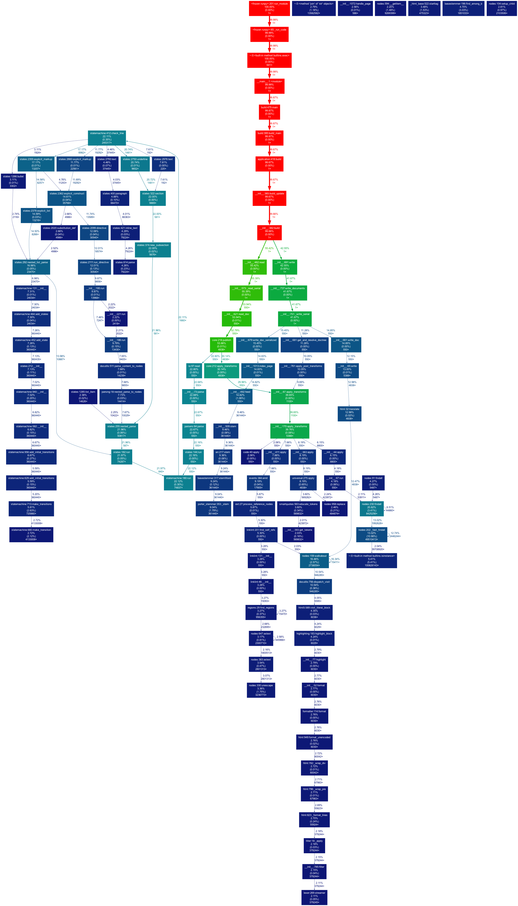
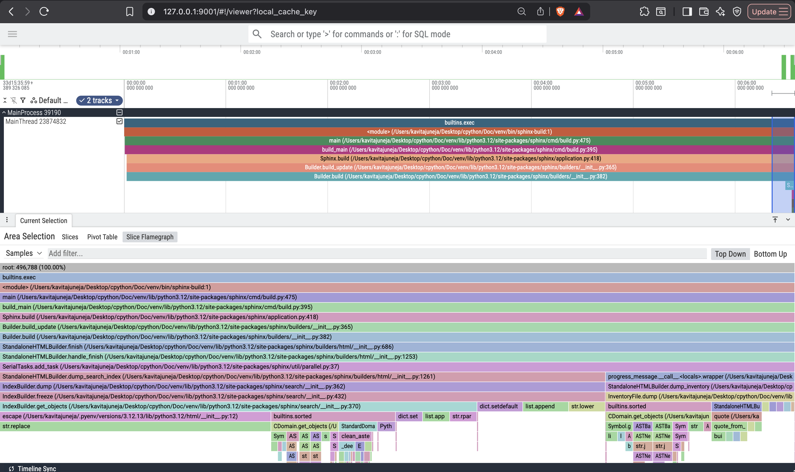
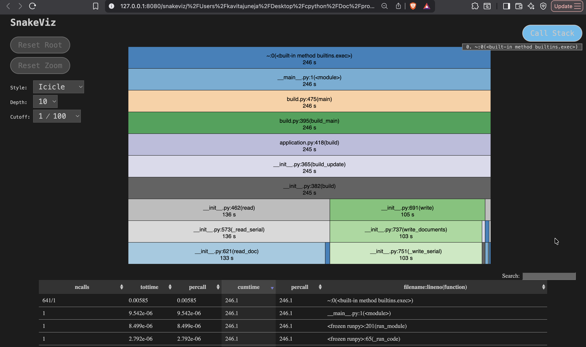

## Week of Jul 6 - Jul 10

### What went well this week? ✨

I completed onboarding, surveyed documentation build pipelines across several open-source projects, explored documentation build optimization ideas for statsmodels and networkx, and made a small contribution to statsmodels. I also profiled the CPython documentation build using multiple profiling tools to better understand the different stages of a Sphinx build, reviewed existing profiling and benchmarking tools, the Sphinx documentation and the sphinx-process-graph project.

### What do you want to achieve/complete next week? ✅

I want to develop a deeper understanding of Sphinx's event system and build process, continue exploring existing performance tooling (sphinx-process-graph, sphinx-performance, etc.), and build a docs build process graph with sphinx-process-graph for a scientific python project, like matplotlib, scikit-learn.

A working PoC that captures and provides a stage-wise performance information of a Sphinx documentation build (of matplotlib or scikit-learn project). Figuring out some way to integrate timing information in sphinx-process-graph project; or some way of combining gprof2dot profiler with sphinx-process-graph.

I'd also like to identify and contribute towards improving documentation build performance in any downstream projects using sphinx or any performance related issues in sphinx project itself.

### If only one deliverable/project could get done this week what would it be? 🚀

doing some initial research and getting familiar with sphinx and build processes in various open source projects.

### What's your biggest challenge right now, and how can I help? 🤝

The biggest challenge is building a sufficiently deep understanding of Sphinx's internals-- particularly its event system and build pipeline-- to identify the right extension points for collecting meaningful performance data. Guidance on Sphinx internals, any prior/similar work, or feedback on the proposed approach (in the second question above) would help me validate that I'm heading in the right direction.


---


## 10th July

- understanding [`sphinx-process-graph`](https://github.com/chrisjsewell/sphinx-process-graph) ([get_info.py](https://github.com/chrisjsewell/sphinx-process-graph/blob/main/scripts/get_info.py))
- briefly reviewed https://github.com/useblocks/sphinx-performance:
    - `--sphinx-events` option of sphinx-analysis might be of our use.

ToDo:

- https://sphinx-needs.readthedocs.io/en/latest/performance/script.html
- https://www.sphinx-doc.org/en/master/extdev/event_callbacks.html#events
- https://github.com/sphinx-doc/sphinx/issues?q=state%3Aopen%20label%3A%22type%3Aperformance%22


## 9th July

- Spent time understanding sphinx build process and extension mechanism:
    - https://www.sphinx-doc.org/en/master/extdev/index.html
    - https://www.sphinx-doc.org/en/master/glossary.html#term-builder
    - https://www.sphinx-doc.org/en/master/extdev/appapi.html#sphinx.application.Sphinx
- tried understanding [`sphinx-process-graph`](https://github.com/chrisjsewell/sphinx-process-graph) codebase and figuring out how to generate a build-stages graph for cpython docs build
- coffee-buddies with Maanas:
    - discussed https://github.com/numpy/numpy/pull/31659 and more!
    - Book: "Computer Systems: A Programmer's Perspective"
- meeting with mentors: got some really useful feeback! (refer [notes](../notes/mentor_meetings_notes.md) for more)
- related to parallel sphinx-gallery config: went through https://github.com/matplotlib/matplotlib/pull/28617


## 8th July

- proposed an optimization for building sphinx-gallery examples in networkx (closed): https://github.com/networkx/networkx/pull/8746
- Built and profiled the [CPython documentation](https://devguide.python.org/documentation/start-documenting/#building-the-documentation) to understand different stages of the Sphinx build process. Used multiple profiling tools (cProfile/pstats, gprof2dot, SnakeViz, and VizTracer) to analyze build performance and compare their usefulness for profiling Sphinx documentation builds. Profiling results are as follows (for observations and more refer [notes](../notes/personal_rough_notes/profiling-cpython-docs-build.pdf)):

    - **cProfiler (pstats)**:
        <details>
        <summary>logs - `python -m pstats profile.prof`</summary>

        ```
        profile.prof% stats 50 sphinx
        Wed Jul  8 18:20:42 2026    profile.prof

                517074352 function calls (437717993 primitive calls) in 246.129 seconds

        Ordered by: cumulative time
        List reduced from 7358 to 50 due to restriction <50>
        List reduced from 50 to 24 due to restriction <'sphinx'>

        ncalls  tottime  percall  cumtime  percall filename:lineno(function)
                1    0.000    0.000  246.132  246.132 ../cpython/Doc/venv/lib/python3.12/site-packages/sphinx/__main__.py:1(<module>)
                1    0.000    0.000  245.837  245.837 ../cpython/Doc/venv/lib/python3.12/site-packages/sphinx/cmd/build.py:475(main)
                1    0.000    0.000  245.835  245.835 ../cpython/Doc/venv/lib/python3.12/site-packages/sphinx/cmd/build.py:395(build_main)
                1    0.000    0.000  245.345  245.345 ../cpython/Doc/venv/lib/python3.12/site-packages/sphinx/application.py:418(build)
                1    0.000    0.000  245.338  245.338 ../cpython/Doc/venv/lib/python3.12/site-packages/sphinx/builders/__init__.py:365(build_update)
                1    0.000    0.000  245.316  245.316 ../cpython/Doc/venv/lib/python3.12/site-packages/sphinx/builders/__init__.py:382(build)
                1    0.000    0.000  136.418  136.418 ../cpython/Doc/venv/lib/python3.12/site-packages/sphinx/builders/__init__.py:462(read)
                1    0.004    0.004  136.349  136.349 ../cpython/Doc/venv/lib/python3.12/site-packages/sphinx/builders/__init__.py:573(_read_serial)
            550    0.024    0.000  132.775    0.241 ../cpython/Doc/venv/lib/python3.12/site-packages/sphinx/builders/__init__.py:621(read_doc)
                1    0.000    0.000  104.744  104.744 ../cpython/Doc/venv/lib/python3.12/site-packages/sphinx/builders/__init__.py:691(write)
                1    0.000    0.000  102.576  102.576 ../cpython/Doc/venv/lib/python3.12/site-packages/sphinx/builders/__init__.py:737(write_documents)
                1    0.005    0.005  102.575  102.575 ../cpython/Doc/venv/lib/python3.12/site-packages/sphinx/builders/__init__.py:751(_write_serial)
            1100    0.003    0.000   97.597    0.089 ../cpython/Doc/venv/lib/python3.12/site-packages/sphinx/transforms/__init__.py:87(apply_transforms)
            550    0.004    0.000   56.132    0.102 ../cpython/Doc/venv/lib/python3.12/site-packages/sphinx/io.py:97(read)
            550    0.007    0.000   55.798    0.101 ../cpython/Doc/venv/lib/python3.12/site-packages/sphinx/parsers.py:64(parse)
            550    0.005    0.000   38.033    0.069 ../cpython/Doc/venv/lib/python3.12/site-packages/sphinx/builders/html/__init__.py:679(write_doc_serialized)
            550    0.010    0.000   36.561    0.066 ../cpython/Doc/venv/lib/python3.12/site-packages/sphinx/builders/html/__init__.py:661(write_doc)
            550    0.034    0.000   36.510    0.066 ../cpython/Doc/venv/lib/python3.12/site-packages/sphinx/builders/html/__init__.py:1013(index_page)
            550    2.613    0.005   36.471    0.066 ../cpython/Doc/venv/lib/python3.12/site-packages/sphinx/search/__init__.py:492(feed)
            4838    0.055    0.000   31.941    0.007 ../cpython/Doc/venv/lib/python3.12/site-packages/sphinx/writers/html.py:32(translate)
            550    0.007    0.000   27.776    0.051 ../cpython/Doc/venv/lib/python3.12/site-packages/sphinx/environment/__init__.py:681(get_and_resolve_doctree)
        946285    0.891    0.000   25.937    0.000 ../cpython/Doc/venv/lib/python3.12/site-packages/sphinx/util/docutils.py:756(dispatch_visit)
            550    0.005    0.000   24.749    0.045 ../cpython/Doc/venv/lib/python3.12/site-packages/sphinx/environment/__init__.py:761(apply_post_transforms)
        13968/9856    0.022    0.000   24.301    0.002 ../cpython/Doc/venv/lib/python3.12/site-packages/sphinx/domains/__init__.py:195(run)
        ```

        </details>

    - **gprof2dot** : `gprof2dot -f pstats profile.prof --node-thres=2 --edge-thres=2 -o graph.dot` (ignoring nodes(functions) taking <2% of runtime, and insignificant function calls(edges)) --> then coverting the graph into png: `dot -Tpng graph.dot -o graph.png`. Note: This is not purely a sphinx-specific call graph i.e. it has non-sphinx function calls as well.

        <details>
        <summary>Call Graph (click on the image to get a better view)</summary>

        

        </details>

    - **viztracer** - useful for a high-level overview, but I couldn't extract detailed insights. Function names were not visible (this may be supported, but I'm still learning this one!), and running this was quite heavy on my laptop.

        <details>
        <summary>SS from vizviewer</summary>

        

        </details>

    - **snakeviz** (similar to pstats-- but a bit more visual)

        <details>
        <summary>SS from `snakeviz profile.prof`</summary>

        

        </details>

- gathered and explored existing profiling and benchmarking tools for sphinx:
    - sphinx's own profiler: https://www.sphinx-doc.org/en/master/usage/extensions/duration.html : only tells total time-- not phase-wise
    - just use total time for benchmarking : https://mtakagishi.com/en/blog/posts/2025-05-27-sphinx-build-performance-optimization#id5
    - (todo: explore tomorrow) https://github.com/useblocks/sphinx-performance
    - (todo: explore tomorrow) https://sphinx-needs.readthedocs.io/en/latest/performance/script.html

- interns meeting
    - https://nostarch.com/writing-c-compiler


## 7th July

- Researched 15 open-source projects using Sphinx to understand their documentation build pipelines, including build times, project structure, extensions, themes, and hosting approaches. (refer [notes](../notes/personal_rough_notes/initial-overview-notes.pdf) for more). This provided a good understanding of the current state of documentation builds across the ecosystem.
- towards the end of the day, investigated the documentation build process of the `statsmodels` project, which had the longest build time (~37 mins), hoping to find some easy optimization:
    - explored ideas such as splitting docs generation build workflow into multiple CI workflows (e.g., separate example notebook builds, etc.) and introducing caching-- more issues/ideas in [notes](../notes/personal_rough_notes/initial-overview-notes.pdf)
    - made one small contribution: https://github.com/statsmodels/statsmodels/pull/9892
    - might focus on this later-- right now going to focus on sphinx only!


## 6 July

- Completed onboarding tasks, including reviewing internal documentation, work-related tools, and company policies.
- HR onboarding meeting
- Interacted with team members via Slack and email
- Began exploring the Sphinx documentation build process:
    - Studied the [`sphinx-process-graph`](https://github.com/chrisjsewell/sphinx-process-graph) repository-- understand how it tracks build stages using `events.listeners`.
    - Reviewed [the docs on `Sphinx` class object](https://www.sphinx-doc.org/en/master/extdev/appapi.html#sphinx.application.Sphinx) -- got an initial understanding of the Sphinx build architecture and extension system.
